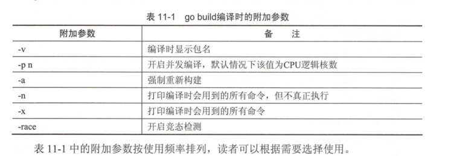
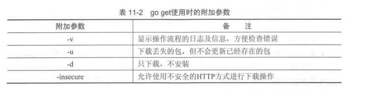
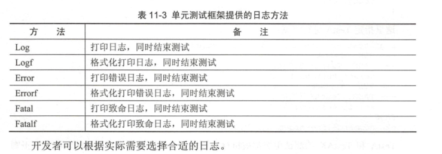

# 编译与工具

## Go常用的编译方法


## 配置GOPATH

GOPATH是真正存放diamante的路径，Go寻找依赖包时会根据$GOPATH来寻找，GOPATH目录约定有如下3个子目录。

* src存放源代码。
* pkg存放编译后生成的文件。
* bin存放编译后的可执行文件。

### 1.编译(go build)
Go语言的编译速度非常快。Go1.9版本后默认利用Go语言的并发特性进行函数粒度的并发编译。

Go语言的程序编写基本以源码方式，无论是直接的代码还是第三方代码，
并且以GOPATH作为母子目录和一套完整的工程目录规则。

因此Go语言中日常编译时无需像C++一样配置各种包含路径、链接库地址等。

#### 1.1 go build无参数编译
将源码编译成可执行文件，go build有很多种编译方法，如：
无参数编译、文件列表编译、指定包编译，使用这些方法都可以输出可执行文件。

``` 
$ tree
.
└── gobuild
    ├── lib.go
    └── main.go

```

lib.go代码如下
``` 
package main

import "fmt"

func pkgFunc()  {
	fmt.Println("call pkgFunc")
}

```

main.go代码如下
``` 
package main

import "fmt"

func main() {
	// 同包的函数
	pkgFunc()
	fmt.Println("hello world")
}

```


``` 
D:\go_studay\go_path\src\awesomeProject20>cd gobuild

D:\go_studay\go_path\src\awesomeProject20\gobuild>go build

$ ls
gobuild.exe  lib.go  main.go


D:\go_studay\go_path\src\awesomeProject20\gobuild>./gobuild.exe
call pkgFunc
hello world

```

#### 1.2 go build+文件列表
编译同目录的多个源码文件时，可以在go build的后面提供多个文件名，go build会编译这些源码。
输出可执行文件， go build + 文件列表的格式如下：
``` 
$ ls
gobuild.exe  lib.go  main.go

18793@DESKTOP-PMJTNGI /cygdrive/d/go_studay/go_path/src/awesomeProject20/gobuild
$ go build main.go lib.go

18793@DESKTOP-PMJTNGI /cygdrive/d/go_studay/go_path/src/awesomeProject20/gobuild
$ ls
gobuild.exe  lib.go  main.exe  main.go

$ ./main.exe
call pkgFunc
hello world

```

如果需要指定输出可执行文件名，可以使用-o参数。
``` 
$ go build -o myexe main.go lib.go

18793@DESKTOP-PMJTNGI /cygdrive/d/go_studay/go_path/src/awesomeProject20/gobuild
$ ./myexe
call pkgFunc
hello world
```
myexe为输出文件名


#### 1.3 go build+包

go `build` 和`clean` 命令会执行编译和清理的工作

“go build+包”在设置GOPATH后，可以直接根据包名进行编译，即使包内文件被增删也不影响编译指令。

``` 
$ tree gobuild02/
gobuild02/
├── main.go
└── mypkg
    └── mypkg.go

```
main.go代码如下
``` 
package main

import (
	"awesomeProject20/gobuild02/mypkg"
	"fmt"
)

func main() {
	mypkg.CustomPkgFunc()
	fmt.Println("hello world")
}

```
mypkg.go代码如下
``` 
package mypkg

import "fmt"

func CustomPkgFunc() {
	fmt.Println("call CustomPkgFunc")
}

```

设置的GOPATH 路径为`D:\go_studay\go_path\`

按包编译命令
``` go
$ go build -o main awesomeProject20/gobuild02
```
-o 执行指定输出文件为main，后面接要编译的包名，包名是相对于GOPATH下的src目录开始的。

``` shell
18793@DESKTOP-PMJTNGI /cygdrive/d/go_studay/go_path/src/awesomeProject20
$ ll
总用量 2060
drwxrwx---+ 1 18793 18793       0 1月  15 11:14 gobuild
drwxrwx---+ 1 18793 18793       0 1月  15 11:18 gobuild02
-rwxrwx---+ 1 18793 18793 2107392 1月  15 11:21 main

18793@DESKTOP-PMJTNGI /cygdrive/d/go_studay/go_path/src/awesomeProject20
$ ./main
call CustomPkgFunc
hello world
```

也可以在指定包的时候使用通配符。3个点表示匹配所有的字符串。例如，下面的命令会编译`chapter3` 目录下的所有包：

```shell
$ go build github.com/goinaction/code/chapter3/...
```

除了指定包，大部分Go命令使用短路径作为参数。例如，下面两条命令的效果相同：

```shell
$ go build wordcount.go

$ go build .
```

#### 1.4 go build编译时的附加参数



### 2.编译后运行(go run)
Python和Lua语言可以在不输出二进制的情况下，将代码使用虚拟机直接执行，
Go语言虽然不使用虚拟机，但可使用go run指令达到同样的效果。

go run命令会编译源码，兵器直接执行源码的main()函数，不会在当前目录下留下可执行文件。

``` 
$ tree gorun/
gorun/
└── main.go

```

我们准备一个`main.go`文件
``` 
package main

import (
	"fmt"
	"os"
)

func main() {
	fmt.Println("args:",os.Args)
}

```

``` 
$ cd gorun/
$ go run main.go --file xxx.go
args: [D:\Cygwin\tmp\go-build804207966\b001\exe\main.exe --file xxx.go]
```
`go run`不会在运行目录下生成任何文件，可执行文件被放在临时文件中被执行，工作目录被设置为当前目录，
在`go run`的后部可以添加参数，这部分参数会作为代码可以接受的命令行输入提供给程序。

`go run`不能使用“go run + 包”的方式进行编译，如果要快速运行编译包，需要使用如下步骤：
（1）使用go build生成可执行文件

（2）运行可执行文件


### 3.编译并安装(go install)

go install的功能和go build类似，附加参数绝大多数都可以与go build通用。
`go install`只是将编译的中间文件放在GOPATH的pkg目录下，以及`固定的地将编译结果放在GOPATH的bin目录下`。

``` 
$ go install awesomeProject20/gobuild
```

· go install是建立在GOPATH上的，无法在独立的目录里使用go install

· GOPATH下的bin目录放置的是使用go install生成的可执行文件，可执行文件的名称来自于编译时的包

· go install输出目录始终为GOPATH下的bin目录，无法使用-o附加参数进行自定义

· GOPATH下的pkg目录放置的是编译期间的中间文件。


### 4.一键获取代码、编译并安装(go get)
go get可以借助代码管理工具通远程拉取或更新代码包及其依赖包，并自动完成编译和安装。
整个过程就像安装一个App一样简单。

使用go get前，需要安装与远程包匹配的代码管理工具，如Git、SVN、HG等，参数中需要提供一个包名。

#### 远程包的路径格式


#### go get + 远程包
默认情况下，go get可以直接使用。例如，想获取go的源码并编译，使用下面命令行即可：
``` go
go get github.com/davyxu/cellnet
```

如果路径包含URL，可以使用Go工具链从DVCS获取包，并把包的源代码保存在`GOPATH` 指向的路径里与URL匹配的目录里。这个获取过程使用`go get` 命令完成。`go get` 将获取任意指定的URL的包，或者一个已经导入的包所依赖的其他包。由于`go get` 的这种递归特性，这个命令会扫描某个包的源码树，获取能找到的所有依赖包。

```go
//例如：
import "github.com/spf13/viper"
```

获取前，请确保GOPATH已经设置，Go 1.8版本之后，GOPATH默认在用户目录的go文件下。

`cellnet`只是一个网络库，并没有可执行文件，
因此在go get操作成功后GOPATH下的bin目录下不会有任何编译好的二进制文件。
``` 
go get giyhub.com/davyxu/tabtoy
```
#### go get 使用时的附加参数


### 5. go vet

这个命令不会帮开发人员写代码，但如果开发人员已经写了一些代码，`vet` 命令会帮开发人员检测代码的常见错误。

每次对代码先执行`go vet` 再将其签入源代码库是一个很好的习惯。

### 6.测试(go test)

#### 6.1 单元测试-测试和验证代码的框架
要开始一个单元测试，需要准备一个go源码文件，在命名文件时需要让文件必须以_test结尾。

单元测试源码文件可以由多个测试用例组成，每个测试用例函数需要以Test为前缀，例如：
``` 
func TestXXX(t *testing.T)
```
· 测试用例文件不会参与正常源码编译，不会被包含到可执行文件中。

· 测试用例文件使用go test指令来执行，没有也不需要main()作为函数入口，所有在以_test结尾的源码内
以Test开头的函数会自动被执行。

· 测试用例可以不传入*testing.T参数。

helloworld_test.go
``` 
package goTest

import "testing"

func TestHelloWorld(t *testing.T)  {
	t.Log("hello world")
}

```
执行如下：
``` 
GOROOT=C:\Go #gosetup
GOPATH=D:\go_studay\go_path #gosetup
C:\Go\bin\go.exe test -c -o C:\Users\18793\AppData\Local\Temp\___TestHelloWorld_in_awesomeProject20_goTest.exe awesomeProject20/goTest #gosetup
C:\Go\bin\go.exe tool test2json -t C:\Users\18793\AppData\Local\Temp\___TestHelloWorld_in_awesomeProject20_goTest.exe -test.v -test.run ^TestHelloWorld$ #gosetup
=== RUN   TestHelloWorld
--- PASS: TestHelloWorld (0.00s)
    helloworld_test.go:6: hello world
PASS
```

#### 6.2 运行指定单元测试用例
go test指定文件时默认执行文件内的所有测试用例，可以使用-run参数选择需要的测试用例单独执行。
参考如下代码：

select_test.go
``` 
package goTest

import "testing"

func TestA(t *testing.T)  {
	t.Log("A")
}

func TestAK(t *testing.T)  {
	t.Log("AK")
}

func TestB(t *testing.T)  {
	t.Log("B")
}
func TestC(t *testing.T)  {
	t.Log("C")
}


```

``` 
go test -run TestA select_test.go
ok      command-line-arguments  0.257s

go test -run TestB helloworld_test.go
ok      command-line-arguments  0.250s [no tests to run]

```

#### 6.3 标记单元测试结果
当需要终止当前测试用例时，可以使用FailNow，参考下面代码：
``` 
package goTest

import "testing"

func TestFailNow(t *testing.T)  {
	t.FailNow()
}
```

``` 
package goTest

import (
	"fmt"
	"testing"
)

func TestFailNow(t *testing.T)  {
	fmt.Println("before fail")
	t.Fail()
	fmt.Println("after fail")
}

```
测试结果如下：
``` 
GOROOT=C:\Go #gosetup
GOPATH=D:\go_studay\go_path #gosetup
C:\Go\bin\go.exe test -c -o C:\Users\18793\AppData\Local\Temp\___TestFailNow_in_awesomeProject20_goTest.exe awesomeProject20/goTest #gosetup
C:\Go\bin\go.exe tool test2json -t C:\Users\18793\AppData\Local\Temp\___TestFailNow_in_awesomeProject20_goTest.exe -test.v -test.run ^TestFailNow$ #gosetup
=== RUN   TestFailNow
before fail
after fail
--- FAIL: TestFailNow (0.00s)
FAIL
```

#### 6.4 单元测试日志
每个测试用例可能并发执行，使用yesying.T提供的日志输出可以保证日志跟随这个测试上下文一起打印输出。
`testing.T`提供了几种日志输出方法。


### 7. 命令

假如你已安装了golang环境，你可以在命令行执行go命令查看相关的Go语言命令：

```
$ goGo is a tool for managing Go source code.Usage:    go command [arguments]The commands are:    build       compile packages and dependencies    clean       remove object files    doc         show documentation for package or symbol    env         print Go environment information    bug         start a bug report    fix         run go tool fix on packages    fmt         run gofmt on package sources    generate    generate Go files by processing source    get         download and install packages and dependencies    install     compile and install packages and dependencies    list        list packages    run         compile and run Go program    test        test packages    tool        run specified go tool    version     print Go version    vet         run go tool vet on packagesUse "go help [command]" for more information about a command.Additional help topics:    c           calling between Go and C    buildmode   description of build modes    filetype    file types    gopath      GOPATH environment variable    environment environment variables    importpath  import path syntax    packages    description of package lists    testflag    description of testing flags    testfunc    description of testing functionsUse "go help [topic]" for more information about that topic.
```


go env用于打印Go语言的环境信息。

go run命令可以编译并运行命令源码文件。

go get可以根据要求和实际情况从互联网上下载或更新指定的代码包及其依赖包，并对它们进行编译和安装。

go build命令用于编译我们指定的源码文件或代码包以及它们的依赖包。

go install用于编译并安装指定的代码包及它们的依赖包。

go clean命令会删除掉执行其它命令时产生的一些文件和目录。

go doc命令可以打印附于Go语言程序实体上的文档。我们可以通过把程序实体的标识符作为该命令的参数来达到查看其文档的目的。

go test命令用于对Go语言编写的程序进行测试。

go list命令的作用是列出指定的代码包的信息。

go fix会把指定代码包的所有Go语言源码文件中的旧版本代码修正为新版本的代码。

go vet是一个用于检查Go语言源码中静态错误的简单工具。

go tool pprof命令来交互式的访问概要文件的内容。

## 8. gb工程

示例：

```
/home/bill/devel/myproject ($PROJECT)
|-- src
|　 |-- cmd
|　 |　 |-- myproject
|　 |　 |　 |-- main.go
|　 |-- examples
|　 |-- model
|　 |-- README.md
|-- vendor
　　|-- src
　　　　|-- bitbucket.org
　　　　|　 |-- ww
　　　　|　　　 |-- goautoneg
　　　　|　　　 |-- Makefile
　　　　|　　　 |-- README.txt
　　　　|　　　 |-- autoneg.go
　　　　|　　　 |-- autoneg_test.go
　　　　|-- github.com
　　　　　　|-- beorn7
　　　　　　　　|-- perks
　　　　　　　　|-- README.md
　　　　　　　　|-- quantile
　　　　　　　　|-- bench_test.go
　　　　|-- example_test.go
　　　　|-- exampledata.txt
　　　　|-- stream.go
```

工程中存放开发人员写的代码的位置

```
$PROJECT/src/
```

存放第三方代码的位置

```
$PROJECT/vendor/src/
```

gb 一个最好的特点是，**不需要重写`导入` 路径**。可以看看这个工程里的main.go文件的`import` 语句——没有任何需要为导入第三方库而做的修改，如代码所示。

代码示例    gb工程的导入路径

```go
 package main

 import (
　　 "bitbucket.org/ww/goautoneg"
　　 "github.com/beorn7/perks"
 )
```

**gb工具首先会在`$PROJECT/src/` 目录中查找代码，如果找不到，会在`$PROJECT/vender/src/` 目录里查找。与工程相关的整个源代码都会在同一个代码库里。自己写的代码在工程目录的`src/` 目录中，第三方依赖代码在工程目录的`vender/src` 子目录中。**

这样，不需要配合重写导入路径也可以完成整个构建过程，同时可以把整个工程放到磁盘的任意位置。这些特点，让gb成为社区里解决可重复构建的流行工具。


## GO国内无法go get的解决办法

```
# 大家都懂的原因，Go官网的依赖都被屏蔽了。所以国内需要本地安装的时候，在终端先执行以下两句。
export GOPROXY=https://goproxy.io && export GO111MODULE=on

#取消代理
export GOPROXY=direct
```

