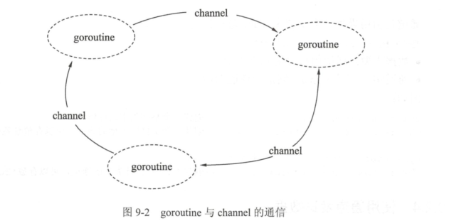

# 03.通道(channel)-在多个goroutine间通信的管道

Go语言提倡使用通信的方法代替共享内存，这里通信的方法就是使用通道(channel).



```
在地铁站、食堂、洗手间等公共场所人很多的情况下，大家养成了排队的习惯，
目的也是避免拥挤、插队导致的低效的资源使用和交换过程。代码与数据也是如此，多个 goroutine 为了争抢数据，势必造成执行的低效率，使用队列的方式是最高效的，channel 就是一种队列一样的结构。
```


## 通道的特性

Go语言中的通道（channel）是一种特殊的类型。在任何时候，同时只能有一个 goroutine 访问通道进行发送和获取数据。goroutine 间通过通道就可以通信。

通道像一个传送带或者队列，总是遵循先入先出（First In First Out）的规则，保证收发数据的顺序。


## 声明通道类型
``` 
通道本身需要一个类型进行修饰，就像切片类型需要标识元素类型。通道的元素类型就是在其内部传输的数据类型，声明如下：

var 通道变量 chan 通道类型

·通道类型：通道内的数据类型。
·通道变量：保存通道的变量。

chan 类型的空值是 nil，声明后需要配合 make 后才能使用。
```

## 创建通道

通道是引用类型，需要使用 make 进行创建，格式如下：
``` 
通道实例 := make(chan 数据类型)

· 数据类型：通道内传输的元素类型。
· 通道实例：通过make创建的通道句柄。
```

例子：
``` 
package main

import "fmt"

func main() {
	ch1 := make(chan int)
	ch2 := make(chan interface{})

	type Equip struct{
		name string
		age int
	}
	ch3 := make(chan *Equip)

	fmt.Printf("%#v\n",ch1)	//(chan int)(0xc000012180)
	fmt.Printf("%#v\n",ch2)	//(chan interface {})(0xc0000121e0)
	fmt.Printf("%#v\n",ch3)	//(chan *main.Equip)(0xc000012240)
}

```


## 使用通道发送数据

通道创建后，就可以使用通道进行发送和接收操作。

1) 通道发送数据的格式
通道的发送使用特殊的操作符<-，将数据通过通道发送的格式为：
``` 
通道变量 <- 值

· 通道变量：通过make创建好的通道实例。
· 值：可以是变量、常量、表达式或者函数返回值等。值的类型必须与ch通道的元素类型一致。
```

2) 通过通道发送数据的例子

使用 make 创建一个通道后，就可以使用<-向通道发送数据，代码如下：

``` 
	// 创建一个空接口通道
	ch := make(chan interface{})

	// 将0放入通道中
	ch <- 0
	// 将hello字符串放入通道中
	ch <- "hello"
```

3)发送将持续阻塞，直到数据被接收

把数据往通道中发送时，如果接收方一直都没有接收，那么发送操作将持续阻塞。Go 程序运行时能智能地发现一些永远无法发送成功的语句并做出提示，

``` 
package main

// 通过通道发送数据的例子

func main() {
	// 创建一个整型通道
	ch := make(chan int)

	// 尝试将0通过通道发送
	ch <- 0
}

/*
fatal error: all goroutines are asleep - deadlock!
 */
```


## 使用通道接收数据

通道接收同样使用<-操作符，通道接收有如下特性：
```
① 通道的收发操作在不同的两个 goroutine 间进行。

由于通道的数据在没有接收方处理时，数据发送方会持续阻塞，因此通道的接收必定在另外一个 goroutine 中进行。

② 接收将持续阻塞直到发送方发送数据。

如果接收方接收时，通道中没有发送方发送数据，接收方也会发生阻塞，直到发送方发送数据为止。

③ 每次接收一个元素。
通道一次只能接收一个数据元素。
```


#### 使用通道做并发同步的写法如下：

``` 
package main

import "fmt"

// 通过通道发送、接收数据的例子

/*
通道的数据接收一共有以下 4 种写法
1.阻塞接收数据
	data := <-ch

2.非阻塞接收数据
	data, ok := <-ch
	· data：表示接收到的数据。未接收到数据时，data 为通道类型的零值。
	· ok：表示是否接收到数据。

3.接收任意数据，忽略接收的数据
	<-ch

4. 循环接收
	for data := range ch {
	}
 */

func main() {
	// 构建一个通道
	ch :=make(chan int)

	// 开启一个并发匿名函数
	go func() {
		fmt.Println("start gorutine")

		// 通过通道通知main的goroutine
		ch <- 0

		fmt.Println("exit goroutine")
	}()

	fmt.Println("wait goroutine")
	// 等待匿名goroutine
	<-ch

	fmt.Println("all done")
}

/*
wait goroutine
start gorutine
exit goroutine
all done
 */
```


#### 遍历通道数据的例子请参考下面的代码。

``` 
package main

import (
	"fmt"
	"time"
)

func main() {
	// 构建一个通道
	ch := make(chan int)

	// 开启一个并发匿名函数
	go func() {
		//从3循环到0
		for i := 3; i >= 0; i-- {
			// 发送3到0之间的数值
			ch <- i
			// 每次发送完时等待
			time.Sleep(time.Second)
		}
	}()

	// 遍历接收通道数据
	for data := range ch {
		//打印通道数据
		fmt.Println(data)
		//当遇到数据0时，退出接收循环
		if data == 0 {
			break
		}
	}
}

```


#### 示例：并发打印
``` 
package main

import "fmt"

func printer(c chan int) {
	// 开始无限循环等待数据
	for {
		// 从channel中获取一个数据
		data := <-c
		// 将0视为数据结束
		if data == 0 {
			break
		}
		// 打印数据
		fmt.Println(data)
	}
	// 通知main已经结束循环 (我搞定了！)
	c <- 0

}

func main() {
	// 创建一个channel
	c := make(chan int)

	// 并发执行printer，传入channel
	go printer(c)
	for i := 1; i <= 10; i++ {
		//将数据通过channel投送给printer
		c <- i
	}

	// 通知并发的printer结束循环（没有数据啦！）
	c <- 0
	//等待printer结束（搞定喊我！）
	<-c

}

/*
1
2
3
4
5
6
7
8
9
10
 */

```

#### 示例，同时发送和接收(不带缓冲的通道)

```
package main

import (
	"fmt"
	"time"
)

/*
使用make来建立一个通道：
var channel chan int = make(chan int)
 // 或
channel := make(chan int)

 // 定义接收的channel
receive_only := make (<-chan int)
 // 定义发送的channel
send_only := make (chan<- int)

// 可同时发送接收
send_receive := make (chan int)


· chan<- 表示数据进入通道，要把数据写进通道，对于调用者就是发送。
· <-chan 表示数据从通道出来，对于调用者就是得到通道的数据，当然就是接收。

定义只发送或只接收的channel意义不大，一般用于在参数传递中：
*/

func main() {
	c := make(chan int) // 不使用带缓冲区的channel
	go send(c)
	go recv(c)
	time.Sleep(3 * time.Second)
	close(c)
}

// 只能向chan里send数据
func send(c chan<- int) {
	for i := 0; i < 10; i++ {
		fmt.Println("send readey", i)
		c <- i
		fmt.Println("send", i)
	}
}

// 只能接收channel中的数据
func recv(c <-chan int) {
	for i := range c{
		fmt.Println("received", i)
	}
}

/*
send readey 0
send 0
send readey 1
received 0
received 1
send 1
.....
....
 */ 
```


