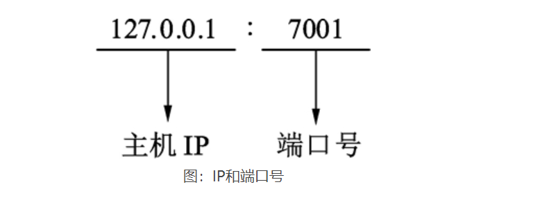
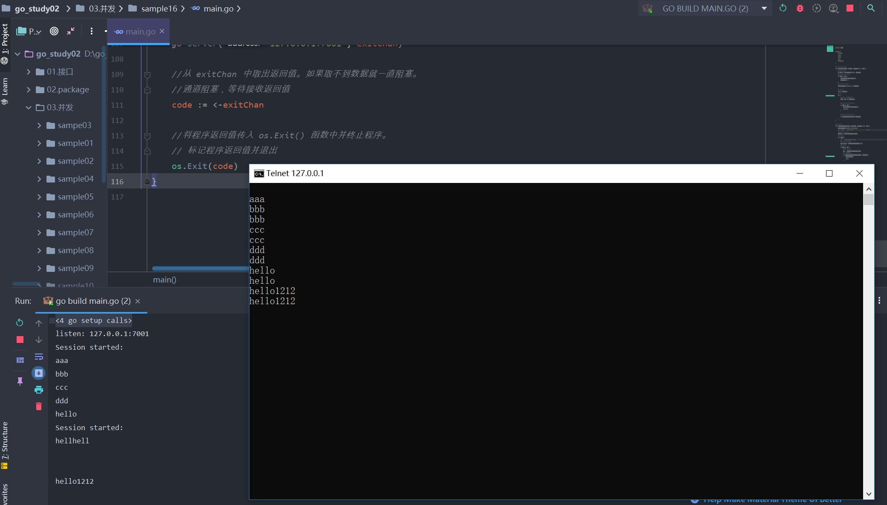

# 11.Go语言Telnet回音服务器-TCP服务器的基本结构

Telnet 协议是 TCP/IP 协议族中的一种。它允许用户（Telnet 客户端）通过一个协商过程与一个远程设备进行通信。本例将使用一部分 Telnet 协议与服务器进行通信。

服务器的网络库为了完整展示自己的代码实现了完整的收发过程，一般比较倾向于使用发送任意封包返回原数据的逻辑。这个过程类似于对着大山高喊，大山把你的声音原样返回的过程。也就是回音（Echo）。本节使用 Go语言中的 Socket、goroutine 和通道编写一个简单的 Telnet 协议的回音服务器。

回音服务器的代码分为 4 个部分，分别是接受连接、会话处理、Telnet 命令处理和程序入口。


## 接受连接
回音服务器能同时服务于多个连接。要接受连接就需要先创建侦听器，侦听器需要一个侦听地址和协议类型。就像你想卖东西，需要先确认卖什么东西，卖东西的类型就是协议类型，然后需要一个店面，店面位于街区的某个位置，这就是侦听器的地址。一个服务器可以开启多个侦听器，就像一个街区可以有多个店面。街区上的编号对应的就是地址中的端口号，如下图所示。


``` 
· 主机 IP：一般为一个 IP 地址或者域名，127.0.0.1 表示本机地址。
· 端口号：16 位无符号整型值，一共有 65536 个有效端口号。
```

通过地址和协议名创建侦听器后，可以使用侦听器响应客户端连接。
响应连接是一个不断循环的过程，就像到银行办理业务时，
一般是排队处理，前一个人办理完后，轮到下一个人办理。

我们把每个客户端连接处理业务的过程叫做会话。
在会话中处理的操作和接受连接的业务并不冲突可以同时进行。

就像银行有 3 个窗口，喊号器会将用户分配到不同的柜台。这里的喊号器就是 Accept 操作，窗口的数量就是 CPU 的处理能力。因此，使用 goroutine 可以轻松实现会话处理和接受连接的并发执行。

如下图清晰地展现了这一过程。


Go语言中可以根据实际会话数量创建多个 goroutine，并自动的调度它们的处理。

telnet 服务器处理：
``` 
package main

import (
	"fmt"
	"net"
)

// 服务逻辑，传入地址和退出的通道
func server(address string, exitChin chan int) {
	// 根据给定地址进行侦听
	l, err := net.Listen("tcp", address)
	// 如果侦听发送错误，打印错误并退出
	if err != nil {
		fmt.Println(err.Error())
		exitChin <- 1
	}
	// 打印侦听地址，表示侦听成功
	fmt.Println("listen: " + address)

	// 延迟关闭侦听器
	defer l.Close()
	// 侦听循环
	for true {
		//新连接没有到来时，Accept是阻塞的
		conn, err := l.Accept()
		// 发送任何的侦听错误，打印错误并退出服务器
		fmt.Println(err.Error())
		continue
	}
	// 根据连接开启会话，这个过程需要并行执行
	go handleSession(conn, exitChan)
}

```
## 会话处理

每个连接的会话就是一个接收数据的循环。当没有数据时，调用 reader.ReadString 会发生阻塞，等待数据的到来。一旦数据到来，就可以进行各种逻辑处理。

回音服务器的基本逻辑是“收到什么返回什么”，reader.ReadString 可以一直读取 Socket 连接中的数据直到碰到期望的结尾符。这种期望的结尾符也叫定界符，一般用于将 TCP 封包中的逻辑数据拆分开。下例中使用的定界符是回车换行符（“\r\n”），HTTP 协议也是使用同样的定界符。使用 reader.ReadString() 函数可以将封包简单地拆分开。

如下图所示为 Telnet 数据处理过程。


回音服务器需要将收到的有效数据通过 Socket 发送回去。

Telnet会话处理：
``` 
// 连接的会话逻辑
func handleSession(conn net.Conn, exitChan chan int) {
	fmt.Println("Session started:")
	//使用 bufio 包的 NewReader() 方法，创建一个网络数据读取器，这个 Reader 将输入数据的读取过程进行封装，方便我们迅速获取到需要的数据
	// 创建一个网络连接数据的读取器
	reader := bufio.NewReader(conn)
	// 接收数据的循环
	for true {
		// 使用 reader.ReadString() 方法进行封包读取。内部会自动处理粘包过程，直到下一个回车符到达后返回数据。这里认为封包来自 Telnet，每个指令以回车换行符（“\r\n”）结尾。
		// 读取字符串，直到碰到回车返回
		str, err := reader.ReadString('\n')
		// 数据读取正确
		if err == nil{
			// 去掉字符串尾部的回车
			str = strings.TrimSpace(str)
			// 处理Telnet指令
			if !processTelnetCommand(str,exitChan){
				conn.Close()
				break
			}

			//Echo逻辑，发什么数据，原样返回
			conn.Write([]byte(str + "\r\n"))

		}else {
			// 发生错误
			fmt.Println("Session closed")
			conn.Close()
			break
		}
	}
}
```

## Telnet命令处理

Telnet 是一种协议。在操作系统中可以在命令行使用 Telnet 命令发起 TCP 连接。
我们一般用 Telnet 来连接 TCP 服务器，键盘输入一行字符回车后，即被发送到服务器上。

在下例中，定义了以下两个特殊控制指令，用以实现一些功能：
```
· 输入“@close”退出当前连接会话。
· 输入“@shutdown”终止服务器运行。
```
Telnet命令处理：
``` 
func processTelnetCommand(str string, exitChan chan int) bool {
	//当输入字符串中包含“@close”前缀时,返回 false，表示需要关闭当前会话。
	// @close指令表示终止本次会话
	if strings.HasPrefix(str, "@close") {
		fmt.Println("Session closed")

		// 告诉外部需要端口连接
		return false

		//当输入字符串中包含“@shutdown”前缀时,将 0 写入 exitChan，表示结束服务器。
		// @shutdown指令表示终止服务进程
	} else if strings.HasPrefix(str, "@shutdown") {
		fmt.Println("Server shutdown")

		// 往通道中写入0，阻塞等待接收方处理
		exitChan <- 0

		// 告诉外部需要断开连接
		return false
	}
	// 打印输入的字符串
	fmt.Println(str)
	return true
}
```

## 程序入口
Telnet 回音处理主流程
``` 
func main() {
	//创建一个整型的无缓冲通道作为退出信号
	// 创建一个程序结束码的通道
	exitChan := make(chan int)

	//接受连接的过程可以并发操作，使用 go 将 server() 函数开启 goroutine。
	// 将服务器并发运行
	go server("127.0.0.1:7001", exitChan)

	//从 exitChan 中取出返回值。如果取不到数据就一直阻塞。
	//通道阻塞，等待接收返回值
	code := <-exitChan
	
	//将程序返回值传入 os.Exit() 函数中并终止程序。
	// 标记程序返回值并退出
	os.Exit(code)
}
```

## 程序测试如下



客户端输入的字符串会在服务器中显示，同时客户端也会收到自己发给服务器的内容，这就是一次回音。

## 测试关闭会话

```
当输入 @close 时，Telnet 命令行显示如下：
@close
Connection closed by foreign host

服务器显示如下：
Session closed

此时，客户端 Telnet 与服务器断开连接。
测试关闭服务器
当输入 @shutdown 时，Telnet 命令行显示如下：
@shutdown
Connection closed by foreign host

服务器显示如下：
Server shutdown

此时服务器会自动关闭。
```