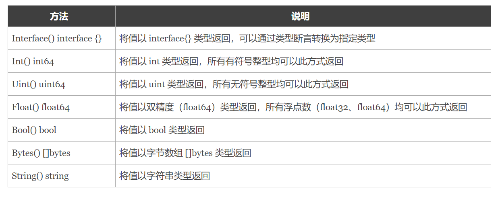

# 01.Go语言基础之反射

## 变量的内在机制

Go语言中的变量是分为两部分的:

```
·类型信息：预先定义好的元信息。
·值信息：程序运行过程中可动态变化的。
```

## 反射介绍
反射是指在程序运行期对程序本身进行访问和修改的能力。程序在编译时，变量被转换为内存地址，变量名不会被编译器写入到可执行部分。在运行程序时，程序无法获取自身的信息。

支持反射的语言可以在程序编译期将变量的反射信息，如字段名称、类型信息、结构体信息等整合到可执行文件中，并给程序提供接口访问反射信息，这样就可以在程序运行期获取类型的反射信息，并且有能力修改它们。

Go程序在运行期使用reflect包访问程序的反射信息。

## reflect包

在Go语言中反射的相关功能由内置的reflect包提供，任意接口值在反射中都可以理解为由`reflect.Type`和`reflect.Value`两部分组成，
并且reflect包提供了`reflect.TypeOf`和`reflect.ValueOf`两个函数来获取任意对象的Value和Type。

## TypeOf
在Go语言中，使用`reflect.TypeOf()`函数可以获得任意值的类型对象（reflect.Type），
程序通过类型对象可以访问任意值的类型信息。

``` 
package main

import (
	"fmt"
	"reflect"
)

func reflectType(x interface{}) {
	v := reflect.TypeOf(x)
	fmt.Printf("type:%v\n", v)
}

func main() {
	var a float32 = 3.14
	reflectType(a) //type:float32

	var b int64 = 100
	reflectType(b) //type:int64
}

```


## type name和type kind
在反射中关于类型还划分为两种：`类型（Type）`和`种类（Kind）`。
因为在Go语言中我们可以使用type关键字构造很多自定义类型，而`种类（Kind）`就是指底层的类型，
但在反射中，当需要区分指针、结构体等大品种的类型时，就会用到`种类（Kind）`。 
举个例子，我们定义了两个指针类型和两个结构体类型，通过反射查看它们的类型和种类。

``` 
package main

import (
	"fmt"
	"reflect"
)

type myInt int64

func reflectType(x interface{}) {
	t := reflect.TypeOf(x)
	fmt.Printf("type:%v kind:%v\n", t.Name(), t.Kind())
}


func main() {
	var a *float32 //指针	
	var b myInt    //自定义类型
	var c rune     // 类型别名
	reflectType(a)		//type: kind:ptr
	reflectType(b)		//type:myInt kind:int64
	reflectType(c)		//type:int32 kind:int32
	type person struct {
		name string
		age int
	}

	type book struct {
		title string
	}

	var d = person{
		name: "沙河小王子",
		age:  18,
	}

	var e = book{title:"《跟小王子学Go语言》"}

	reflectType(d)		//type:person kind:struct
	reflectType(e)		//type:book kind:struct
}

```
Go语言的反射中像数组、切片、Map、指针等类型的变量，它们的.Name()都是返回空


## ValueOf
`reflect.ValueOf()`返回的是`reflect.Value`类型，其中包含了原始值的值信息。

`reflect.Value`与原始值之间可以互相转换。

`reflect.Value`类型提供的获取原始值的方法如下：



### 通过反射获取值

``` 
package main

import (
	"fmt"
	"reflect"
)

func reflectValue(x interface{}) {
	v := reflect.ValueOf(x)
	k := v.Kind()
	switch k {
	case reflect.Int64:
		// v.Int()从反射中获取整型的原始值，然后通过int64()强制类型转换
		fmt.Printf("type is int64, value is %d\n", int64(v.Int()))
	case reflect.Float32:
		// v.Float()从反射中获取浮点型的原始值，然后通过float32()强制类型转换
		fmt.Printf("type is float32, value is %f\n", float32(v.Float()))
	case reflect.Float64:
		// v.Float()从反射中获取浮点型的原始值，然后通过float64()强制类型转换
		fmt.Printf("type is float64, value is %f\n", float64(v.Float()))
	}
}
func main() {
	var a float32 = 3.14
	var b int64 = 100
	reflectValue(a) // type is float32, value is 3.140000
	reflectValue(b) // type is int64, value is 100
	// 将int类型的原始值转换为reflect.Value类型
	c := reflect.ValueOf(10)
	fmt.Printf("type c :%T\n", c) // type c :reflect.Value
}
```

## 指针与指针指向的元素
``` 
package main

import (
	"fmt"
	"reflect"
)

/*
指针与指针指向的元素，可以通过refect.Elem()方法获取这个指针指向的元素类型。
这个获取过程被称为取元素，等效于对指针类型变量做了一个“*”操作
*/

func main() {
	// 声明一个空结构体
	type cat struct {
	}
	// 创建cat的实例
	ins := &cat{}
	//获取结构体实例的反射类型对象
	typeOfCat := reflect.TypeOf(ins)
	// 显示反射类型对象的名称和种类
	fmt.Printf("name:'%v' kind:'%v'\n", typeOfCat.Name(), typeOfCat.Kind())
	//name:'' kind:'ptr'

	// 取类型的元素
	typeOfCat = typeOfCat.Elem()
	// 显示反射类型对象的名称和种类
	fmt.Printf("element name:'%v' element kind:'%v'\n", typeOfCat.Name(), typeOfCat.Kind())
	//element name:'cat' element kind:'struct'

}
```

## 通过反射设置变量的值

想要在函数中通过反射修改变量的值，需要注意函数参数传递的是值拷贝，必须传递变量地址才能修改变量值。而反射中使用专有的`Elem()`方法来获取指针对应的值。

```
package main

import (
	"fmt"
	"reflect"
)

func reflectSetValue1(x interface{}) {
	v := reflect.ValueOf(x)
	if v.Kind() == reflect.Int64 {
		v.SetInt(200) // 修改的是副本，reflect包会引发panic
	}
}

func reflectSetValue2(x interface{}) {
	v := reflect.ValueOf(x)
	// 反射中使用Elem()方法获取指针对应的值
	if v.Elem().Kind() == reflect.Int64 {
		v.Elem().SetInt(200)
	}
}

func main() {
	var a int64 = 100
	//reflectSetValue1(a)		//panic: reflect: reflect.flag.mustBeAssignable using unaddressable value
	reflectSetValue2(&a)
	fmt.Println(a) //200
}
```

## 值可修改条件之一：可被寻址
通过反射修改变量值的前提条件之一：`这个值必须可以被寻址`。简单地说就是这个变量必须能被修改。

示例代码如下：
``` 
package main

import (
	"fmt"
	"reflect"
)

func main() {
	// 声明整型变量a并赋初值
	var a int = 1024
	// 获取变量a的反射值对象(a的地址)
	valueofA := reflect.ValueOf(&a)
	
	// 取出a地址的元素(a的值)
	valueofA = valueofA.Elem()
	// 修改a的值为1
	valueofA.SetInt(1)
	// 打印a的值
	fmt.Print(valueofA.Int())
	
}
```


