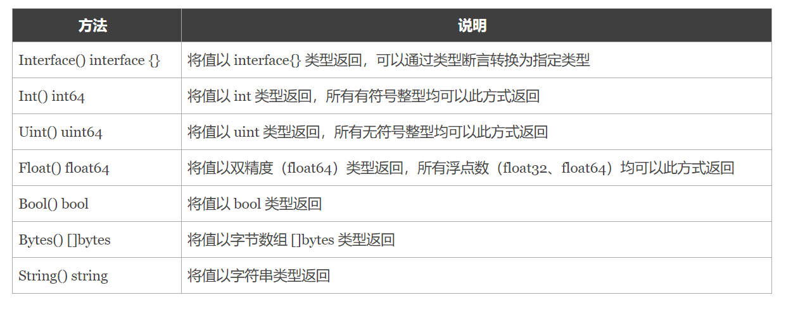

.. contents::
   :depth: 3
..

01.Go语言基础之反射
===================

变量的内在机制
--------------

Go语言中的变量是分为两部分的:

::

   ·类型信息：预先定义好的元信息。
   ·值信息：程序运行过程中可动态变化的。

反射介绍
--------

反射是指在程序运行期对程序本身进行访问和修改的能力。程序在编译时，变量被转换为内存地址，变量名不会被编译器写入到可执行部分。在运行程序时，程序无法获取自身的信息。

支持反射的语言可以在程序编译期将变量的反射信息，如字段名称、类型信息、结构体信息等整合到可执行文件中，并给程序提供接口访问反射信息，这样就可以在程序运行期获取类型的反射信息，并且有能力修改它们。

Go程序在运行期使用reflect包访问程序的反射信息。

reflect包
---------

在Go语言中反射的相关功能由内置的reflect包提供，任意接口值在反射中都可以理解为由\ ``reflect.Type``\ 和\ ``reflect.Value``\ 两部分组成，
并且reflect包提供了\ ``reflect.TypeOf``\ 和\ ``reflect.ValueOf``\ 两个函数来获取任意对象的Value和Type。

TypeOf
------

在Go语言中，使用\ ``reflect.TypeOf()``\ 函数可以获得任意值的类型对象（reflect.Type），
程序通过类型对象可以访问任意值的类型信息。

::

   package main

   import (
       "fmt"
       "reflect"
   )

   func reflectType(x interface{}) {
       v := reflect.TypeOf(x)
       fmt.Printf("type:%v\n", v)
   }

   func main() {
       var a float32 = 3.14
       reflectType(a) //type:float32

       var b int64 = 100
       reflectType(b) //type:int64
   }

type name和type kind
--------------------

在反射中关于类型还划分为两种：\ ``类型（Type）``\ 和\ ``种类（Kind）``\ 。
因为在Go语言中我们可以使用type关键字构造很多自定义类型，而\ ``种类（Kind）``\ 就是指底层的类型，
但在反射中，当需要区分指针、结构体等大品种的类型时，就会用到\ ``种类（Kind）``\ 。
举个例子，我们定义了两个指针类型和两个结构体类型，通过反射查看它们的类型和种类。

::

   package main

   import (
       "fmt"
       "reflect"
   )

   type myInt int64

   func reflectType(x interface{}) {
       t := reflect.TypeOf(x)
       fmt.Printf("type:%v kind:%v\n", t.Name(), t.Kind())
   }

   func main() {
       var a *float32 //指针 
       var b myInt    //自定义类型
       var c rune     // 类型别名
       reflectType(a)      //type: kind:ptr
       reflectType(b)      //type:myInt kind:int64
       reflectType(c)      //type:int32 kind:int32
       type person struct {
           name string
           age int
       }

       type book struct {
           title string
       }

       var d = person{
           name: "沙河小王子",
           age:  18,
       }

       var e = book{title:"《跟小王子学Go语言》"}

       reflectType(d)      //type:person kind:struct
       reflectType(e)      //type:book kind:struct
   }

Go语言的反射中像数组、切片、Map、指针等类型的变量，它们的.Name()都是返回空

ValueOf
-------

``reflect.ValueOf()``\ 返回的是\ ``reflect.Value``\ 类型，其中包含了原始值的值信息。

``reflect.Value``\ 与原始值之间可以互相转换。

``reflect.Value``\ 类型提供的获取原始值的方法如下：

|image0|

通过反射获取值
~~~~~~~~~~~~~~

::

   package main

   import (
       "fmt"
       "reflect"
   )

   func reflectValue(x interface{}) {
       v := reflect.ValueOf(x)
       k := v.Kind()
       switch k {
       case reflect.Int64:
           // v.Int()从反射中获取整型的原始值，然后通过int64()强制类型转换
           fmt.Printf("type is int64, value is %d\n", int64(v.Int()))
       case reflect.Float32:
           // v.Float()从反射中获取浮点型的原始值，然后通过float32()强制类型转换
           fmt.Printf("type is float32, value is %f\n", float32(v.Float()))
       case reflect.Float64:
           // v.Float()从反射中获取浮点型的原始值，然后通过float64()强制类型转换
           fmt.Printf("type is float64, value is %f\n", float64(v.Float()))
       }
   }
   func main() {
       var a float32 = 3.14
       var b int64 = 100
       reflectValue(a) // type is float32, value is 3.140000
       reflectValue(b) // type is int64, value is 100
       // 将int类型的原始值转换为reflect.Value类型
       c := reflect.ValueOf(10)
       fmt.Printf("type c :%T\n", c) // type c :reflect.Value
   }

指针与指针指向的元素
--------------------

::

   package main

   import (
       "fmt"
       "reflect"
   )

   /*
   指针与指针指向的元素，可以通过refect.Elem()方法获取这个指针指向的元素类型。
   这个获取过程被称为取元素，等效于对指针类型变量做了一个“*”操作
   */

   func main() {
       // 声明一个空结构体
       type cat struct {
       }
       // 创建cat的实例
       ins := &cat{}
       //获取结构体实例的反射类型对象
       typeOfCat := reflect.TypeOf(ins)
       // 显示反射类型对象的名称和种类
       fmt.Printf("name:'%v' kind:'%v'\n", typeOfCat.Name(), typeOfCat.Kind())
       //name:'' kind:'ptr'

       // 取类型的元素
       typeOfCat = typeOfCat.Elem()
       // 显示反射类型对象的名称和种类
       fmt.Printf("element name:'%v' element kind:'%v'\n", typeOfCat.Name(), typeOfCat.Kind())
       //element name:'cat' element kind:'struct'

   }

通过反射设置变量的值
--------------------

想要在函数中通过反射修改变量的值，需要注意函数参数传递的是值拷贝，必须传递变量地址才能修改变量值。而反射中使用专有的\ ``Elem()``\ 方法来获取指针对应的值。

::

   package main

   import (
       "fmt"
       "reflect"
   )

   func reflectSetValue1(x interface{}) {
       v := reflect.ValueOf(x)
       if v.Kind() == reflect.Int64 {
           v.SetInt(200) // 修改的是副本，reflect包会引发panic
       }
   }

   func reflectSetValue2(x interface{}) {
       v := reflect.ValueOf(x)
       // 反射中使用Elem()方法获取指针对应的值
       if v.Elem().Kind() == reflect.Int64 {
           v.Elem().SetInt(200)
       }
   }

   func main() {
       var a int64 = 100
       //reflectSetValue1(a)       //panic: reflect: reflect.flag.mustBeAssignable using unaddressable value
       reflectSetValue2(&a)
       fmt.Println(a) //200
   }

值可修改条件之一：可被寻址
--------------------------

通过反射修改变量值的前提条件之一：\ ``这个值必须可以被寻址``\ 。简单地说就是这个变量必须能被修改。

示例代码如下：

::

   package main

   import (
       "fmt"
       "reflect"
   )

   func main() {
       // 声明整型变量a并赋初值
       var a int = 1024
       // 获取变量a的反射值对象(a的地址)
       valueofA := reflect.ValueOf(&a)
       
       // 取出a地址的元素(a的值)
       valueofA = valueofA.Elem()
       // 修改a的值为1
       valueofA.SetInt(1)
       // 打印a的值
       fmt.Print(valueofA.Int())
       
   }

