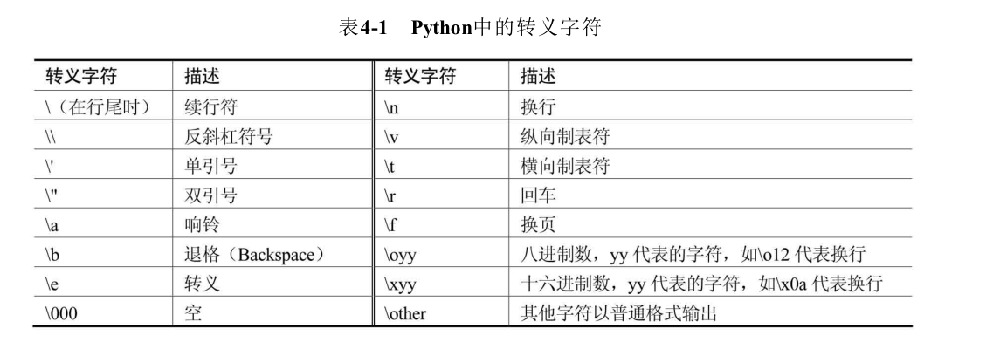

.. contents::
   :depth: 3
..

字符串数据类型
==============

标准的字符转义码
----------------

|image0|

字符串内建方法
--------------

::

   str='人生苦短'print(len(str.encode()))  #utf8每个中文占3个字节12print(len(str.encode("gbk")))   #gbk每个中文占2个字节8
   string.expandtabs(tabsize=8)                  # tab符号转为空格 #默认8个空格
   string.endswith(obj,beg=0,end=len(staring))   # 检测字符串是否已obj结束,如果是返回True #如果beg或end指定检测范围是否已obj结束
   string.count(str,beg=0,end=len(string))       # 检测str在string里出现次数  f.count('\n',0,len(f)) 判断文件行数
   string.find(str,beg=0,end=len(string))        # 检测str是否包含在string中
   string.index(str,beg=0,end=len(string))       # 检测str不在string中,会报异常
   string.isalnum()                              # 如果string至少有一个字符并且所有字符都是字母或数字则返回True
   string.isalpha()                              # 如果string至少有一个字符并且所有字符都是字母则返回True
   string.isnumeric()                            # 如果string只包含数字字符,则返回True
   string.isspace()                              # 如果string包含空格则返回True string.capitalize()                           #首字母小写转化为大写
   string.isupper()                              # 字符串都是大写返回True
   string.islower()                              # 字符串都是小写返回True
   string.lower()                                # 转换字符串中所有大写为小写
   string.upper()                                # 转换字符串中所有小写为大写
   string.strip()                                       #用于移除字符串头尾指定的字符（默认为空格）
   string.lstrip()                               # 去掉string左边的空格
   string.rstrip()                               # 去掉string字符末尾的空格
   string.replace(str1,str2,num=string.count(str1))  # 把string中的str1替换成str2,如果num指定,则替换不超过num次
   string.startswith(obj,beg=0,end=len(string))  # 检测字符串是否以obj开头
   string.zfill(width)                           # 返回字符长度为width的字符,原字符串右对齐,前面填充0
   string.isdigit()                              # 只包含数字返回True
   string.split("分隔符")                        # 把string切片成一个列表
   ":".join(string.split())                      # 以:作为分隔符,将所有元素合并为一个新的字符
   string.swapcase()                                  #方法用于对字符串的大小写字母进行转换，将字符串中大写转换为小写、小写转换为大写。

操作字符串示例
~~~~~~~~~~~~~~

::

   #!/usr/bin/env python
   # -*- coding:utf8 -*-
   # auther; 18793
   # Date：2020/3/13 10:51
   # filename: string01.py

   mystr = 'Beautiful is better than ugly.'
   print('source string is:', mystr)
   print('swapcase demo\t', mystr.swapcase())
   print('upper demo\t', mystr.upper())
   print('lower demo\t', mystr.lower())
   print('title demo\t', mystr.title())
   print('istitle demo\t', mystr.istitle())
   print('islower demo\t', mystr.islower())
   print('capitalize demo\t', mystr.capitalize())
   print('find demo\t', mystr.find('u'))
   print('count demo\t', mystr.count('a'))
   print('split demo\t', mystr.split(' '))
   print('join demo\t', ' '.join('abcde'))
   print('len demo\t', len(mystr))

代码示例：
~~~~~~~~~~

::

   #!/usr/bin/env python
   #-*- coding:utf8 -*-
   "abc"
   "123abc"
   "abc12*"
   "大家"

   str2='''
   This is function
   Return a tuple
   '''
   print(str2)

   print("aaa\nbbb")  #换行符
   print("制表符\t制表符*2") #制表符
   print("print \r")
   print("\\显示\\")
   print("单引号\'")
   print('双引号\"')

   print("字符串运算".center(100,"#"))
   print("aaa" + "bbbb")
   print("aaa"*3)

   print("字符串处理函数".center(100,'#'))
   str3 = "beautiful is batter ugly"
   print("source string is ",str3)
   print("字符串大小写互换\n",str3.swapcase())
   print("字符串转大写\n",str3.upper())
   print("字符串转小写\n",str3.lower())
   print("字符串首字母大写\n",str3.title())
   print("字符串首字母是否大写\n",str3.istitle())
   print("字符串首字母是否小写\n",str3.islower())
   print("字符串的第一个字母大写\n",str3.capitalize())
   print("获得字符串字母u的下标\n",str3.find("u"))
   print("获得字符串中某一个字母的数量\n",str3.count("u"))
   print("将字符串转换为列表，以空格分割\n",str3.split(" "))
   print("以空格拼接字符串")
   print(" ".join("abcd"))
   print("计算字符串的长度\n",len(str3))

字符串的拼接
------------

::

   bottles=99

   base=''

   base +="hujianli staduy python3.6 "

   base +=str(bottles)

   base
   'hujianli staduy python3.699'

   "hujianli" + " recover" + " 学习python3.6"
   'hujianli recover 学习python3.6'

将其他类型数据转为字符串
------------------------

::

   #!/usr/bin/env python
   # -*- coding:utf8 -*-
   # auther; 18793
   # Date：2020/3/3 11:56
   # filename: 字符串操作.py

   x = 42
   y = 18

   # 使用str()、repr()或format()函数可以将非字符串值转换为字符串表示形式
   s1 = "This value of x is " + str(x)
   s2 = "This value of x is " + repr(x)
   s3 = "This value of x is " + format(x, "4d")
   print(s1)
   print(s2)
   print(s3)
   """
   This value of x is 42
   This value of x is 42
   This value of x is   42
   """

   str()创建普通的字符串。
   repr()函数通常会创建一个表达式字符串，可以使用evel()对它求值以重新创建对象。

使用反斜线进行转义
~~~~~~~~~~~~~~~~~~

::

   speen = "today we honor our friend, the backslash :\\."

   print(speen)
   today we honor our friend, the backslash :\.

字符串格式化(%和format的使用)
-----------------------------

::

   #!/usr/bin/env python
   #-*- coding:utf8 -*-
   print("I am %s stduy %s" %("hujianli","python"))
   print("I am {0} stduy {1}".format("hujianli","python") )
   str = "I am {0} stduy {1}"
   name = ("hujianli","python")
   print(str.format(*name))

   print("%d + %d = %d" % (2,3,2+3))
   print("%d + %d = %d" % (3,7,3+7))

   print(" 分割线 ".center(100,"*"))

   template = '编号:%09d\t 公司名称：%s \t 官网 ：http://www.%s.com'
   arg1 = (7, "xxx方", "futong")
   print(template%arg1)

   template2 = "编号:{:0>9s}\t公司名称：{:s} \t 官网:http://www.{:s}.com "
   context1 = template2.format("7", "百度", "baidu")
   print(context1)

   print("".center(100, "*"))

打印浮点数
----------

::

   number = 123
   print("%f" % number)
   print("%.2f" % number)
   print("%.4f" % number)
   print()

   print("{:.2f}".format(number))
   print("{:+.2f}".format(number))

   print("圆周率PI 的值为：%.2f" % 3.14)
   print("圆周率PI 的值为：%10f" % 3.141593)  #字段宽度为10
   print("保留2位小数，圆周率PI 的值为：%10.2f" % 3.141593)  #字段宽度为10，字符串占据4个
   print("保留2位小数， 圆周率PI的值为：%.2f" % 3.141593)   #输出，没有字段宽度参数
   print("字符串精度获取：%.5s " % ('hello world'))    #打印字符串前5个字符

format格式化字符串
~~~~~~~~~~~~~~~~~~

一对一填充
^^^^^^^^^^

::

   print('我正在学习:{}'.format('python基础知识'))

多对多填充
^^^^^^^^^^

.. code:: python

   print("我正在学习：{}中的{}".format("python数据分析","python基础知识"))

浮点数设置
^^^^^^^^^^

.2f表示以浮点型展示，且显示小数点后两位，也可以是.3f或者其他
''''''''''''''''''''''''''''''''''''''''''''''''''''''''''''

.. code:: python

   print("{}约{:.2f}亿".format("2018年中国单身人数",2))

百分数设置
^^^^^^^^^^

.2%表示以百分比的形式展示，且展示小数点后两位，也可以是.3%或者其他。
''''''''''''''''''''''''''''''''''''''''''''''''''''''''''''''''''''

.. code:: python

   print("中国男性占总人口的比例:{:.2%}".format(0.519))

指定占位符宽度
~~~~~~~~~~~~~~

::

   print("".center(100, "*"))
   number = "ABCDE"
   print("%6s" % number)
   print("%06s" % number)
   print("%8s" % number)

字符串的修改和替换
------------------

.. _代码示例-1:

代码示例
~~~~~~~~

::

   #!/usr/bin/env python
   #-*- coding:utf8 -*-
   s = 'spammy'
   S = s[:3] + 'xx' + s[5:]
   print(S)

   print(s.replace('mm','xx'))

   hu = 'aa$bb$cc$dd'.replace('$', 'SPAM')
   print(hu)

   S = 'xxxxSPAMxxxxSPAMxxxx'

   where = S.find("SPAM")
   S = S[:where] + 'EGGS' + S[(where+4):]
   print(S)

   S = 'xxxxSPAMxxxxSPAMxxxx'
   print(S.replace("SPAM","EGGS",1))

字符串格式化输出
~~~~~~~~~~~~~~~~

.. _代码示例-2:

代码示例
^^^^^^^^

::

   #!/usr/bin/env python
   #-*- coding:utf8 -*-
   print("I am %s stduy %s" %("hujianli","python"))
   print("I am {0} stduy {1}".format("hujianli","python") )
   str = "I am {0} stduy {1}"
   name = ("hujianli","python")
   print(str.format(*name))

   print("%d + %d = %d" % (2,3,2+3))
   print("%d + %d = %d" % (3,7,3+7))

   print(" 分割线 ".center(100,"*"))

   template = '编号:%09d\t 公司名称：%s \t 官网 ：http://www.%s.com'
   arg1 = (7, "xxx方", "futong")
   print(template%arg1)

   template2 = "编号:{:0>9s}\t公司名称：{:s} \t 官网:http://www.{:s}.com "
   context1 = template2.format("7", "百度", "baidu")
   print(context1)

::

   占位符 说明
   %s  字符串(采用str()的显示)
   %r  字符串(采用repr()的显示)
   %c  单个字符
   %b  二进制整数
   %d  十进制整数
   %i  十进制整数
   %o  八进制整数
   %x  十六进制整数
   %e  指数 (基底写为e)
   %E  指数 (基底写为E)
   %f  浮点数
   %F  浮点数，与上相同
   %g  指数(e)或浮点数 (根据显示长度)
   %G  指数(E)或浮点数 (根据显示长度)

   print("hello,%s" % "world")
   print('小智今年 %s 岁了' % 18)

   print('小智今年 %s 岁了' % 19)
   print('小智今年 %d 岁了' % 20)

   print("圆周率PI 的值为 %.2f" % 3.14)

   # 输出类似1.23%这样的结果
   print("小智的识别能力比去年提高了:%.2f" % 1.25+"%")

   print("小智的识别能力比去年提高了:%.2f%%" % 1.26 )
   # 输出百分号
   print("输出百分号:%s" % "%")

   # 字符串格式化元组
   print("今年是%s年，奥运会第%s，中国获得%d枚金牌" % ('2016', '10', 20))

   # 宽度和精度
   print("圆周率PI 的值为：%10f" % 3.1415926)
   print("保留2位小数，圆周率PI 的值为：%10.2f " % 3.1415926)
   print("字符串精度获取：%.5s" % ("hello world") )

   print ('从元组中获取字符串精度：%*.*s' % (10,5,'hello world'))
   print ('从元组中获取字符串精度：%.*s' % (5, 'hello world'))

   #符号、对齐和0填充
   print ('圆周率PI 的值为：%010.2f' % 3.141593)

   #减号（-）用来左对齐数值
   print ('圆周率PI 的值为：%10.2f' % 3.14)
   print ('圆周率PI 的值为：%-10.2f' % 3.14)

   # 加号（+）表示无论是正数还是负数都表示出符号
   print(('宽度前加加号：%+5d'%10)+'\n'+('宽度前加加号：%+5d'%-10))

|image1|

示例
^^^^

::

   In [2]: print("Suzhou is more than %d years. %s lives in here." % (2500, "qiwsir"))
   Suzhou is more than 2500 years. qiwsir lives in here.

::

   python非常提倡的string.format()的格式化方法，其中{索引值}作为占位符

|image2|

::

   In [3]: print("my name is {name}, age is {age}".format(name="hujianli",age="22"))
   my name is hujianli, age is 22

   In [3]: print("my name is {name}, age is {age}".format(name="hujianli",age="22"))
   my name is hujianli, age is 22

   In [6]: str="my name is {0}"
   In [7]: str.format("hu")
   Out[7]: 'my name is hu'

   #字典格式化
   In [8]: lang = "python"
   In [10]: print("I LOVE %(program)s" % {'program':lang})
   I LOVE python

   In [1]: '{0:!^20s}'.format('BIG SALE')
   Out[1]: '!!!!!!BIG SALE!!!!!!'

::

   text = "hello world"
   print(text.ljust(20))

   print(text.rjust(20))

   print(text.center(20))
   print()
   print("增加填充字段")
   print()
   print(text.rjust(20, "-"))
   print(text.ljust(20, "-"))
   print(text.center(20, "-"))
   print()
   print("format的使用")
   print()
   print(format(text, ">20"))
   print(format(text, "<20"))
   print(format(text, "^20"))

   print(format(text, "*>20"))
   print(format(text, "*<20"))
   print(format(text, "*^20"))

   print()
   print("格式化多个值")
   print()
   print("{:>10s} {:>10s}".format("hello", "world"))

   x = 1.2345
   print(format(x, ">10"))
   print(format(x, "^10.2f"))

   # 使用%进行格式化，较老的格式，不常用
   print("%-20s" % text)
   print("%20s" % text)

   template = "编号， %09d \t公司名称：%s \t官网： http://www.%s.com"     # 定义模板

   print()
   context1 = (7, "百度", "baidu")
   context2 = (9, "百度2", "baidu2")
   print(template % context1)
   print(template % context2)

   print()

   template2 = "编号：{:0>9s}\t公司名称: {:s}\t 官网: http://www.{:s}.com"  # 定义模板
   context01 = template2.format("7", "百度3", "baidu3")
   context02 = template2.format("8", "百度4", "baidu4")
   print(context01)
   print(context02)

字符串的反转
------------

::

   def reverse(s):
       out = ""
       li = list(s)
       for i in range(len(li), 0, -1):
           out += "".join(li[i - 1])
       return out

   print(reverse("胡建力啊啊啊啊哈哈哈哈哈"))

``使用列表的反转，更简单，如下``

::

   def reverse2(s):
       li = list(s)
       li.reverse()
       s = "".join(li)
       return s

   print(reverse2("胡建力啊啊啊啊哈哈哈哈哈"))

``一行代码实现字符串的反转``

::

   def reverse3(s):
       return s[::-1]

   # 或者

   # 使用lambda来实现
   lambda_str = lambda s: s[::-1]
   print(lambda_str("hujianlishuaige"))

字符串操作技巧
--------------

::

   ##不推荐
   colors = ['red', 'blue', 'green', 'yellow']
   result = ''
   for s in colors:
     result += s # 每次赋值都丢弃以前的字符串对象, 生成一个新对象 
     
   ##推荐
   colors = ['red', 'blue', 'green', 'yellow']
   result = ''.join(colors) # 没有额外的内存分配

字符串切片
----------

::

   #!/usr/bin/python3
   str1 = 'Hello Python!'
   str2 = "Object Oriented Programming"
   print("str1[0]: ", str1[0])  # str1[0]:  H
   print("str2[1:5]: ", str2[1:5])  # str2[1:5]:  bjec

字符串拼接
----------

::

   #!/usr/bin/python3
   str1 = 'Hello Python!'
   print("Original String: - ", str1)  # Original String: -  Hello Python!
   print ("Updated String: - ", str1 [:6] + 'John')    # Updated String: -  Hello John

文本输入的变量插入.
-------------------

::

   #!/usr/bin/env python
   # -*- coding:utf8 -*-
   # auther; 18793
   # Date：2020/3/3 17:32
   # filename: 文本输入的变量插入.py

   form = """\
   Dear %(name)s,
   Please send back my %(item)s or pay me $%(amount)0.2f,
   Sincerely yours,
   Joe Python User 
   """ % {
       'name': 'hujianli',
       'item': 'blender',
       'amount': 50.00,
   }

   print(form)

   form = """\
   Dear %(name)s,
   Please send back my %(item)s or pay me $%(amount)0.2f,
   Sincerely yours,
   Joe Python User 
   """ % {
       'name': 'hujianli',
       'item': 'blender',
       'amount': 50.00,
   }

   form2 = """\
   Dear {name},
   Please send back my {item} or pay me ${amount:0.2f},
   Sincerely yours,
   Joe Python User 
   """.format(name="xiaojian", item="python", amount=60.00)

   print(form2)

   import string

   form3 = string.Template("""\
   Dear $name,
   Please send back my $item or pay me $amount,
   Sincerely yours,
   Joe Python User 
   """)

   info2 = form3.substitute({'name': 'huxiaojian',
                     'item': 'blener',
                     'amount': "$%0.2f" % 1000.0})
   print(info2)

.. |image1| image:: ../../_static/string1.png
.. |image2| image:: ../../_static/format.png
