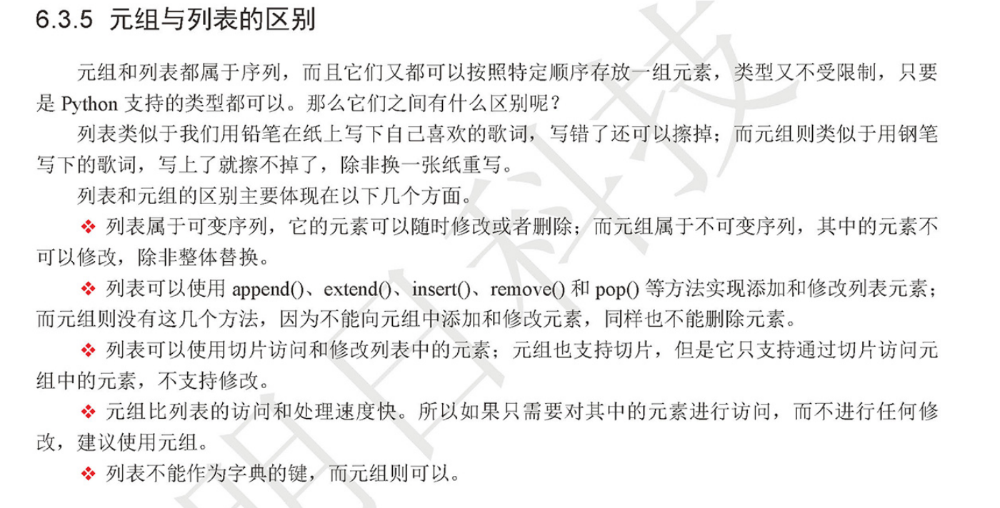

# 元祖 Tuple
tuple()函数创建一个空元祖


#### 代码示例

```
# 和列表操作很类似，但不可变
zoo = ('wolf', 'elephant', 'penguin')


# 元祖的小括号并不是必须的，只要将一组数用逗号分隔开来，python就可以认为它是元祖。
In [1]: tmp="aa","bb","cc"

In [2]: type(tmp)
Out[2]: tuple


# 元祖使用+号可以组合，类似列表
#!/usr/bin/env python
#-*- coding:utf8 -*-
# auther; 18793
# Date：2019/4/15 20:09
# filename: 元祖.py
play1=("梅西","C罗","卡卡西","胡歌")
print("原始的元祖：{}".format(play1))
play2=play1+("胡建力","小贱","胡小健")
print("组合后的元祖：{}".format(play2))

# 在元祖添加时，若只有1个元祖，需要在后面加上逗号
play3= play2+("路飞",)
print("添加元祖，当只有一个元素时，需要在后面加上逗号:{}".format(play3))

```


### 元祖特性
```
不可变序列
（不能添加、修改和删除元素，可以整体替换）

支持切片的操作
（只能访问元祖中的元素）

元祖访问速度快

元祖可以作为字典的键
```
### 元祖一口气赋值(解包)
``` 
In [25]: marx_tuple = ("hu","jian","li")

In [27]: a,b,c = marx_tuple

In [28]: a
Out[28]: 'hu'

In [29]: b
Out[29]: 'jian'

In [30]: c
Out[30]: 'li'

可以利用元组在一条语句中对多个变量的值进行交换，而不需要借助临时变量
```


## 元祖
元组（tup）虽然与列表类似，但也有不同之处，元组的元素不能修改；元组使用小括号，而列表使用中括号。


### zip()函数


```python
list_a = [1,2,3,4]
```


```python
list_b = ["a","b","c","d","e"]
```


```python
for i in zip(list_a,list_b):
    print(i)
```

    (1, 'a')
    (2, 'b')
    (3, 'c')
    (4, 'd')
    


```python
list_a = ["hu1","hu2","hu3","hu4"]
```


```python
list_b = ("python1","python2","python3")
```


```python
for i in zip(list_a,list_b):
    print(i)
```

    ('hu1', 'python1')
    ('hu2', 'python2')
    ('hu3', 'python3')
    


### 列表和元祖的区别

```
可变序列
(随时可以添加修改或者删除)

支持切片操作
（可以访问、修改列表总的元素）

列表访问速度慢

不能作为字典的键
```


