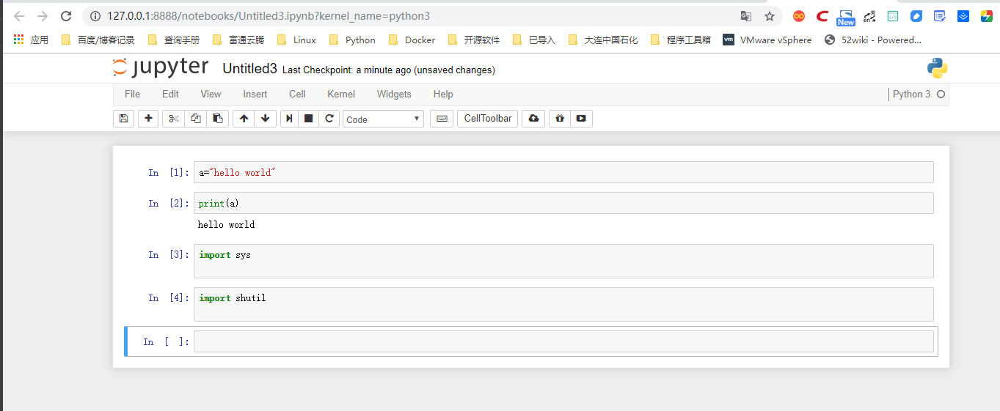
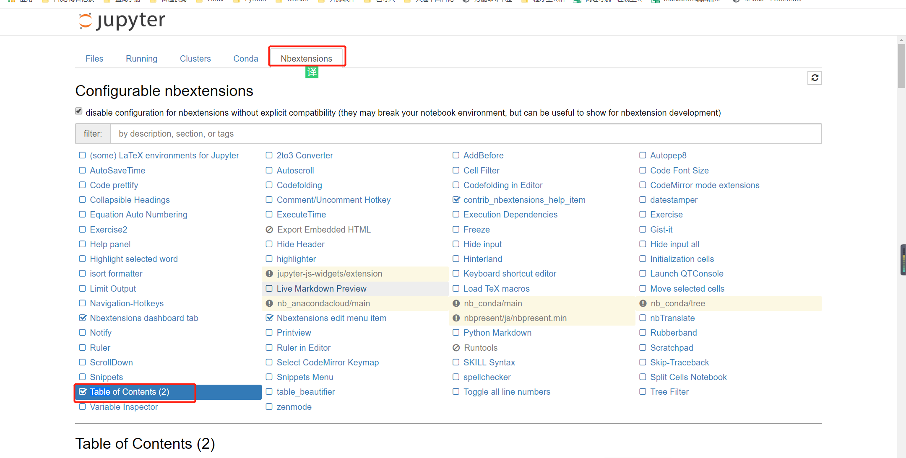
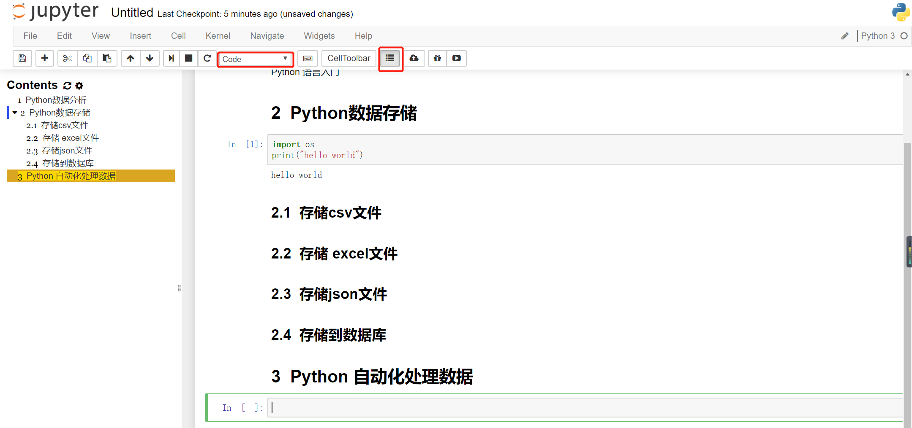

# Python常用IDE集成环境

## 安装pip

``` 
#linux上安装pip方法：
curl https://bootstrap.pypa.io/get-pip.py -o get-pip.py 
或
curl https://bootstrap.pypa.io/get-pip.py | python

yum install python-pip            # centos安装pip
sudo apt-get install python-pip python-dev   # ubuntu安装pip


#pip官方安装脚本
wget https://raw.github.com/pypa/pip/master/contrib/get-pip.py
python get-pip.py


#pip编译安装

# https://pypi.python.org/pypi/setuptools
wget http://pypi.python.org/packages/source/s/setuptools/setuptools-0.6c11.tar.gz
tar zxvf setuptools-0.6c11.tar.gz
cd setuptools-0.6c11
python setup.py install

# https://pypi.python.org/pypi/ez_setup
tar zxvf ez_setup.tar.gz
cd ez_setup/
python setup.py build
python setup.py install
# https://pypi.python.org/pypi/pip
tar zxvf pip.tar.gz
cd pip/
python setup.py build
python setup.py install


#编译安装
wget https://pypi.python.org/packages/79/63/b671fc2bf0051739e87a7478a207bbeb45cfae3c328d38ccdd063d9e0074/ipython-6.1.0.tar.gz
tar	zxvf ipython-6.1.0.tar.gz
cd ipython-6.1.0
python3 setup.py install

    
加载环境变量
vim /etc/profile
'''在适当位置添加 PATH=$PATH:/etc/apache/bin (注意：= 即等号两边不能有任何空格) 

这种方法最好,除非你手动强制修改PATH的值,否则将不会被改变 '''
export PATH=/usr/local/python27/bin:$PATH
. /etc/profile

pip install -U pip 				    #升级pip包
pip search flask 				    #查找安装包
pip install flask==0.8			    #安装特定的安装包版本
pip uninstall Werkzeug			    #删除安装包
pip show flask					    #查看安装包信息
pip freeze                          # 查看包版本
pip install Package                 # 安装包 pip install requests
pip show --files Package            # 查看安装包时安装了哪些文件
pip show --files Package            # 查看哪些包有更新
pip install --upgrade Package       # 更新一个软件包
pip uninstall Package               # 卸载软件包
pip list                            # 查看pip安装的包及版本
pip install django==1.5             # 指定版本安装
pip install django==1.5             # 指定版本安装
pip check flask					     # 检查安装包是否完整
pip list						     # 查看已安装的安装包列表
pip freeze > requirements.txt   	 # 导出系统已安装包列表到requirements.txt文件
pip install -r requirements.txt 	 # 从requirements.txt文件安装


pip completion --bash >> ~/.profile
source ~/.profile   					 # 使用pip命令补全


pip install -i https://pypi.doubanio.com/simple/ --trusted-host pypi.doutsnio.com pyqt5  #使用国内豆瓣源加速安装三方库
pip install -U wxpy -i "https://pypi.doubanio.com/simple/"		    #使用国内的pip源安装wxpy


使用豆瓣或阿里云的源加速软件安装
pip install -i https://pypi.douban.com/simple/ flask


pip install --download='pwd' -r requirements.txt 	#将软件下载到本地部署
pip install --no-index -f file://'pwd' -r requirements.txt		#本地安装

pip install --download='pwd' flask

Linux中修改pip的配置文件：
vim ~/.pip/pip.conf 
[global]
index-url = https://pypi.doubanio.com/simple/ 


pip的优点有：
· pip提供了丰富的功能，其竞争对手easy_install 则只支持安装，没有提供卸载和显示已安装列表的功能。
· pip能够很好地支持虚拟环境；
· pip可以通过requirements.txt集中管理依赖；
· pip 能够处理二进制格式(.whl);
· pip是先下载后安装，如果安装失败，也会清理干净，不会留下一个中间状态。

```

## Python开发之Python离线安装项目所需所有pip包

参考资料

https://shazhenyu.blog.csdn.net/article/details/84943889

## 安装ipython

``` 
pip install ipython


# 更好的获取帮助信息
In [14]: ?os.path.is*
os.path.isabs
os.path.isdir
os.path.isfile
os.path.islink
os.path.ismount

```


## 下载安装第三方库一般有以下几种方法

- (1) pip进行安装，命令如下：
```    
pip install libname  
# libname是要下载安装的第三方库的名称，它会自动下载和安装其依赖的第三方库。

卸载库文件
pip uninstall libname

检查第三方库是否正确安装
[root@pxe-server ~]# python
Python 2.7.5 (default, Oct 30 2018, 23:45:53) 
[GCC 4.8.5 20150623 (Red Hat 4.8.5-36)] on linux2
Type "help", "copyright", "credits" or "license" for more information.
>>> import paramiko
>>> 

```

``` 
[root@pxe-server ~]# python -c "import paramiko"

[root@k8s-master ~]# python -c "import sys"
```
### 设置pip timeout超时时间


创建或修改pip.conf配置文件：
``` 
$ sudo vi ~/.pip/pip.config //linux or MacOS
 
timeout = 6000    #设置pip超时时间
```


使用国内镜像
``` 
使用镜像来替代原来的官网，方法如下：（推荐这种方法）

1. pip install redis -i https://pypi.douban.com/simple
-i：指定镜像地址
　
2.配置好环境变量后cmd输入
python -m pip --default-timeout=100 install 库名称 -i http://pypi.douban.com/simple/ --trusted-host pypi.douban.com

3.python.exe改名版
python3 -m pip --default-timeout=100 install 库名称 -i http://pypi.douban.com/simple/ --trusted-host pypi.douban.com
```

```
2. 创建或修改pip.conf配置文件指定镜像地址：
[global]
timeout = 6000
index-url = http://pypi.douban.com/simple/ 
[install]
use-mirrors = true
mirrors = http://pypi.douban.com/simple/ 
trusted-host = pypi.douban.com
```


- (2) Installing from PyPI using easy_install:
```
$ easy_install watchdog
```


- (3) 源码安装

自行下载第三方库的压缩包并解压缩，然后在命令提示符下或终端下进入目录输入：
```        
python setup.py install
```

如果在系统上同时安装了python2和python3.为python3.x安装第三方库时应适应命令为：
```        
python3 setup.py install
```
在Linux环境下，使用安装命令前必须要加sudo，或者先su进入可以安装软件的用户权限中才可以安装。


## 常用三方库的网站
```
https://pypi.python.org
还可以在此网站中搜索想要的第三方库。也可以通过搜索引擎来搜索相关的第三方库来下载安装。

或者从网络上下载安装包，在浏览器中输入安装包的下载地址https://www.lfd.uci.edu/～gohlke/pythonlibs/，找到与系统相对应的模块信息


https://pypi.org/
下载pyC8-0.14.4-py2.py3-none-any.whl类型文件，然后

pip install pyC8-0.14.4-py2.py3-none-any.whl
```


​    
​    
## jupyter的使用
``` 
# pip安装jupyter
C:\Users\18793>pip install jupyter
Requirement already satisfied: jupyter in c:\users\18793\anaconda3\lib\site-packages (1.0.0)
```

开启jupyter
``` 
C:\Users\18793>jupyter notebook --no-browser --ip=0.0.0.0

[E 17:11:22.817 NotebookApp] [nb_conda_kernels] couldn't call conda:
    Command '['conda', 'info', '--json']' returned non-zero exit status 1
[I 17:11:22.818 NotebookApp] [nb_conda_kernels] enabled, 0 kernels found
[I 17:11:23.367 NotebookApp] [nb_anacondacloud] enabled
[I 17:11:23.463 NotebookApp] \u2713 nbpresent HTML export ENABLED
[W 17:11:23.463 NotebookApp] \u2717 nbpresent PDF export DISABLED: No module named 'nbbrowserpdf'
[I 17:11:23.470 NotebookApp] [nb_conda] enabled
[I 17:11:23.714 NotebookApp] Serving notebooks from local directory: C:\Users\18793
[I 17:11:23.714 NotebookApp] 0 active kernels
[I 17:11:23.715 NotebookApp] The Jupyter Notebook is running at: http://0.0.0.0:8888/
[I 17:11:23.715 NotebookApp] Use Control-C to stop this server and shut down all kernels (twice to skip confirmation).

# 可以通过设置--no-browser和--ip=0.0.0.0 进行外部访问。如果不指定ip，默认IP是localhost，也就是只有本地
才能访问。

```



#### 为Jupyter Notebook添加目录
①：
在Windows搜索框中输入Anaconda Prompt并单击打开.


②：

`输入 pip install jupyter_contrib_nbextensions `
然后按 Enter 键运行，安装jupyter_contrib_nbextensions模块

③：

`继续输入jupyter contrib nbextension install --user`
然后按Enter键进行用户配置

④：
打开Jupyter Notebook会看到界面上多了Nbextensions选项卡
单击Nbextensions选项卡打开，`勾选Table of Contents(2)复选框`


这个时候打开一个已经带有目录的ipynb文件，就会看到主界面多了一个方框内的按钮（如下图所示），但是仍然没有目录
按下图右上角方框内的按钮，目录就会显示出来了，如下图所示。


⑤：
为Jupyter Notebook创建了目录环境，下面介绍如何新建带有目录的文件

```
直接在代码框输入不同级别的标题，
1个#表示一级标题，2个#表示二级标题，3个#表示三级标题（注意，#与标题文字之间是有空格的），
标题级别随着#数量的增加依次递减。
```


## 安装Anaconda
`Anaconda是一个集成的python环境，自带很多python三方库`

下载地址：
``` 
进入官网（https://www.anaconda.com），单击右上角的Download按钮
根据电脑系统类型（Windows/macOS/Linux）选择对应的软件类型

建议百度云下载，因为Anacoda官网是国外地址，下载较慢
```

## 使用较多的IDE
``` 
IDLE是IDE中的一种，也是最简单、最基础的一种IDE。当然了，IDE中有很多种IDLE，例如Visual Studio（VS）、PyCharm、Xcode、Spyder、Jupyter Notebook等
```


​    
​    
​    
​    
​    
​    
​    
​    
​    
