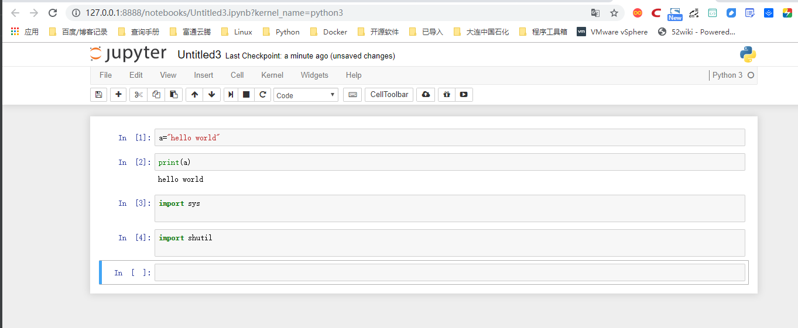

.. contents::
   :depth: 3
..

Python常用IDE集成环境
=====================

安装pip
-------

::

   #linux上安装pip方法：
   curl https://bootstrap.pypa.io/get-pip.py -o get-pip.py 
   或
   curl https://bootstrap.pypa.io/get-pip.py | python

   yum install python-pip            # centos安装pip
   sudo apt-get install python-pip python-dev   # ubuntu安装pip

   #pip官方安装脚本
   wget https://raw.github.com/pypa/pip/master/contrib/get-pip.py
   python get-pip.py

   #pip编译安装

   # https://pypi.python.org/pypi/setuptools
   wget http://pypi.python.org/packages/source/s/setuptools/setuptools-0.6c11.tar.gz
   tar zxvf setuptools-0.6c11.tar.gz
   cd setuptools-0.6c11
   python setup.py install

   # https://pypi.python.org/pypi/ez_setup
   tar zxvf ez_setup.tar.gz
   cd ez_setup/
   python setup.py build
   python setup.py install
   # https://pypi.python.org/pypi/pip
   tar zxvf pip.tar.gz
   cd pip/
   python setup.py build
   python setup.py install

   #编译安装
   wget https://pypi.python.org/packages/79/63/b671fc2bf0051739e87a7478a207bbeb45cfae3c328d38ccdd063d9e0074/ipython-6.1.0.tar.gz
   tar zxvf ipython-6.1.0.tar.gz
   cd ipython-6.1.0
   python3 setup.py install

       
   加载环境变量
   vim /etc/profile
   '''在适当位置添加 PATH=$PATH:/etc/apache/bin (注意：= 即等号两边不能有任何空格) 

   这种方法最好,除非你手动强制修改PATH的值,否则将不会被改变 '''
   export PATH=/usr/local/python27/bin:$PATH
   . /etc/profile

   pip install -U pip                  #升级pip包
   pip search flask                    #查找安装包
   pip install flask==0.8              #安装特定的安装包版本
   pip uninstall Werkzeug              #删除安装包
   pip show flask                      #查看安装包信息
   pip freeze                          # 查看包版本
   pip install Package                 # 安装包 pip install requests
   pip show --files Package            # 查看安装包时安装了哪些文件
   pip show --files Package            # 查看哪些包有更新
   pip install --upgrade Package       # 更新一个软件包
   pip uninstall Package               # 卸载软件包
   pip list                            # 查看pip安装的包及版本
   pip install django==1.5             # 指定版本安装
   pip install django==1.5             # 指定版本安装
   pip check flask                      # 检查安装包是否完整
   pip list                             # 查看已安装的安装包列表
   pip freeze > requirements.txt        # 导出系统已安装包列表到requirements.txt文件
   pip install -r requirements.txt      # 从requirements.txt文件安装

   pip completion --bash >> ~/.profile
   source ~/.profile                        # 使用pip命令补全

   pip install -i https://pypi.doubanio.com/simple/ --trusted-host pypi.doutsnio.com pyqt5  #使用国内豆瓣源加速安装三方库
   pip install -U wxpy -i "https://pypi.doubanio.com/simple/"          #使用国内的pip源安装wxpy

   使用豆瓣或阿里云的源加速软件安装
   pip install -i https://pypi.douban.com/simple/ flask

   pip install --download='pwd' -r requirements.txt    #将软件下载到本地部署
   pip install --no-index -f file://'pwd' -r requirements.txt      #本地安装

   pip install --download='pwd' flask

   Linux中修改pip的配置文件：
   vim ~/.pip/pip.conf 
   [global]
   index-url = https://pypi.doubanio.com/simple/ 

   pip的优点有：
   · pip提供了丰富的功能，其竞争对手easy_install 则只支持安装，没有提供卸载和显示已安装列表的功能。
   · pip能够很好地支持虚拟环境；
   · pip可以通过requirements.txt集中管理依赖；
   · pip 能够处理二进制格式(.whl);
   · pip是先下载后安装，如果安装失败，也会清理干净，不会留下一个中间状态。

Python开发之Python离线安装项目所需所有pip包
-------------------------------------------

参考资料

https://shazhenyu.blog.csdn.net/article/details/84943889

安装ipython
-----------

::

   pip install ipython

   # 更好的获取帮助信息
   In [14]: ?os.path.is*
   os.path.isabs
   os.path.isdir
   os.path.isfile
   os.path.islink
   os.path.ismount

下载安装第三方库一般有以下几种方法
----------------------------------

-  

   (1) pip进行安装，命令如下：

::

   pip install libname  
   # libname是要下载安装的第三方库的名称，它会自动下载和安装其依赖的第三方库。

   卸载库文件
   pip uninstall libname

   检查第三方库是否正确安装
   [root@pxe-server ~]# python
   Python 2.7.5 (default, Oct 30 2018, 23:45:53) 
   [GCC 4.8.5 20150623 (Red Hat 4.8.5-36)] on linux2
   Type "help", "copyright", "credits" or "license" for more information.
   >>> import paramiko
   >>> 

::

   [root@pxe-server ~]# python -c "import paramiko"

   [root@k8s-master ~]# python -c "import sys"

设置pip timeout超时时间
~~~~~~~~~~~~~~~~~~~~~~~

创建或修改pip.conf配置文件：

::

   $ sudo vi ~/.pip/pip.config //linux or MacOS
    
   timeout = 6000    #设置pip超时时间

使用国内镜像

::

   使用镜像来替代原来的官网，方法如下：（推荐这种方法）

   1. pip install redis -i https://pypi.douban.com/simple
   -i：指定镜像地址
   　
   2.配置好环境变量后cmd输入
   python -m pip --default-timeout=100 install 库名称 -i http://pypi.douban.com/simple/ --trusted-host pypi.douban.com

   3.python.exe改名版
   python3 -m pip --default-timeout=100 install 库名称 -i http://pypi.douban.com/simple/ --trusted-host pypi.douban.com

::

   2. 创建或修改pip.conf配置文件指定镜像地址：
   [global]
   timeout = 6000
   index-url = http://pypi.douban.com/simple/ 
   [install]
   use-mirrors = true
   mirrors = http://pypi.douban.com/simple/ 
   trusted-host = pypi.douban.com

-  

   (2) Installing from PyPI using easy_install:

::

   $ easy_install watchdog

-  

   (3) 源码安装

自行下载第三方库的压缩包并解压缩，然后在命令提示符下或终端下进入目录输入：

::

   python setup.py install

如果在系统上同时安装了python2和python3.为python3.x安装第三方库时应适应命令为：

::

   python3 setup.py install

在Linux环境下，使用安装命令前必须要加sudo，或者先su进入可以安装软件的用户权限中才可以安装。

常用三方库的网站
----------------

::

   https://pypi.python.org
   还可以在此网站中搜索想要的第三方库。也可以通过搜索引擎来搜索相关的第三方库来下载安装。

   或者从网络上下载安装包，在浏览器中输入安装包的下载地址https://www.lfd.uci.edu/～gohlke/pythonlibs/，找到与系统相对应的模块信息

   https://pypi.org/
   下载pyC8-0.14.4-py2.py3-none-any.whl类型文件，然后

   pip install pyC8-0.14.4-py2.py3-none-any.whl

| ​
| ​
| ## jupyter的使用

::

   # pip安装jupyter
   C:\Users\18793>pip install jupyter
   Requirement already satisfied: jupyter in c:\users\18793\anaconda3\lib\site-packages (1.0.0)

开启jupyter

::

   C:\Users\18793>jupyter notebook --no-browser --ip=0.0.0.0

   [E 17:11:22.817 NotebookApp] [nb_conda_kernels] couldn't call conda:
       Command '['conda', 'info', '--json']' returned non-zero exit status 1
   [I 17:11:22.818 NotebookApp] [nb_conda_kernels] enabled, 0 kernels found
   [I 17:11:23.367 NotebookApp] [nb_anacondacloud] enabled
   [I 17:11:23.463 NotebookApp] \u2713 nbpresent HTML export ENABLED
   [W 17:11:23.463 NotebookApp] \u2717 nbpresent PDF export DISABLED: No module named 'nbbrowserpdf'
   [I 17:11:23.470 NotebookApp] [nb_conda] enabled
   [I 17:11:23.714 NotebookApp] Serving notebooks from local directory: C:\Users\18793
   [I 17:11:23.714 NotebookApp] 0 active kernels
   [I 17:11:23.715 NotebookApp] The Jupyter Notebook is running at: http://0.0.0.0:8888/
   [I 17:11:23.715 NotebookApp] Use Control-C to stop this server and shut down all kernels (twice to skip confirmation).

   # 可以通过设置--no-browser和--ip=0.0.0.0 进行外部访问。如果不指定ip，默认IP是localhost，也就是只有本地
   才能访问。

|image0|

为Jupyter Notebook添加目录
~~~~~~~~~~~~~~~~~~~~~~~~~~

①： 在Windows搜索框中输入Anaconda Prompt并单击打开. |image1|

②：

``输入 pip install jupyter_contrib_nbextensions`` 然后按 Enter
键运行，安装jupyter_contrib_nbextensions模块

③：

``继续输入jupyter contrib nbextension install --user``
然后按Enter键进行用户配置

④： 打开Jupyter Notebook会看到界面上多了Nbextensions选项卡
单击Nbextensions选项卡打开，\ ``勾选Table of Contents(2)复选框``
|image2|

这个时候打开一个已经带有目录的ipynb文件，就会看到主界面多了一个方框内的按钮（如下图所示），但是仍然没有目录
按下图右上角方框内的按钮，目录就会显示出来了，如下图所示。 |image3|

⑤： 为Jupyter Notebook创建了目录环境，下面介绍如何新建带有目录的文件

::

   直接在代码框输入不同级别的标题，
   1个#表示一级标题，2个#表示二级标题，3个#表示三级标题（注意，#与标题文字之间是有空格的），
   标题级别随着#数量的增加依次递减。

|image4|

安装Anaconda
------------

``Anaconda是一个集成的python环境，自带很多python三方库``

下载地址：

::

   进入官网（https://www.anaconda.com），单击右上角的Download按钮
   根据电脑系统类型（Windows/macOS/Linux）选择对应的软件类型

   建议百度云下载，因为Anacoda官网是国外地址，下载较慢

使用较多的IDE
-------------

::

   IDLE是IDE中的一种，也是最简单、最基础的一种IDE。当然了，IDE中有很多种IDLE，例如Visual Studio（VS）、PyCharm、Xcode、Spyder、Jupyter Notebook等

| ​
| ​
| ​
| ​
| ​
| ​
| ​
| ​
| ​

.. |image1| image:: ../../_static/Ancona00001.png
.. |image2| image:: ../../_static/ancode0002.png
.. |image3| image:: ../../_static/ancode00003.png

