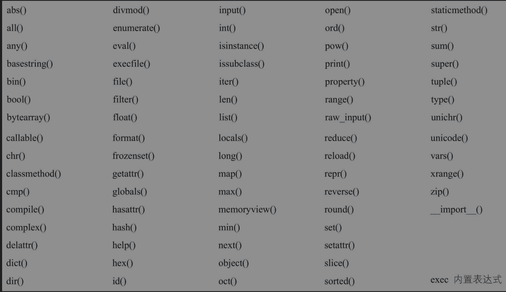
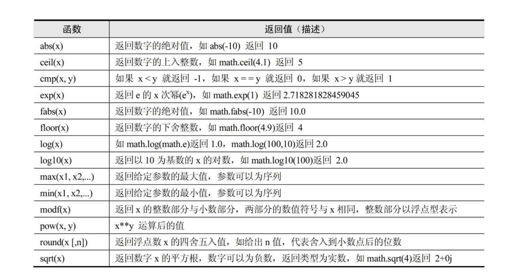
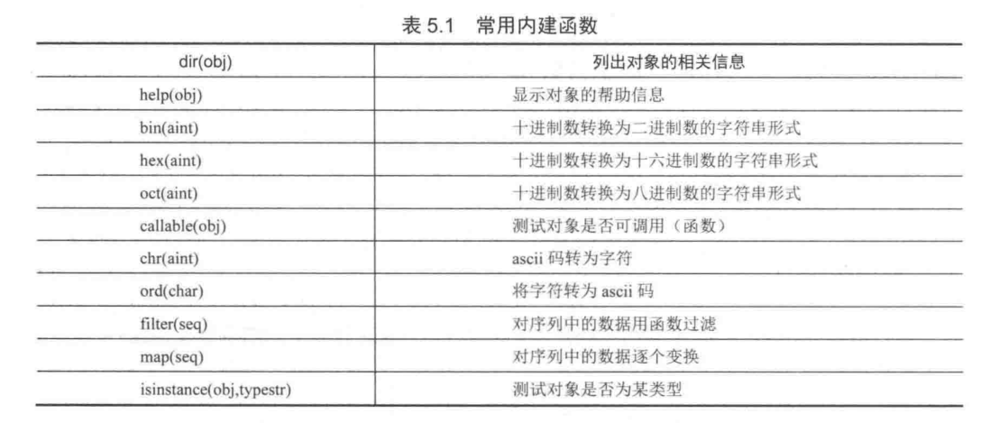
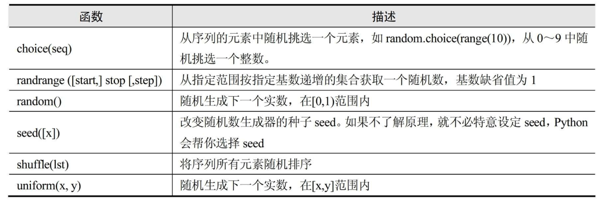

# Python内建函数

### 内建数学函数









### map()函数

`map()函数用于对容器中的元素进行映射（或变换）`

    map(func,seq1[,seq2])
    将函数func作用于给定序列(s)的每个元素,并用一个列表来提供返回值;如果func为None,func表现为一个身份函数,返回一个含有每个序列中元素集合的n个元组的列表
```

alst = [1,2,3,4,5,6]
print(list(map(lambda x: x*2,alst)))        #map配合lambda函数一起使用，将列表中的元素扩大两倍
# map 通过函数对列表进行处理得到新的列表
def cube(x):
    return x*x*x
map(cube, range(1, 11))
[1, 8, 27, 64, 125, 216, 343, 512, 729, 1000]xx
```

eg
``` 
#!/usr/bin/env python
# -*- coding:utf8 -*-
# auther; 18793
# Date：2019/5/17 23:46
# filename: map()函数.py
users = ["Tony", "Tom", "Ben", "Alex"]
user_map = map(lambda u: str(u).lower(), users)
print(list(user_map))

user_filter = filter(lambda u: str(u).startswith("T"), users)
# user_map3 = map(lambda u: str(u).lower(),user_filter)

#下面实现功能与上一样
user_map2 = map(lambda u: str(u).lower(), filter(lambda u: str(u).startswith("T"), users))
print(list(user_map2))
```
输出结果
``` 
['tony', 'tom', 'ben', 'alex']
['tony', 'tom']
```


### filter()函数

`filter()函数用于对容器中的元素进行过滤处理。`

    filter(func,seq)
    调用一个布尔函数func来迭代遍历每个seq中的元素;返回一个使func返回值为true的元素的序列

```
print(list(filter(lambda x: x % 2,alst)))   #去重复，filter可以去掉列表中的重复元素
# filter 即通过函数方法只保留结果为真的值组成列表

def f(x):
    return x % 2 != 0 and x % 3 != 0

f(3)     # 函数结果是False  3被filter抛弃
f(5)     # 函数结果是True   5被加入filter最后的列表结果
filter(f, range(2, 25))
[5, 7, 11, 13, 17, 19, 23]

In [13]: list(range(-5,5))
Out[13]: [-5, -4, -3, -2, -1, 0, 1, 2, 3, 4]

In [14]: list(filter((lambda x:x>0),range(-5,5)))
Out[14]: [1, 2, 3, 4]

```

eg1

``` 
users = ["Tony", "Tom", "Ben", "Alex"]
users_list = filter(lambda x:str(x).startswith("T"),users)
print(list(users_list))
```
输出结果
``` 
['Tony', 'Tom']
```

eg2
``` 
number_list = range(1, 11)
number_filter = filter(lambda it: it % 2 == 0,number_list)
print(list(number_filter))

类似实现方式，列表推导式
list_hu = [ x for x in range(1,11) if x % 2 == 0]
print(list_hu)
[0, 2, 4, 6, 8, 10]
```
输出结果
``` 
[2, 4, 6, 8, 10]
```

### reduce()函数
    reduce(func,seq[,init])

将二元函数作用于seq序列的元素,
每次携带一堆(先前的结果以及下一个序列元素),
连续地将现有的结果和下一个值作用在获得的随后的结果上,最后减少我们的序列为一个单一的返回值;如果初始值init给定,
第一个比较会是init和第一个序列元素而不是序列的头两个元素。

```
from functools import reduce
alst = [1,2,3,4,5]
a = reduce(lambda x, y:x+y,alst)            #reduce()对list的每个元素反复调用函数f，并返回最终结果值
print(a)


# reduce 通过函数会先接收初始值和序列的第一个元素，然后是返回值和下一个元素，依此类推
def add(x,y):
    return x+y
reduce(add, range(1, 11))              # 结果55  是1到10的和  x的值是上一次函数返回的结果，y是列表中循环的值
reduce(lambda x,y:x+y, range(1,11))    # 等同上面两条  lambda来创建匿名函数[ lambda x,y:x+y ] ,后面跟可迭代的对


>>> from functools import reduce      
>>> reduce((lambda x, y: x + y), [1, 2, 3, 4]) 
10 
>>> reduce((lambda x, y: x * y), [1, 2, 3, 4]) 
24

```

eg
``` 
#!/usr/bin/env python
# -*- coding:utf8 -*-
# auther; 18793
# Date：2019/5/17 23:51
# filename: reduce()函数.py
from functools import reduce

a = (1, 2, 3, 4)
a_reduce = reduce(lambda acc, i: acc + i, a)
print(a_reduce)
b_reduce = reduce(lambda acc, i: acc + i, a, 2)
print(b_reduce)
```
输出
``` 
10
12
```

### eval、exec、compile函数
```
#!/usr/bin/env python
#-*- coding:utf8 -*-
hu = eval('3+4')         # 将字符串当表达式求值 得到7
print(hu)


exec('a=100') # 将字符串按python语句执行
print(a)
exec(a+'=new')      # 将变量a的值作为新的变量

s = "for i in range(0,10):print(i)"
c = compile(s,',',"exec")
exec(c)

x=3
y=4
s2 = "3*x+4*y"
c2 = compile(s2, '', 'eval')
result = eval(c2)
print(result)
```

### random随机数函数

```
import random
```




### eval与exec的区别

exec中最适合放置运行后没有结果的语句,而eval中适合放置有结果返回
```

#!/usr/bin/env python
# -*- coding:utf8 -*-
# auther; 18793
# Date：2019/9/20 23:29
# filename: exec和evel的区别.py
exec("print(\"I love Python \")")  # I love Python
eval("print(\"I love Python \")")  # I love Python

# 两者不同的是：evel执行完要返回结果，而exec执行完不返回结果。
a = 1
exec("a =2")
print(a)  # 2

hu = exec("2+3")  # 直接执行2+3，无返回结果
print(hu)  # None

hu = eval("2+3")  # 执行2+3，有返回结果
print(hu)  # 5

```
### eval和exec的使用经验
使用exec和eval时一定要记住： 

`里面的第一个参数是字符串,而字符串的内容一定要是可执行的代码。`

repr函数在exec与eval函数中的作用

repr可以将元素转为 'xxx'的字符串值
```
s="hello"
print(evel(repr(s)))            #使用函数repr进行转化，输出hello
```

### reversed()
    函数倒序排序
```
In [9]: list = ["1","2","3","4"]
In [10]: list2 = []

In [11]: for i in reversed(list):
   ....:     list2.append(i)
   ....:
In [12]: list2
Out[12]: ['4', '3', '2', '1']
```

### sorted()函数正向排列:
    不改变原值，在内存中新开辟一个空间
```
In [13]: list2
Out[13]: ['4', '3', '2', '1']
In [14]: sorted(list2)
Out[14]: ['1', '2', '3', '4']
In [15]: list2
Out[15]: ['4', '3', '2', '1']
```
### enumerate()
    enumerate()函数的调用形式如下：
    
    enumerate(iterable, [start=0])
    enumerate()函数用于将一个可遍历的数据对象(如列表、元组或字符串)组合为一个索引序列，同时列出数据和数据下标，一般用在 for 循环当中。
    
    >>> enumerate(['Spring', 'Summer', 'Fall', 'Winter'])
    <enumerate object at 0x1031780>
    >>> list(enumerate(['Spring', 'Summer', 'Fall', 'Winter']))
    [(0, 'Spring'), (1, 'Summer'), (2, 'Fall'), (3, 'Winter')]

### zip(s,t)
    返回一个合并后的列表
```
s = ['11','22']
t = ['aa','bb']

In [5]: list(zip(s,t))
Out[5]: [('11', 'aa'), ('22', 'bb')] 
```
### cmp(x,y)
    比较两个对象,根据比较结果返回一个整数，如果x<y，则返回-1；如果x>y，则返回1,如果x==y则返回0

### round(x[,n])
    函数返回浮点数x的四舍五入值，如给出n值，则代表舍入到小数点后的位数

### dir(sys)
    显示对象的属性

### abs()
    求绝对值的函数

### isinstance(object,int)
    测试对象类型 int