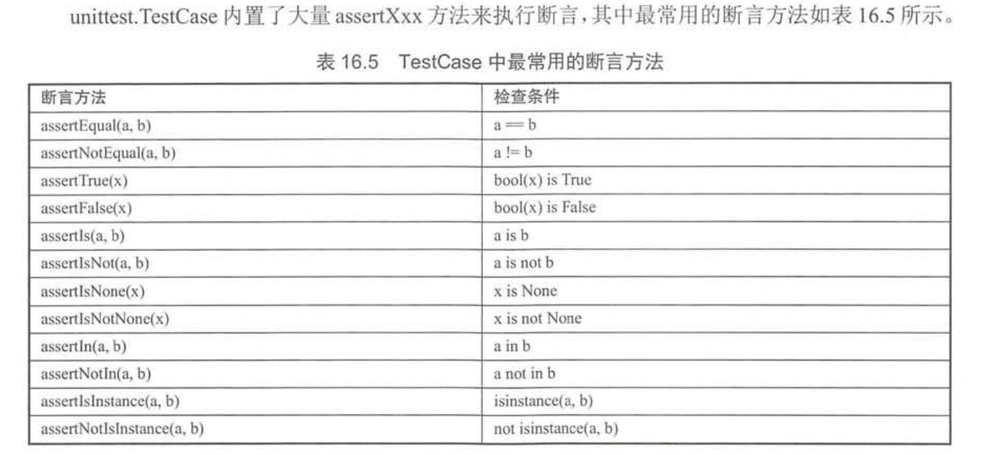
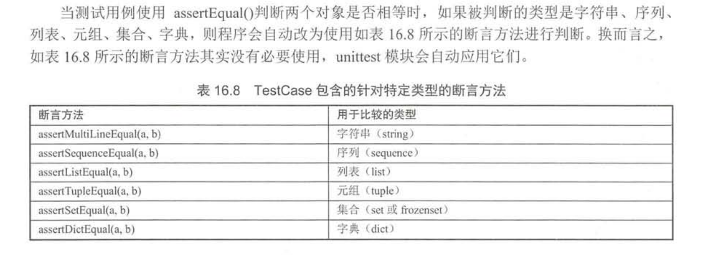

# 测试程序

## 使用PyUnit(unittest)

PyUnit是Python自带的单元测试框架，用于编写和运行可重复的测试，PyUnit是xUnit体系的一个成员，
xUnit是众多测试框架的一个总称，PyUnit主要用于白盒测试和回归测试。


``` 
所有测试的本质其实都是一样的：通过给定参数来执行函数，然后判断函数的实际输出结果和期望输出的结果是否一致。
```

PyUnit测试与其他xUnit的套路是一样的：基于断言机制来判断函数和方法的实际输出结果和期望输出结果是否一致。
测试用例提供参数来执行函数或方法，获取他们的执行结果，然后使用断言方法判断该函数或方法的输出结果和期望输出结果是否一致，
如果一致说明测试通过，如果不一致说明测试不通过。
``` 
unittest要求单元测试类必须继承unittest.TestCase,该类中的测试方法需要满足如下要求：

· 测试方法应该没有返回值。
· 测试方法不应该有任何参数。
· 测试方法应该以test_开头。
```

### 代码示例
``` 
import arithmetic
import unittest
# Testing add_numbers function from arithmetic.
class Test_addition(unittest.TestCase):
	# Testing Integers
	def test_add_numbers_int(self):
		sum = arithmetic.add_numbers(50, 50)
		self.assertEqual(sum, 100)

	# Testing Floats
	def test_add_numbers_float(self):
		sum = arithmetic.add_numbers(50.55, 78)
		self.assertEqual(sum, 128.55)

	# Testing Strings
	def test_add_numbers_strings(self):
		sum = arithmetic.add_numbers('hello','python')
		self.assertEqual(sum, 'hellopython')

class Test_subtraction(unittest.TestCase):
	# Testing Integers
	def test_sub_numbers_int(self):
		diff = arithmetic.sub_numbers(50, 50)
		self.assertEqual(diff, 0)

	# Testing Floats
	def test_sub_numbers_float(self):
		diff = arithmetic.sub_numbers(80.00, 78)
		self.assertEqual(diff, 2.00)

class Test_multiplication(unittest.TestCase):
	# Testing Integers
	def test_mul_numbers_int(self):
		multi = arithmetic.mul_numbers(78, 46)
		self.assertEqual(multi, 3588)

	# Testing Floats
	def test_mul_numbers_float(self):
		multi = arithmetic.mul_numbers(77.85, 8)
		self.assertEqual(multi, 622.8)

class Test_division(unittest.TestCase):
	# Testing Integers
	def test_div_numbers_int(self):
		quotient = arithmetic.div_numbers(78, 2)
		self.assertEqual(quotient, 39)

	# Testing Floats
	def test_div_numbers_float(self):
		quotient = arithmetic.div_numbers(77.8, 2)
		self.assertEqual(quotient, 38.9)

if __name__ == '__main__':
	unittest.main()

```






``` 
import if_example
import unittest

class Test_if(unittest.TestCase):
	def test_if(self):
		result = if_example.check_if()
		self.assertEqual(result, 100)
		
if __name__ == '__main__':
	unittest.main()

```