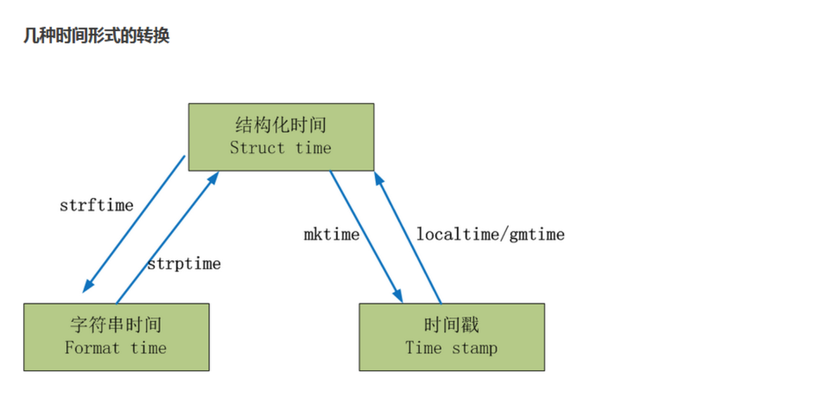
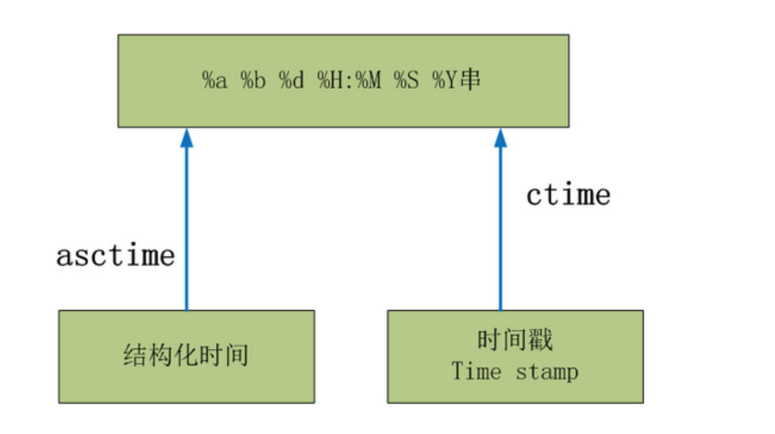

# time、datetime模块
## time模块
```
常用表示时间方式： 时间戳，格式化的时间字符串，元组（struct_time）
UTC（Coordinated Universal Time，世界协调时）:亦即格林威治天文时间，世界标准时间。在中国为UTC+8。DST（Daylight Saving Time）即夏令时。
时间戳（timestamp）的方式：通常来说，时间戳表示的是从1970年1月1日00:00:00开始按秒计算的偏移量。
元组（struct_time）方式：struct_time元组共有9个元素，返回struct_time的函数主要有gmtime()，localtime()，strptime()。
```

### 几种时间形式的转换

```
#!/usr/bin/env python
#-*- coding:utf8 -*-
import time
#时间戳格式时间
print(time.time())

#UTC时间
print(time.gmtime())

#本地时间
print(time.localtime())

#tm_wday(0-6)  星期1-星期6


#将本地时间转为时间戳
hu=time.localtime()
print(time.mktime(hu))

#struct_time转换成format_time
'''
%a    本地（locale）简化星期名称
%A    本地完整星期名称
%b    本地简化月份名称
%B    本地完整月份名称
%c    本地相应的日期和时间表示
%d    一个月中的第几天（01 - 31）
%H    一天中的第几个小时（24小时制，00 - 23）
%I    第几个小时（12小时制，01 - 12）
%j    一年中的第几天（001 - 366）
%m    月份（01 - 12）
%M    分钟数（00 - 59）
%p    本地am或者pm的相应符    一
%S    秒（01 - 61）    二
%U    一年中的星期数。（00 - 53星期天是一个星期的开始。）第一个星期天之前的所有天数都放在第0周。
%w    一个星期中的第几天（0 - 6，0是星期天）    三
%W    和%U基本相同，不同的是%W以星期一为一个星期的开始。
%x    本地相应日期
%X    本地相应时间
%y    去掉世纪的年份（00 - 99）
%Y    完整的年份
%Z    时区的名字（如果不存在为空字符）
%%    ‘%’字符
'''
import time
print(time.time())
hu = time.localtime()
print(hu)
print(time.strftime("%Y-%m-%d %H:%M:%S",hu))

#语法：
#strftime(format,[tuple])

# format_time转换成struct_time
hu2 = time.strftime("%Y-%m-%d %H:%M:%S",hu)
print(hu)

```
### 结构化时间转为字符串时间


```
import time
x = time.localtime()
print(x)
print(time.asctime(x))
```
```
#时间戳转换成字符串
import time
print(time.time())
print(time.ctime())
```

eg
``` 
import time
# 将当前时间转换为时间字符串
print(time.asctime())

# 将指定时间转换时间字符串，时间元组的后面3个元素没有设置
print(time.asctime((2018, 2, 4, 11, 8, 23, 0, 0 ,0))) # Mon Feb  4 11:08:23 2018

# 将以秒数为代表的时间转换为时间字符串
print(time.ctime(30)) # Thu Jan  1 08:00:30 1970

# 将以秒数为代表的时间转换为struct_time对象。
print(time.gmtime(30)) 

# 将当前时间转换为struct_time对象。
print(time.gmtime()) 

# 将以秒数为代表的时间转换为代表当前时间的struct_time对象
print(time.localtime(30))

# 将元组格式的时间转换为秒数代表的时间
print(time.mktime((2018, 2, 4, 11, 8, 23, 0, 0 ,0))) # 1517713703.0

# 返回性能计数器的值
print(time.perf_counter())

# 返回当前进程使用CPU的时间
print(time.process_time())
#time.sleep(10)

# 将当前时间转换为指定格式的字符串
print(time.strftime('%Y-%m-%d %H:%M:%S'))

st = '2018年3月20日'
# 将指定时间字符串恢复成struct_time对象。
print(time.strptime(st, '%Y年%m月%d日'))

# 返回从1970年1970年1月1日0点整到现在过了多少秒。
print(time.time())

# 返回本地时区的时间偏移，以秒为单位
print(time.timezone) # 在国内东八区输出-28800

```

eg

```python
#!/usr/bin/env python
# -*- coding:utf8 -*-
# auther; 18793
# Date：2019/9/17 12:42
# filename: time模块测试.py
import time
from loggingClass import MyLog


class TimeInfo(object):
    def __init__(self):
        self.log = MyLog()
        self.testTime()
        self.testLocaltime()
        self.testSleep(1)
        self.testStrftime()

    def testTime(self):
        self.log.info("开始测试time.time()函数")
        print('当前时间戳为：time.time() = {!r}'.format(time.time()))
        print('这里返回的是一个浮点数，它是1970纪元后经过的浮点秒数')
        print("\n")

    def testLocaltime(self):
        self.log.info("开始测试time.localtime()函数")
        print("当前本地时间为：time.localtime() = {!r}".format(time.localtime()))
        print("这里返回的是一个struct_time结构的元祖")
        print("\n")

    def testSleep(self, n):
        self.log.info("开始测试time.sleep()函数")
        print("这是计时器：time.sleep(5)")
        print("闭上眼睛1秒就可以了")
        time.sleep(n)
        print("\n")

    def testStrftime(self):
        self.log.info("开始测试time.strftime()函数")
        print("这个函数返回的是一个格式化的时间")
        print("time.strftime(%%Y-%%m-%%d %%X,time.localtime()) = {!r}".format(
            time.strftime("%Y-%m-%d %X", time.localtime())))
        print("\n")


if __name__ == '__main__':
    t1 = TimeInfo()


```

## datetime模块
```
功能	说明
datetime.date.today()	打印输出当前的系统日期
datetime.date.fromtimestamp(time.time())	将时间戳转成日期格式
datetime.datetime.now()	打印当前的系统时间

current_time = datetime.datetime.now()
print(current_time)   #输出当前的时间：2016-10-11 22:23:44.468269
print(current_time.timetuple())   #将当前时间转换为结构化时间（struct_time）
print(current_time.replace(2014,9,16))   #将当前时间替换为2014-9-16

datetime.datetime.strptime("21/11/06 16:30", "%d/%m/%y %H:%M")	将字符串转换成日期格式
```


### 输出当前系统时间
```
>>> print(datetime.date.today())
2016-05-25
```
### 将时间戳格式转换为日期格式
```
>>> time.time()
# 时间戳格式
1464156222.1887317
>>> print(datetime.date.fromtimestamp(time.time()))
# 日期格式
2016-05-25
```

### 将日期格式转换为struct_time格式
```
>>> current_time = datetime.datetime.now()
>>> print(current_time)
2016-05-25 14:05:26.706667

>>> print(current_time.timetuple())
# 返回struct_time格式
time.struct_time(tm_year=2016, tm_mon=5, tm_mday=25, tm_hour=14, tm_min=5, tm_sec=26, tm_wday=2, tm_yday=146, tm_isdst=-1)
```

### 替换当前系统时间
```
>>> print(current_time.replace(2016,5,12))
2016-05-12 14:05:26.706667
将字符串转换成日期格式

>>> str_to_date = datetime.datetime.strptime("21/11/06 16:30", "%d/%m/%y %H:%M")
>>> print(str_to_date)
2006-11-21 16:30:00
```


### 时间相加减

比现在加10天
```
>>> new_date = datetime.datetime.now() + datetime.timedelta(days=10)
>>> print(new_date)
2016-06-04 14:10:36.119523
```

比现在减10天
```
>>> new_date = datetime.datetime.now() + datetime.timedelta(days=-10)
>>> print(new_date)
2016-05-15 14:11:06.739814
```

比现在减10小时
```
>>> new_date = datetime.datetime.now() + datetime.timedelta(hours=-10)
>>> print(new_date)
2016-05-25 04:11:44.095624
```

比现在+120s
```
>>> new_date = datetime.datetime.now() + datetime.timedelta(seconds=120)
>>> print(new_date)
2016-05-25 14:14:02.090219
```

代码示例

```python
#!/usr/bin/env python
# -*- coding:utf8 -*-
# auther; 18793
# Date：2019/8/26 11:22
# filename: datetime模块.py
"""

datetime模块定义了以下5个类。

datetime.date：表示日期的类。常用的属性有year、month、day。
datetime.time：表示时间的类。常用的属性有hour、minute、second、microsecond。
datetime.datetime：表示日期时间。
datetime.timedelta：表示时间间隔，即两个时间点之间的长度。
datetime.tzinfo：与时区有关的相关信息。
"""

#!/usr/bin/env python
# -*- coding:utf8 -*-
# auther; 18793
# Date：2019/8/26 11:22
# filename: datetime模块.py
"""

datetime模块定义了以下5个类。

datetime.date：表示日期的类。常用的属性有year、month、day。
datetime.time：表示时间的类。常用的属性有hour、minute、second、microsecond。
datetime.datetime：表示日期时间。
datetime.timedelta：表示时间间隔，即两个时间点之间的长度。
datetime.tzinfo：与时区有关的相关信息。
"""

import datetime

dt = datetime.datetime.now()

print("当前时间：", dt)
print('(%Y-%m-%d %H:%M:%S %f): ', dt.strftime('%Y-%m-%d %H:%M:%S %f'))
print('(%Y-%m-%d %H:%M:%S %p): ', dt.strftime('%y-%m-%d %I:%M:%S %p'))
print('%%a: %s ' % dt.strftime('%a'))
print('%%A: %s ' % dt.strftime('%A'))
print('%%b: %s ' % dt.strftime('%b'))
print('%%B: %s ' % dt.strftime('%B'))
print('日期时间%%c: %s ' % dt.strftime('%c'))
print('日期%%x：%s ' % dt.strftime('%x'))
print('时间%%X：%s ' % dt.strftime('%X'))
print('今天是这周的第 %s 天 ' % dt.strftime('%w'))
print('今天是今年的第 %s 天 ' % dt.strftime('%j'))
print('这周是今年的第 %s 周 ' % dt.strftime('%U'))
```

输出信息：
```
当前时间： 2019-09-12 12:54:11.749537
(%Y-%m-%d %H:%M:%S %f):  2019-09-12 12:54:11 749537
(%Y-%m-%d %H:%M:%S %p):  19-09-12 12:54:11 PM
%a: Thu 
%A: Thursday 
%b: Sep 
%B: September 
日期时间%c: Thu Sep 12 12:54:11 2019 
日期%x：09/12/19 
时间%X：12:54:11 
今天是这周的第 4 天 
今天是今年的第 255 天 
这周是今年的第 36 周 
"""
```


代码示例
```python
from time import strftime, localtime
from datetime import timedelta, date
import calendar
import datetime

year = strftime("%Y", localtime())
mon = strftime("%m", localtime())
day = strftime("%d", localtime())
hour = strftime("%H", localtime())
min = strftime("%M", localtime())
sec = strftime("%S", localtime())


def today():
    '''''
    get today,date format="YYYY-MM-DD"
    '''''
    return date.today()


def todaystr():
    '''
    get date string, date format="YYYYMMDD"
    '''
    return year + mon + day


def datetime():
    '''''
    get datetime,format="YYYY-MM-DD HH:MM:SS"
    '''
    return strftime("%Y-%m-%d %H:%M:%S", localtime())


def datetimestr():
    '''''
    get datetime string
    date format="YYYYMMDDHHMMSS"
    '''
    return year + mon + day + hour + min + sec


def get_day_of_day(n=0):
    '''''
    if n>=0,date is larger than today
    if n<0,date is less than today
    date format = "YYYY-MM-DD"
    '''
    if n < 0:
        n = abs(n)
        return date.today() - timedelta(days=n)
    else:
        return date.today() + timedelta(days=n)


def get_days_of_month(year, mon):
    '''''
    get days of month
    '''
    return calendar.monthrange(year, mon)[1]


def get_firstday_of_month(year, mon):
    '''''
    get the first day of month
    date format = "YYYY-MM-DD"
    '''
    days = "01"
    if int(mon) < 10:
        mon = "0" + str(int(mon))
    arr = (year, mon, days)
    return "-".join("%s" % i for i in arr)


def get_lastday_of_month(year, mon):
    '''''
    get the last day of month
    date format = "YYYY-MM-DD"
    '''
    days = calendar.monthrange(year, mon)[1]
    mon = addzero(mon)
    arr = (year, mon, days)
    return "-".join("%s" % i for i in arr)


def get_firstday_month(n=0):
    '''''
    get the first day of month from today
    n is how many months
    '''
    (y, m, d) = getyearandmonth(n)
    d = "01"
    arr = (y, m, d)
    return "-".join("%s" % i for i in arr)


def get_lastday_month(n=0):
    '''''
    get the last day of month from today
    n is how many months
    '''
    return "-".join("%s" % i for i in getyearandmonth(n))


def getyearandmonth(n=0):
    '''''
    get the year,month,days from today
    befor or after n months
    '''
    thisyear = int(year)
    thismon = int(mon)
    totalmon = thismon + n
    if n >= 0:
        if totalmon <= 12:
            days = str(get_days_of_month(thisyear, totalmon))
            totalmon = addzero(totalmon)
            return year, totalmon, days
        else:
            i = totalmon // 12
            j = totalmon % 12
            if j == 0:
                i -= 1
                j = 12
            thisyear += i
            days = str(get_days_of_month(thisyear, j))
            j = addzero(j)
            return str(thisyear), str(j), days
    else:
        if totalmon > 0 and totalmon < 12:
            days = str(get_days_of_month(thisyear, totalmon))
            totalmon = addzero(totalmon)
            return year, totalmon, days
        else:
            i = totalmon // 12
            j = totalmon % 12
            if (j == 0):
                i -= 1
                j = 12
            thisyear += i
            days = str(get_days_of_month(thisyear, j))
            j = addzero(j)
            return str(thisyear), str(j), days


def addzero(n):
    '''''
    add 0 before 0-9
    return 01-09
    '''
    nabs = abs(int(n))
    if nabs < 10:
        return "0" + str(nabs)
    else:
        return nabs


def get_today_month(n=0):
    '''''
    获取当前日期前后N月的日期
    if n>0, 获取当前日期前N月的日期
    if n<0, 获取当前日期后N月的日期
    date format = "YYYY-MM-DD"
    '''
    (y, m, d) = getyearandmonth(n)
    arr = (y, m, d)
    if int(day) < int(d):
        arr = (y, m, day)
    return "-".join("%s" % i for i in arr)


def get_firstday_month(n=0):
    (y, m, d) = getyearandmonth(n)
    arr = (y, m, '01')
    return "-".join("%s" % i for i in arr)


def main():
    print('today is:', today())  # today is: 2019-09-06
    print('today is:', todaystr())  # today is: 20190906
    print('the date time is:', datetime())  # the date time is: 2019-09-06 16:21:58
    print('data time is:', datetimestr())  # data time is: 20190906162158
    print('2 days after today is:', get_day_of_day(2))  # 2 days after today is: 2019-09-08
    print('2 days before today is:', get_day_of_day(-2))  # 2 days before today is: 2019-09-04
    print('2 months after today is:', get_today_month(2))  # 2 months after today is: 2019-11-06
    print('2 months before today is:', get_today_month(-2))  # 2 months before today is: 2019-07-06
    print('2 months after this month is:', get_firstday_month(2))  # 2 months after this month is: 2019-11-01
    print('2 months before this month is:', get_firstday_month(-2))  # 2 months before this month is: 2019-07-01


if __name__ == "__main__":
    main()
```