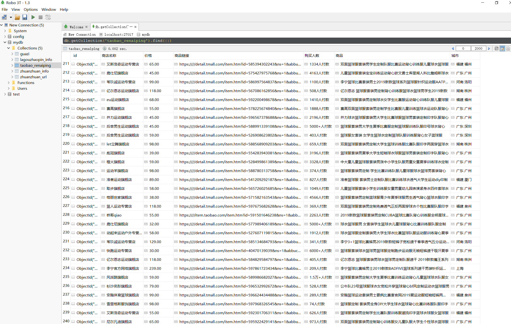

.. contents::
   :depth: 3
..

Selenium模拟浏览器
==================

Selenium + PhantomJS的配合使用
------------------------------

``Selenium``\ ：用于模拟真实用户在浏览器中操作。对于一些采用异步加载技术的网页，如果难以用抓包来构造爬虫，可以通过Selenium让浏览器自动加载页面，从而获取所需的数据。

``PhantomJS``\ ：无界面浏览器，相比Chrome，Firefox等浏览器，意味着开销小，速度快。

``可直接在官网上下载：http://phantomjs.org/``

1. PhantomJS的安装
~~~~~~~~~~~~~~~~~~

①下载PhantomJS文件后，解压并将phantomjs.exe复制到系统路径中，例如：\ ``C:\Python36。``

②运行下述代码无误，说明PhantomJS环境已经配置好。

::

   from selenium import webdriver
   driver = webdriver.PhantomJS()

3.使用selenium操作元素的常用方法有：

::

   elem.send_keys("输入内容")
   elem.click() #鼠标单击元素
   elem.clear() #清除元素内容

2. PhantomJS的使用
~~~~~~~~~~~~~~~~~~

``以豆瓣为例：``

::

   #!/usr/bin/env python
   #-*- coding:utf8 -*-
   # auther; 18793
   # Date：2019/7/23 17:25
   # filename: 模拟豆瓣测试.py

   from selenium import webdriver
   import time
   from lxml import etree

   # 动态页面获取之二
   driver = webdriver.PhantomJS()
   driver.get("https://www.douban.com/")

   # 获取源码
   html = driver.page_source
   root = etree.HTML(html)
   iframes = root.xpath('//div[contains(@class,"login")]/iframe/@src')[0]

   # 因为登录是iframe引入的  所以重新再开一个
   driver.get("https:" + iframes)

   # 模拟点击  切换到密码登录
   driver.find_element_by_class_name("account-tab-account").click()
   time.sleep(1)
   # 输入账号和密码
   driver.find_element_by_id("username").send_keys("13262662216")
   driver.find_element_by_id("password").send_keys("cu0gu0ai@94")

   # 点击登录
   driver.find_element_by_class_name("btn-account").click()

   time.sleep(4)
   #打印网页源码
   # print(driver.page_source)

   # 快照保存
   driver.save_screenshot('douban_denglu.png')
   # 退出
   driver.quit()

对于不复杂的网页结构，可以使用class、name、id属性来定位元素。
对于复杂的网页结构来说，使用Xpath更加合适。

3.以简书网的某篇文章为例，进行信息的爬取。
~~~~~~~~~~~~~~~~~~~~~~~~~~~~~~~~~~~~~~~~~~

::

   爬取网址：https://www.jianshu.com/p/c80badcaa5bf
   爬取方式：selenium + phantomJS

::

   from selenium import webdriver
   driver = webdriver.PhantomJS()
   driver.get("https://www.jianshu.com/p/c80badcaa5bf")
   driver.implicitly_wait(10)                                       #隐式等待20秒
   author = driver.find_element_by_css_selector("span.name").text    ##使用CSS方式
   author1 = driver.find_element_by_xpath('//span[@class="name"]').text   ##使用xpath方式，与上一句等价
   date = driver.find_element_by_css_selector("span.publish-time").text
   word = driver.find_element_by_css_selector("span.wordage").text
   view = driver.find_element_by_css_selector("span.views-count").text
   comment = driver.find_element_by_css_selector("span.comments-count").text
   like = driver.find_element_by_css_selector("span.likes-count").text
   reward = driver.find_element_by_css_selector("span.rewards-count ").text  #其中，reward的信息没办法获取。
   print(author,date,word,view,comment,like,reward)

``代码``

::

   author1 = driver.find_element_by_xpath('//span[@class="name"]').text 

看出，要想取得文本信息，要在末尾加上.text，而Xpath的语法是路径后加上/text()，就这一点不同需要注意。

PhantomJS实例 - 淘宝商品搜索和翻页
----------------------------------

::

   爬取网址：https://www.taobao.com/
   爬取信息：商品价格，付款人数，商品名称、商家名称和地址
   存储方式：mongodb存储

::

   淘宝的商品信息是采用Ajax动态加载的，所以使用PhantomJS能自动加载内容，省去了分析构造网页的步骤。

代码信息：

::

   #!/usr/bin/env python
   # -*- coding:utf8 -*-
   # auther; 18793
   # Date：2019/7/24 11:09
   # filename: 02.爬取淘宝商品信息.py
   from selenium import webdriver
   from bs4 import BeautifulSoup
   import pymongo
   import time

   # 连接mongodb
   client = pymongo.MongoClient('localhost', 27017)
   mydb = client['mydb']
   taobao_rnp = mydb['taobao_renaiping']   # 连接数据库及创建数据库、数据集合

   def search_good(word):
       """
       模拟淘宝搜索框搜索
       :param word:
       :return:
       """
       url = "https://www.taobao.com/"
       driver.get(url)
       driver.implicitly_wait(4)
       driver.find_element_by_id("q").clear()  # 清除搜索框内容
       driver.find_element_by_id("q").send_keys(word)  # 搜索框输入搜索内容
       driver.find_element_by_class_name("btn-search").click()  # 点击搜索按钮
       return driver.current_url  # Gets the URL of the current page.

   def get_info(url):
       """
       获取每一页的如下信息:
       "商品": xx
       "价格": xx
       "购买人数":xx
       "商店名称":xx
       "城市": xx
       :param url:
       :return:
       """
       driver.get(url)  # 获取网页源码
       driver.implicitly_wait(4)
       soup = BeautifulSoup(driver.page_source, "lxml")
       infos = soup.select("#mainsrp-itemlist > div > div")
       for info in infos:
           goodss = info.select("div.row > a")
           prices = info.select("div.price.g_price.g_price-highlight > strong")
           Play_Number_peoples = info.select("div.row.row-1.g-clearfix > div.deal-cnt")
           Shop_names = info.select("div.shop > a > span:nth-of-type(2)")
           Citys = info.select("div.row.row-3.g-clearfix > div.location")
           Product_links = info.select(" div.row.row-2.title > a")
           # print(Product_link)

           # goods = info.select("div.row > a")[0].get_text().strip()
           # price = info.select("div.price.g_price.g_price-highlight > strong")[0].get_text().strip()
           # Play_Number_people = info.select("div.row.row-1.g-clearfix > div.deal-cnt")[0].get_text().strip()
           # Shop_name = info.select("div.shop > a > span:nth-of-type(2)")[0].get_text().strip()
           # City = info.select("div.row.row-3.g-clearfix > div.location")[0].get_text().strip()

           for goods, price, Play_Number_people, Shop_name, City,Product_link in zip(goodss, prices, Play_Number_peoples, Shop_names,
                                                                        Citys,Product_links):
               data = {
                   "商品": goods.get_text().strip(),
                   "价格": price.get_text().strip(),
                   "购买人数": Play_Number_people.get_text().strip(),
                   "商店名称": Shop_name.get_text().strip(),
                   "城市": City.get_text().strip(),
                   "商品链接": "https://" + Product_link.get("href")
               }

               # print(data)
               taobao_rnp.insert_one(data)
               time.sleep(0.2)

   def get_nextpage(url):
       """
       模拟鼠标进行翻页操作
       :param url:
       :return:
       """
       driver.get(url)
       driver.implicitly_wait(4)
       driver.find_element_by_css_selector('a[trace="srp_bottom_pagedown"]').click()
       time.sleep(2)
       return driver.current_url

   if __name__ == '__main__':
       driver = webdriver.PhantomJS()
       # driver = webdriver.Chrome()
       driver.maximize_window()

       url = search_good("篮球服")
       # print(url)
       get_info(url)

       for i in range(50):
           next_url = get_nextpage(url)
           get_info(url)

执行后信息如下： |image0|

