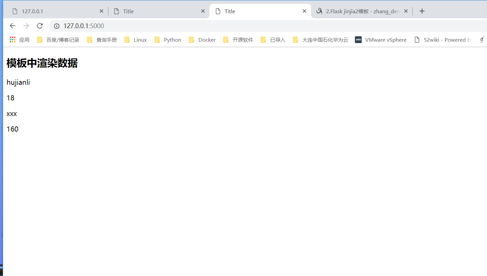

# Jinja2模板引擎
index.html
``` 
<!DOCTYPE html>
<html lang="en">
<head>
    <meta charset="UTF-8">
    <title>Title</title>
</head>
<body>
    <h1>Hello Word </h1>
    <p>这是一个标签</p>
</body>
</html>
```
user.html
``` 
<!DOCTYPE html>
<html lang="en">
<head>
    <meta charset="UTF-8">
    <title>Title</title>
</head>
<body>
 <h1>hello ,{{ name }}</h1>

</body>
</html>
```

render.py
```python
#!/usr/bin/env python
# -*- coding:utf8 -*-
# auther; 18793
# Date：2019/4/19 15:47
# filename: render.py
from flask import Flask, render_template

app = Flask(__name__)


@app.route("/")
def hello_world():
    return render_template("index.html")


@app.route("/user/<username>")
def user_login(username):
    # 显示该用户的信息
    return render_template("user.html", name=username)


if __name__ == '__main__':
    app.run(debug=True)
```

## 变量

``` 
#!/usr/bin/env python
# -*- coding:utf8 -*-
# auther; 18793
# Date：2019/4/19 15:47
# filename: render.py
from flask import Flask,render_template

app = Flask(__name__)

@app.route('/')
def hello_world():

    context = {
        'username':'hujianli',
        'age':18,
        'gf':{
            'name':'xxx',
            'height':160
        }
    }
    return render_template('index.html',**context)    #加双下划綫，就可以直接获取key和value了

if __name__ == '__main__':

    app.run(debug=True)
```

index.html
``` 
<!DOCTYPE html>
<html lang="en">
<head>
    <meta charset="UTF-8">
    <title>Title</title>
</head>
<body>
 <h2>模板中渲染数据</h2>
    <p>{{ username }}</p>
    <p>{{ age }}</p>
    <p>{{ gf.name }}</p>
    <p>{{ gf['height'] }}</p>
</body>
</html>
```


``` 
Jinja2 能识别所有类型的变量，甚至是一些复杂的类型，例如列表、字典和对象。在模板
中使用变量的一些示例如下：
<p>A value from a dictionary: {{ mydict['key'] }}.</p>
<p>A value from a list: {{ mylist[3] }}.</p>
<p>A value from a list, with a variable index: {{ mylist[myintvar] }}.</p>
<p>A value from an object's method: {{ myobj.somemethod() }}.</p>
```

代码示例：

hello1.html

```html
<!DOCTYPE html>
<html lang="en">
<head>
    <meta charset="UTF-8">
    <title>First Jinja2 webpage</title>
</head>
<body>
<ul id="navigation">
    
        <li><a href="{{ item }}">{{ item }}</a></li>
    
</ul>

<h1>Hello world</h1>
{{ a_variable }}
</body>
</html>
```

sample3.py

```python
#!/usr/bin/env python
# -*- coding: utf-8 -*-


from flask import Flask, render_template

app = Flask(__name__)


@app.route("/")
def hello_world():
    return render_template("hello01.html", a_variable="Devops!", navigation=["www.baidu.com", "www.google.com"])


if __name__ == '__main__':
    app.run(debug=True)
```

## 模板继承

在web开发中很多页面的部分内容是一样的，比如页头、导航、尾页。通过Jinja2模板继承，可以把相同内容的一部分集中到一个“基模板”中，而在每个页面中继承“基模板”以到达导入其内容的目的。

这样达到使公共内容集中且易于修改的目的。


### 1.基模板

base.html

```html
<!DOCTYPE html>
<html lang="zh-CN">
  <head>
    <meta charset="utf-8">
    <meta http-equiv="X-UA-Compatible" content="IE=edge">
    <meta name="viewport" content="width=device-width, initial-scale=1">
    <!-- 上述3个meta标签*必须*放在最前面，任何其他内容都*必须*跟随其后！ -->
    <title>{{ site_name }}</title>

    <!-- Bootstrap -->
    <link href="https://cdn.jsdelivr.net/npm/bootstrap@3.3.7/dist/css/bootstrap.min.css" rel="stylesheet">

    <!-- HTML5 shim 和 Respond.js 是为了让 IE8 支持 HTML5 元素和媒体查询（media queries）功能 -->
    <!-- 警告：通过 file:// 协议（就是直接将 html 页面拖拽到浏览器中）访问页面时 Respond.js 不起作用 -->
    <!--[if lt IE 9]>
      <script src="https://cdn.jsdelivr.net/npm/html5shiv@3.7.3/dist/html5shiv.min.js"></script>
      <script src="https://cdn.jsdelivr.net/npm/respond.js@1.4.2/dest/respond.min.js"></script>
    <![endif]-->
  </head>
  <body class="skin-blue sidebar-mini">
    <h1>你好，世界！</h1>
    <span class="logo-mini"><b>我在基模板中</b></span>

    <!-- jQuery (Bootstrap 的所有 JavaScript 插件都依赖 jQuery，所以必须放在前边) -->
    <script src="https://cdn.jsdelivr.net/npm/jquery@1.12.4/dist/jquery.min.js"></script>
    <!-- 加载 Bootstrap 的所有 JavaScript 插件。你也可以根据需要只加载单个插件。 -->
    <script src="https://cdn.jsdelivr.net/npm/bootstrap@3.3.7/dist/js/bootstrap.min.js"></script>
  </body>
</html>
```

sub.html

```html
<!DOCTYPE html>
<html lang="en">
<head>
    <meta charset="UTF-8">
</head>
<body>


<p class="important">
    我在子模板中。
</p>

</body>
</html>
```

本例中的支模板文件可以直接用于对Flask的渲染，用如下代码渲染子模板。

```python
@app.route('/hello')
def hello():
    return render_template("sub.html", site_name="继承测试")
```


