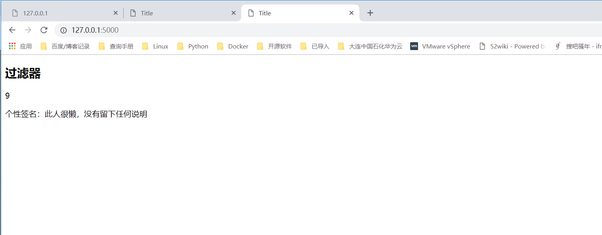
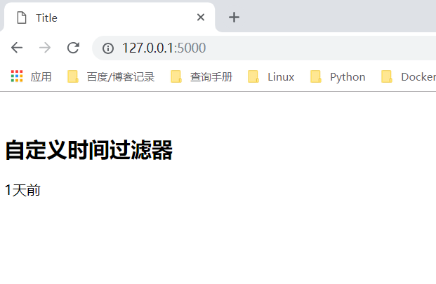

# 过滤器
### 常用的过滤器
``` 
abs:绝对值
default:如果当前变量没有值，则会使用参数中的值来替代
escape:转义字符
first:返回一个序列的第一个元素
format:格式化字符串
last:返回一个序列的最后一个元素
length:返回一个序列的长度
join：拼接字符串
safe:关掉转义
int:转为int类型
float:转为浮点类型
lower：转换为小写
upper:转换为答谢
replace：替换
truncate：截取length长度的字符串
striptags：删除字符串中所有的html标签，如果出现多个空格，将替换成一个空格
```

index.html
``` 
<!DOCTYPE html>
<html lang="en">
<head>
    <meta charset="UTF-8">
    <title>Title</title>
</head>
<body>
<h2>过滤器</h2>
<p>{{ position|abs }}</p>
<p>个性签名：{{ signature|default('此人很懒，没有留下任何说明',boolean=True) }}</p>

</body>
</html>
```
render.py
``` python
#!/usr/bin/env python
# -*- coding:utf8 -*-
# auther; 18793
# Date：2019/4/19 15:47
# filename: render.py
from flask import Flask, render_template

app = Flask(__name__)


@app.route('/')
def hello_world():
    context = {
        "position": -9,
        "signature": None
    }

    return render_template('index.html', **context)  # 加双下划綫，就可以直接获取key和value了


if __name__ == '__main__':
    app.run(debug=True)

```


## 自定义过滤器
render.py
``` python
#!/usr/bin/env python
# -*- coding:utf8 -*-
# auther; 18793
# Date：2019/4/19 15:47
# filename: render.py
from flask import Flask,render_template
from datetime import datetime
app = Flask(__name__)

@app.route('/')
def hello_world():
    context = {
        'create_time':datetime(2019,4,22,17,52,10)
    }
    return render_template('index.html',**context)

@app.template_filter('handle_time')  #括号里面是自己给过滤器起的名字
def handle_time(time):
    '''
    1.如果时间间隔小与1分钟以内，就显示“刚刚”
    2.如果是1小时以内，显示“xx分钟”
    3.如果24h以内，显示“xx小时前”
    4.如果大于24小时小与30天，显示“xx天前”
    5.大于一个月，显示具体的时间
    :param time:
    :return:
    '''
    if isinstance(time,datetime):
        now = datetime.now()
        timestamp = (now-time).total_seconds()  #当前时间离创建时间的秒数
        if timestamp < 60:     #60s以内
            return "刚刚"
        elif timestamp >= 60 and timestamp < 60*60:
            minutes = timestamp / 60
            return "%s分钟前"%int(minutes)
        elif timestamp >= 60*60 and timestamp < 60*60*24:
            hours = timestamp / (60*60)
            return '%s小时前'%int(hours)
        elif timestamp >= 60*60*24 and timestamp < 60*60*24*30:
            days = timestamp / (60*60*24)
            return '%s天前'%int(days)
        else:
            return time.strftime('%Y/%m/%d %H:%M')
    else:
        return time

if __name__ == '__main__':
    app.run(debug=True)
```

index.py
```
<!DOCTYPE html>
<html lang="en">
<head>
    <meta charset="UTF-8">
    <title>Title</title>
</head>
<body>
　<h2>自定义时间过滤器</h2>
    {{ create_time|handle_time }}

</body>
</html> 

```

