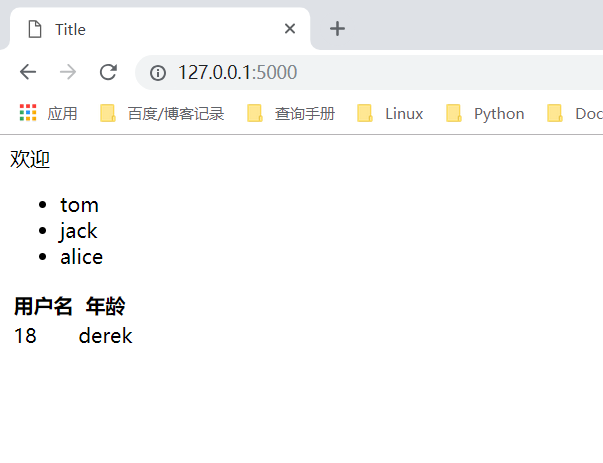

# if和for的使用
for中包含以下变量，可以用来获取当前的遍历状态
``` 
loop.index
loop.index0
loop.first
loop.last
loop.length
```
reder.py
``` python
#!/usr/bin/env python
# -*- coding:utf8 -*-
# auther; 18793
# Date：2019/4/19 15:47
# filename: render.py
from flask import Flask,render_template

app = Flask(__name__)
app.config.update({
    'DEBUG':True,
    'TEMPLATES_AUTO_RELOAD':True
})

@app.route('/')
def hello_world():
    context = {
        'age':20,
        'users':['tom','jack','alice'],
        'person':{
            'name':'hujianli',
            'age':18
        }
    }
    return render_template('index.html',**context)

if __name__ == '__main__':
    app.run(debug=True)
```

index.html
``` html
<!DOCTYPE html>
<html lang="en">
<head>
    <meta charset="UTF-8">
    <title>Title</title>
</head>
<body>

    
        欢迎
    
        无权限
    

    <ul>
    
        <li>{{ user }}</li>
    
    </ul>

    <table>
        <thead>
            <tr>
                <th>用户名</th>
                <th>年龄</th>
            </tr>
        </thead>
        <tbody>
            <tr>
                
                    <td>{{ value }}</td>
                
            </tr>
        </tbody>
    </table>

</body>
</html>
```

