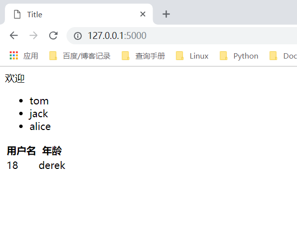

.. contents::
   :depth: 3
..

if和for的使用
=============

for中包含以下变量，可以用来获取当前的遍历状态

::

   loop.index
   loop.index0
   loop.first
   loop.last
   loop.length

reder.py

::

   #!/usr/bin/env python
   # -*- coding:utf8 -*-
   # auther; 18793
   # Date：2019/4/19 15:47
   # filename: render.py
   from flask import Flask,render_template

   app = Flask(__name__)
   app.config.update({
       'DEBUG':True,
       'TEMPLATES_AUTO_RELOAD':True
   })

   @app.route('/')
   def hello_world():
       context = {
           'age':20,
           'users':['tom','jack','alice'],
           'person':{
               'name':'hujianli',
               'age':18
           }
       }
       return render_template('index.html',**context)

   if __name__ == '__main__':
       app.run(debug=True)

index.html

::

   <!DOCTYPE html>
   <html lang="en">
   <head>
       <meta charset="UTF-8">
       <title>Title</title>
   </head>
   <body>

       
           欢迎
       
           无权限
       

       <ul>
       
           <li>{{ user }}</li>
       
       </ul>

       <table>
           <thead>
               <tr>
                   <th>用户名</th>
                   <th>年龄</th>
               </tr>
           </thead>
           <tbody>
               <tr>
                   
                       <td>{{ value }}</td>
                   
               </tr>
           </tbody>
       </table>

   </body>
   </html>

|image0|

