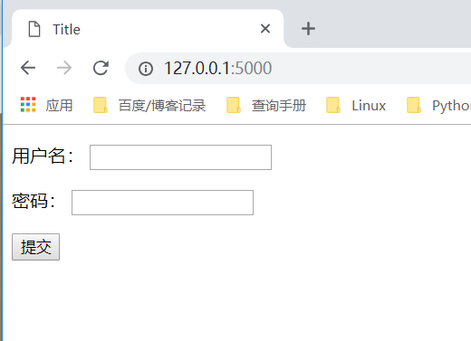

# 宏的使用和导入
    模板的宏跟python中的函数类似，可以传递参数，但是不能有返回值，
    可以将一些经常用到的代码片段放到宏中，然后把一些不固定的值抽取出来当成一个变量。
    
* 简单使用实例
index.html
``` 
<!DOCTYPE html>
<html lang="en">
<head>
    <meta charset="UTF-8">
    <title>Title</title>
</head>
<body>
{#    定义一个宏，input是宏的名字，里面三个参数，可以指定默认参数值，也可以调用的传参#}
    
        <input name="{{ name }}" value="{{ value }}" type="{{ type }}">
    

    <form>
        <p>用户名：{{ input('username') }}</p>
        <p>密码：{{ input('password',type="password" )}}</p>
        <p> {{ input(value="提交",type="submit" )}}</p>

    </form>

</body>
</html>
```


## 宏的两种导入方式
① 新建macros.html文件
```
 
        <input name="{{ name }}" value="{{ value }}" type="{{ type }}">
     

```
②index.html中导入使用宏
在index.html中导入使用宏
``` 
{#第一种#}
{# with context可以把后端传到当前模板的变量传到定义的宏里面#}
    
{#第二种#}

```

``` 
<!DOCTYPE html>
<html lang="en">
<head>
    <meta charset="UTF-8">
    <title>Title</title>
</head>
<body>
{#    第一种#}
    <form>
        <p>用户名：{{ macro.input('username') }}</p>
        <p>密码：{{ macro.input('password',type="password" )}}</p>
        <p> {{ macro.input(value="提交",type="submit" )}}</p>
    </form>

{#    第二种#}
     <form>
        <p>用户名：{{ input_field('username') }}</p>
        <p>密码：{{ input_field('password',type="password" )}}</p>
        <p> {{ input_field(value="提交",type="submit" )}}</p>
    </form>

</body>
</html>

```


