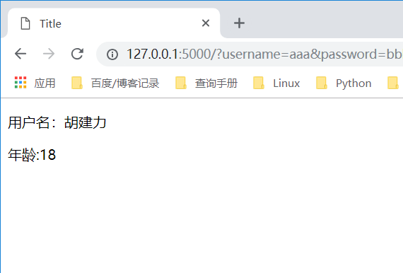

# set、with在模板中自定义变量
 ①set
``` 
在模板中可以使用set来定义变量，一旦定义了这个变量，在后面的代码中都可以使用，index.html
```

index.html

``` 
<!DOCTYPE html>
<html lang="en">
<head>
    <meta charset="UTF-8">
    <title>Title</title>
</head>
<body>


    <p>用户名：{{ usernmae }}</p>
</body>
</html>
```


② with
``` 
with语句定义的变量，只能在with语句代码块(endwith)里面使用，
超过代码块，就不能再使用了,set语句没有end，全局使用
```
index.html
```
<!DOCTYPE html>
<html lang="en">
<head>
    <meta charset="UTF-8">
    <title>Title</title>
</head>
<body>


    <p>用户名：{{ usernmae }}</p>
    
        <p>年龄:{{ age }}</p>
    

</body>
</html>
```

