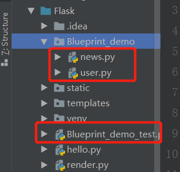
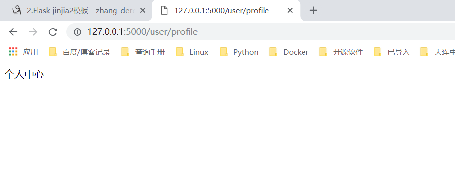

# 蓝图的使用

news.py
``` 
#!/usr/bin/env python
# -*- coding:utf8 -*-
# auther; 18793
# Date：2019/4/23 22:04
# filename: news.py
from flask import Blueprint

news_bp = Blueprint('new', __name__, url_prefix='/news')


@news_bp.route("/list")
def news_list():
    return "新闻列表"


```

user.py
``` 
#!/usr/bin/env python
# -*- coding:utf8 -*-
# auther; 18793
# Date：2019/4/23 22:04
# filename: user.py
from flask import Blueprint

# 1.定义一个蓝图，'user':蓝图的名字,url_prefix='/user'：给url加一个前缀，注意后面不要加'/'
user_bp = Blueprint('user', __name__, url_prefix='/user')

@user_bp.route("/profile")
def profile():
    return "个人中心"
```

Blueprint_demo_test.py
``` 
#!/usr/bin/env python
#-*- coding:utf8 -*-
# auther; 18793
# Date：2019/4/23 22:08
# filename: Blueprint_demo_test.py
from flask import Flask, url_for
from Blueprint_demo.news import news_bp
from Blueprint_demo.user import user_bp

app = Flask(__name__)
# 3.注册蓝图
app.register_blueprint(user_bp)
app.register_blueprint(news_bp)


@app.route("/")
def hello_world():
    return "Hello world"


with app.test_request_context():
    print(url_for('new.news_list'))     # /news/list/   通过url_for反转url的时候要加蓝图的名字
    print(url_for('user.profile'))      # /user/profile/

if __name__ == '__main__':
    app.run(debug=True)
```



