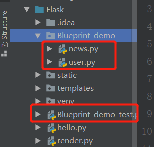
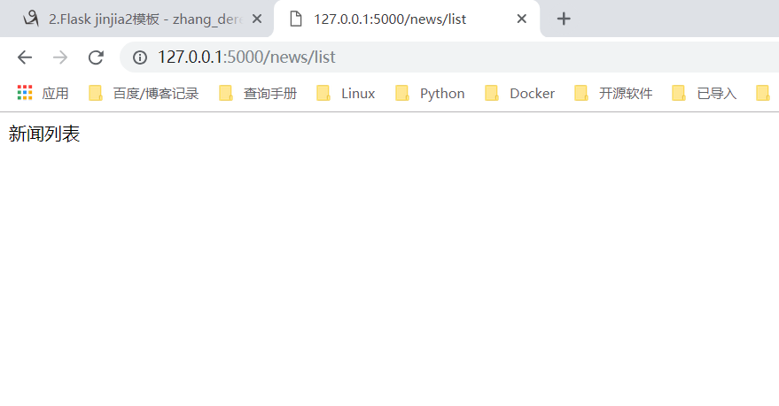

.. contents::
   :depth: 3
..

蓝图的使用
==========

news.py

::

   #!/usr/bin/env python
   # -*- coding:utf8 -*-
   # auther; 18793
   # Date：2019/4/23 22:04
   # filename: news.py
   from flask import Blueprint

   news_bp = Blueprint('new', __name__, url_prefix='/news')

   @news_bp.route("/list")
   def news_list():
       return "新闻列表"

user.py

::

   #!/usr/bin/env python
   # -*- coding:utf8 -*-
   # auther; 18793
   # Date：2019/4/23 22:04
   # filename: user.py
   from flask import Blueprint

   # 1.定义一个蓝图，'user':蓝图的名字,url_prefix='/user'：给url加一个前缀，注意后面不要加'/'
   user_bp = Blueprint('user', __name__, url_prefix='/user')

   @user_bp.route("/profile")
   def profile():
       return "个人中心"

Blueprint_demo_test.py

::

   #!/usr/bin/env python
   #-*- coding:utf8 -*-
   # auther; 18793
   # Date：2019/4/23 22:08
   # filename: Blueprint_demo_test.py
   from flask import Flask, url_for
   from Blueprint_demo.news import news_bp
   from Blueprint_demo.user import user_bp

   app = Flask(__name__)
   # 3.注册蓝图
   app.register_blueprint(user_bp)
   app.register_blueprint(news_bp)

   @app.route("/")
   def hello_world():
       return "Hello world"

   with app.test_request_context():
       print(url_for('new.news_list'))     # /news/list/   通过url_for反转url的时候要加蓝图的名字
       print(url_for('user.profile'))      # /user/profile/

   if __name__ == '__main__':
       app.run(debug=True)

|image0|

|image1| |image2|

.. |image1| image:: ../../../_static/flask9.png

