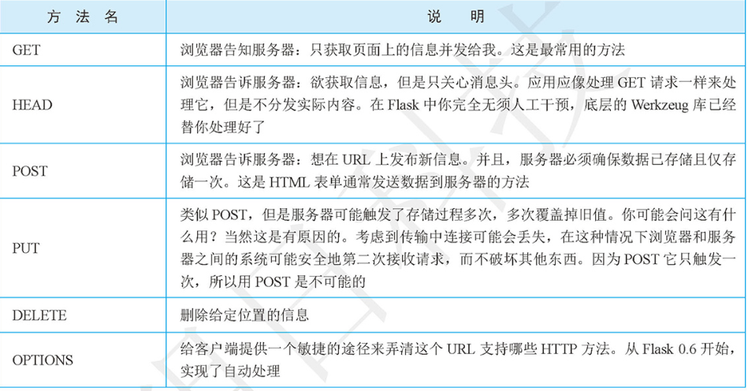

# 路由

## 新增一个路由
* 访问http://127.0.0.1:5000/hujianli时触发index方法，方法名称可以自定义

```
#!/usr/bin/env python
#-*- coding:utf8 -*-
# auther; 18793
# Date：2019/4/19 12:41
# filename: helloword.py

from flask import Flask
app = Flask(__name__)

@app.route("/")
def hello():
    return "Hello World!你好啊，小健"

@app.route("/hujianli")
def index():
    return "This is index! ......"

if __name__ == '__main__':
    app.debug = True
    app.run()
```

eg
```  
#!/usr/bin/env python
#-*- coding:utf8 -*-
# auther; 18793
# Date：2019/4/19 12:41
# filename: helloword.py

from flask import Flask
app = Flask(__name__)

@app.route("/")
def hello():
    return "Hello World!你好啊，小健"

@app.route("/hujianli")
def index():
    return "This is index! ......"

# 匹配任意的数据类型，http://127.0.0.1:5000/user/XXX
@app.route("/user/<username>")
def user_login(username):
    return "Hello {}".format(username)


#只匹配整数型 http://127.0.0.1:5000/post/123，输入字符串会报错
@app.route("/post/<int:post_id>")
def show_post(post_id):
    return "Post:{}".format(post_id)


if __name__ == '__main__':
    app.debug = True
    app.run()

```

eg
``` 
# 获取url信息，通过url_for函数,http://127.0.0.1:5000/url  输出/post/3
@app.route("/url")
def get_url():
    return url_for("show_post", post_id=3)
```

## Http方法


```
# Http请求
@app.route("/login",methods=['POST','GET','PUT'])
def login():
    if request.method == "GET":
        return "这是get请求"
    elif request.method == "POST":
        pass
    else:
        pass
```

* POST和GET请求判断
``` 
#!/usr/bin/env python
#-*- coding:utf8 -*-
# auther; 18793
# Date：2019/6/25 16:58
# filename: day3_flask.py
import flask
html_txt = """
<!DOCTYPE html>
<html lang="en">
<head>
    <meta charset="UTF-8">
    <title>Title</title>
    <body>
    <h2>  收到GET请求 </h2>
    <form method='post'>        
        <input type="submit" value="发送POST请求" />
    </form>
</head>

</body>
</html>

"""
app = flask.Flask(__name__)     #实例化主类Flask

@app.route("/route",methods=["GET", "POST"])
def hello():                            #定义业务函数
    if flask.request.method == "GET":       # 判断收到的请求是否为GET
        return html_txt
    else:
        return "收到POST请求，我是Flask"

if __name__ == '__main__':
    app.run(debug=True)
```

## 使用cookie跟踪用户的实例：
``` 
#!/usr/bin/env python
# -*- coding:utf8 -*-
# auther; 18793
# Date：2019/6/25 17:23
# filename: day5_flask.py
import flask

html_txt = """
<!DOCTYPE html>
<html lang="en">
<head>
    <meta charset="UTF-8">
    <title>Title</title>
    
</head>
<body>

<h2> 收到GET 请求</h2>
<a href="/get_info"> 获取cookie信息 </a>
</body>
</html>
"""

app = flask.Flask(__name__)


@app.route("/set_info/<name>")
def set_cks(name):
    name = name if name else 'anonymous'
    resp = flask.make_response(html_txt)
    resp.set_cookie("name", name)
    return resp


@app.route("/get_info")
def get_cks():
    name = flask.request.cookies.get("name")  # 获取cookie信息
    return "获取的cookie信息是：" + name


if __name__ == '__main__':
    app.run(debug=True)

```

## 使用session跟踪用户的实例：
``` 
#!/usr/bin/env python
# -*- coding:utf8 -*-
# auther; 18793
# Date：2019/6/25 17:23
# filename: day5_flask.py
import flask

html_txt = """
<!DOCTYPE html>
<html lang="en">
<head>
    <meta charset="UTF-8">
    <title>Title</title>

</head>
<body>

<h2> 收到GET 请求</h2>
<a href="/get_info"> 获取cookie信息 </a>
</body>
</html>
"""

app = flask.Flask(__name__)


@app.route("/set_info/<name>")
def set_cks(name):
    name = name if name else 'anonymous'
    flask.session["name"] = name
    return html_txt


@app.route("/get_info")
def get_cks():
    name = "name" in flask.session and flask.session['name']    #获取session
    if name:
        return "获取的回话信息是：" + name
    else:
        return "没有相应回话信息"


if __name__ == '__main__':
    app.secret_key = 'sdadajasgfajsgasjgdajgasgasahsuq$$#$%^'
    app.run(debug=True)

```