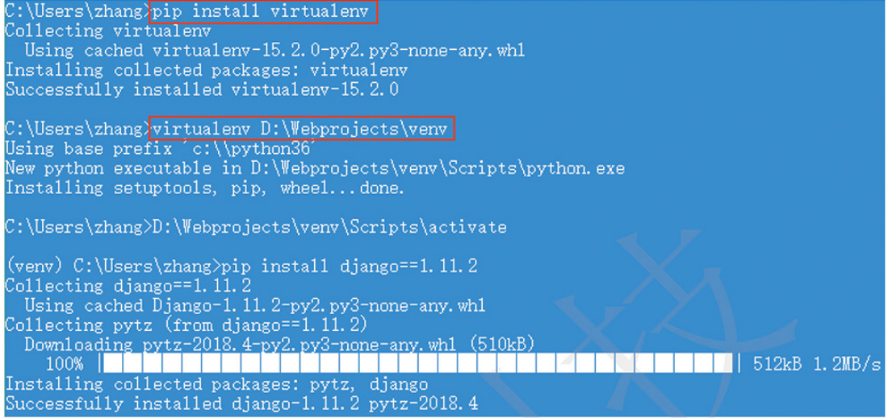

# 安装DjangoWeb框架
```
- 1.使用pip安装

    pip install django==2.0
    
- 2. 使用virtualenv安装
    
    
    (venv)pip install django==1.11.2
    
    
- 3.使用anacoda安装
    
    
    conda install django
```


### 安装virtualenv虚拟环境
参考文献

`http://www.python88.cn/book/django12/`


```
	#安装virtualenv
	sudo pip install virtualenv

	#创建python环境
	＞ virtualenv venv
	
	#使用source激活virtualenv环境：
	＞ source venv/bin/activate
	(venv)＞ which python 				#注意终端提示的改变，前面添加了“(venv)”前缀。    
	 /home/ubuntu/venv/bin/python 		#可以看到已经不再使用系统环境变量中的Python了。
	#如果要退出虚拟环境，可以取消激活：     
	(venv)＞ deactivate
	
	# 清除非root用户信息，还原一个干净的虚拟环境
	virtualenv --clear first_project/

```





    