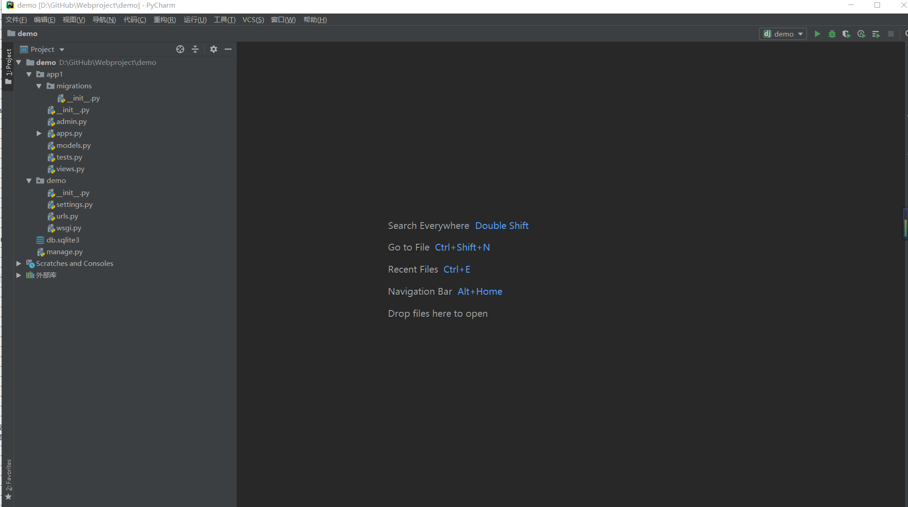

# Django框架的使用
## 创建一个Django项目

* 项目存放目录为：`D:\GitHub\Webproject`

* 1.创建environments目录用于放置虚拟环境
``` 
C:\Users\18793> virtualenv D:\GitHub\Webproject\venv
Using base prefix 'c:\\users\\18793\\anaconda3'
  No LICENSE.txt / LICENSE found in source
New python executable in D:\GitHub\Webproject\venv\Scripts\python.exe
Installing setuptools, pip, wheel...
done.
```

* 2.使用如下命令激活环境
```
D:\GitHub\Webproject\venv>d:\GitHub\Webproject\venv\Scripts\activate

(venv) D:\GitHub\Webproject\venv>cd ..

(venv) D:\GitHub\Webproject>
```
* 3.使用"django-admin"命令创建一个项目
``` 
(venv) D:\GitHub\Webproject>django-admin startproject demo

(venv) D:\GitHub\Webproject>
(venv) D:\GitHub\Webproject>cd demo

#进入虚拟环境安装django2.0
(venv) D:\GitHub\Webproject\demo>pip install django==2.0
```

* 4.使用pychrm打开demo项目，查看目录结构


```
#运行项目
python manage.py runserver


#为Django项目生成数据表，创建账户名和密码
python manage.py migrate			#执行数据库迁移生成数据库
python manage.py createsuperuser	#按照提示输入账户和密码，强度复合一定的规则要求
```


    D:\GitHub\Webproject\demo>python manage.py createsuperuser
    Username (leave blank to use '18793'): hujianli
    Email address: 1879324764@qq.com
    Password:
    Password (again):
    Superuser created successfully.
    

```
运行项目,并访问
http://127.0.0.1:8000/admin/
```
#### 总结
```

创建一个Django 项目
创建项目：
django-admin startproject demo   
或者
python manage.py startapp blog


运行程序：python manage.py runserver
生成迁移文件: python manage.py makemigrations
数据迁移,创建新表：python manage.py migrate
创建管理员：python manage.py createsuperuser

```


## 创建App


    D:\GitHub\Webproject\demo>python manage.py startapp app1
    此时根目录下又多了一个"app1"的目录，如图：




* 将app1应用加入到项目中

```
修改setting文件
INSTALLED_APPS = [
    'django.contrib.admin',
    'django.contrib.auth',
    'django.contrib.contenttypes',
    'django.contrib.sessions',
    'django.contrib.messages',
    'django.contrib.staticfiles',
    'app1',
]
		
		
import pymysql         # 一定要添加这两行！通过pip install pymysql  设置在app1的__init__文件中
pymysql.install_as_MySQLdb()


DATABASES = {
'default': {
'ENGINE': 'django.db.backends.mysql',
'NAME': 'mysite',
'HOST': '192.168.1.1',
'USER': 'root',
'PASSWORD': 'pwd',
'PORT': '3306',
}
}
	

#生成迁移文件
python manage.py makemigrations

#迁移数据库，创建新表
python manage.py migrate


#了解Django命令的API
python manage.py shell	
	
	
#### 启用交互命令
python manage.py shell	

#创建数据 方式1
>>> from app1.models import Person,Order
>>> p = Person(first_name="hujianli",last_name="胡")
>>> p.save()

方式2
p  = Person.objects.create(first_name="kebi",last_name="hu")
     
     
## 查询数据
>>> Person.objects.all()
<QuerySet [<Person: Person object (1)>, <Person: Person object (2)>]>
>>> Person.objects.get(first_name="hujianli")
<Person: Person object (1)>
 
 
## 查询指定条件的数据
>>> Person.objects.filter(first_name__exact="hujianli")
<QuerySet [<Person: Person object (1)>]>
>>> Person.objects.filter(first_name__exact="kebi")
<QuerySet [<Person: Person object (2)>]>
>>> Person.objects.filter(id__gt=1)
<QuerySet [<Person: Person object (2)>]>
>>> Person.objects.filter(id__lt=100)
<QuerySet [<Person: Person object (1)>, <Person: Person object (2)>]>

## 修改查询到的数据
>>> p = Person.objects.get(first_name="hujianli")
>>> p.first_name = "huxiaojian"
>>> p.last_name = "xiaojian"
>>> p.save()

## 删除数据
>>> Person.objects.get(id=1).delete()
(1, {'app1.Person': 1})
```
 
## 数据模型（models）
在app1的models.py中添加如下代码
``` 
from django.db import models  # 引入django.db.models模块


class CreateUpdate(models.Model):  # 创建抽象数据模型，同样要继承于models.Model
    # 创建时间，使用models.DateTimeField
    created_at = models.DateTimeField(auto_now_add=True)
    # 修改时间，使用models.DateTimeField
    updated_at = models.DateTimeField(auto_now=True)

    class Meta:  # 元数据，除了字段以外的所有属性
        # 设置model为抽象类。指定该表不应该在数据库中创建
        abstract = True


class Person(CreateUpdate):  # 继承CreateUpdate基类
    first_name = models.CharField(max_length=30)
    last_name = models.CharField(max_length=30)


class Order(CreateUpdate):  # 继承CreateUpdate基类
    order_id = models.CharField(max_length=30, db_index=True)
    order_desc = models.CharField(max_length=120)

```

python manage.py makemigrations

python manage.py migrate

