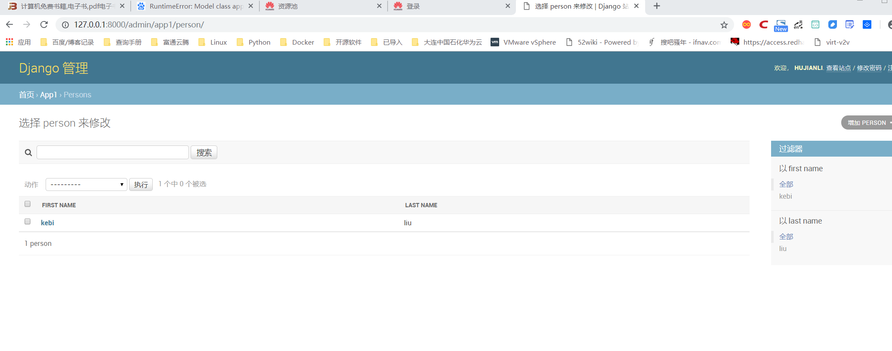
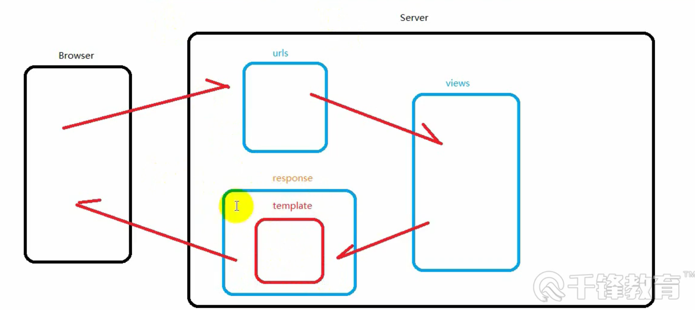

# Django流程跑通
app1下的admin.py中配置
``` 
from django.contrib import admin # 引入admin模块
from app1.models import Person, Order # 引入数据模型类

class PersonAdmin(admin.ModelAdmin):
    """
    创建PersonAdmin类，继承于admin.ModelAdmin
    """
    #  配置展示列表，在Person板块下的列表展示
    list_display = ('first_name', 'last_name')
    # 配置过滤查询字段，在Person板块下右侧过滤框
    list_filter = ('first_name', 'last_name')
    # 配置可以搜索的字段，在Person板块下右侧搜索框
    search_fields = ('first_name',)
    # 配置只读字段展示，设置后该字段不可编辑
    readonly_fields = ('created_at', 'updated_at')
# 绑定Person模型到PersonAdmin管理后台
admin.site.register(Person, PersonAdmin)

```

* 配置完成后，登录http://127.0.0.1:8000/admin/




## 路由


Django的URL路由流程：
（1）Django查找全局urlpatterns变量（urls.py）
（2）按照先后顺序，对URL逐一匹配urlpatterns每个元素
（3）找到第一个匹配时停止查找，根据匹配结果执行对应的处理函数
（4）如果没有找到或出现异常，Django进行错误处理


Django支持三种表达格式：

（1） 精确字符串格式

（2）Django的转换格式

（3）正则表达式格式


demo下的urls.py
```
from django.contrib import admin
from django.urls import path,include

urlpatterns = [
    path('admin/', admin.site.urls),
    path('app1/',include('app1.urls'))
]
```

找到项目根目录的配置文件夹demo下面的urls.py文件，打开文件，添加如下代码：
``` 
from app1 import views as app1_views
from django.urls import path
urlpatterns = [
    # 精确匹配视图
    path('articles/2003/', app1_views.special_case_2003),
    # 匹配一个整数
    path('articles/<int:year>/', app1_views.year_archive),
    # 匹配两个位置的整数
    path('articles/<int:year>/<int:month>/', app1_views.month_archive),
    # 匹配两个位置的整数和一个slug类型的字符串
    path('articles/<int:year>/<int:month>/<slug:slug>/', app1_views.article_detail),
]

```

如果想使用正则表达式，则使用如下代码:
``` 
from django.urls import re_path
from app1 import views as views
from django.urls import path
urlpatterns = [
    # 精确匹配
    path('articles/2003/', views.special_case_2003),
    # 按照正则表达式匹配4位数字年份
    re_path(r'^articles/(?P<year>[0-9]{4})/$', views.year_archive),
    # 按照正则表达式匹配4位数字年份和2位数字月份
    re_path(r'^articles/(?P<year>[0-9]{4})/(?P<month>[0-9]{2})/$', views.month_archive),
    # 按照正则表达式匹配4位数字年份和2位数字月份和一个至少1位的slug类型的字符串
    re_path(r'^articles/(?P<year>[0-9]{4})/(?P<month>[0-9]{2})/(?P<slug>[\w-]+)/$', views.article_detail),
]


```

## 表单
在app1文件夹下创建一个forms.py文件，添加如下类代码：
``` 
from django import forms
class PersonForm(forms.Form):
    first_name = forms.CharField(label='你的名字', max_length=20)
    last_name = forms.CharField(label='你的姓氏', max_length=20)

```
表单类forms.Form有一个is_valid()方法，可以在views.py中验证提交的表单是否符合规则。
对于提交的内容，在views.py编写如下：
``` 
from django.shortcuts import render
from django.http import HttpResponse, HttpResponseRedirect
from app1.forms import PersonForm

def get_name(request):
    # 判断请求方法是否为POST
    if request.method == 'POST':
        # 将请求数据填充到PersonForm实例中
        form = PersonForm(request.POST)
        # 判断form是否为有效表单
        if form.is_valid():
            # 使用form.cleaned_data获取请求的数据
            first_name = form.cleaned_data['first_name']
            last_name = form.cleaned_data['last_name']
            # 响应拼接后的字符串
            return HttpResponse(first_name + '' + last_name)
        else:
            return HttpResponseRedirect('/error/')
    # 请求为GET方法
    else:
        return render(request, 'name.html', {'form': PersonForm()})

```

在app1下创建一个templates目录，编写name.html文件
``` 
<!DOCTYPE html>
<html lang="en">
<head>
    <meta charset="UTF-8">
    <title>Title</title>
</head>
<body>
<form action="/app1/get_name" method="post">
    
    {{ form }}
    <button type="submit">提交</button>
</form>

</body>
</html>
```

添加URL到创建的app1/urls.py文件中。
``` 
from django.urls import re_path
from app1 import views as views
from django.urls import path

urlpatterns = [
    path('get_name', views.get_name),
    ## 精确匹配
    # path('articles/2003/', views.special_case_2003),
    # # 按照正则表达式匹配4位数字年份
    # re_path(r'^articles/(?P<year>[0-9]{4})/$', views.year_archive),
    # # 按照正则表达式匹配4位数字年份和2位数字月份
    # re_path(r'^articles/(?P<year>[0-9]{4})/(?P<month>[0-9]{2})/$', views.month_archive),
    # # 按照正则表达式匹配4位数字年份和2位数字月份和一个至少1位的slug类型的字符串
    # re_path(r'^articles/(?P<year>[0-9]{4})/(?P<month>[0-9]{2})/(?P<slug>[\w-]+)/$', views.article_detail),
]
```
此时访问访问 http://127.0.0.1:8000/app1/get_name


## 视图

在django项目中定义新的视图，app1/views.py

``` 
from django.http import HttpResponse  # 导入响应对象
import datetime  # 导入时间模块

def current_datetime(request):  # 定义一个视图方法，必须带有请求对象作为参数
    now = datetime.datetime.now()  # 请求的时间
    html = "<html><body>It is now %s.</body></html>" % now  # 生成html代码
    return HttpResponse(html)  # 将响应对象返回，数据为生成的html代码
```

添加URL到创建的app1/urls.py文件中。
``` 
    path('current_datetime', views.current_datetime),
```


#### 定义一个404错误页面
app1/views.py
``` 

from django.shortcuts import render
from django.http import HttpResponse, HttpResponseRedirect, Http404
from app1.forms import PersonForm
from app1.models import Person

def person_detail(request, pk):  # url参数pk
    try:
        p = Person.objects.get(pk=pk)  # 获取Person数据
    except Person.DoesNotExist:
        raise Http404('Person Does Not Exist')  # 获取不到抛出Http404错误页面
    return render(request, 'person_detail.html', {'person': p})  # 返回详细信息视图
```

app1/urls.py
``` 
    path('person_detail/<int:pk>', views.person_detail),
```


## 基于类的视图(CBV)
app1/views.py
``` 
from django.shortcuts import render
from django.http import HttpResponse, HttpResponseRedirect
from app1.forms import PersonForm

def get_name(request):
    # 判断请求方法是否为POST
    if request.method == 'POST':
        # 将请求数据填充到PersonForm实例中
        form = PersonForm(request.POST)
        # 判断form是否为有效表单
        if form.is_valid():
            # 使用form.cleaned_data获取请求的数据
            first_name = form.cleaned_data['first_name']
            last_name = form.cleaned_data['last_name']
            # 响应拼接后的字符串
            return HttpResponse(first_name + '' + last_name)
        else:
            return HttpResponseRedirect('/error/')
    # 请求为GET方法
    else:
        return render(request, 'name.html', {'form': PersonForm()})


from django.http import HttpResponse  # 导入响应对象
import datetime  # 导入时间模块

def current_datetime(request):  # 定义一个视图方法，必须带有请求对象作为参数
    now = datetime.datetime.now()  # 请求的时间
    html = "<html><body>It is now %s.</body></html>" % now  # 生成html代码
    return HttpResponse(html)  # 将响应对象返回，数据为生成的html代码


from django.shortcuts import render
from django.http import HttpResponse, HttpResponseRedirect, Http404
from app1.forms import PersonForm
from app1.models import Person

def person_detail(request, pk):  # url参数pk
    try:
        p = Person.objects.get(pk=pk)  # 获取Person数据
    except Person.DoesNotExist:
        raise Http404('Person Does Not Exist')  # 获取不到抛出Http404错误页面
    return render(request, 'person_detail.html', {'person': p})  # 返回详细信息视图

from django.shortcuts import render
from django.http import HttpResponse, HttpResponseRedirect, Http404
from django.views import View
from app1.forms import PersonForm
from app1.models import Person

class PersonFormView(View):
    form_class = PersonForm  # 定义表单类
    initial = {'key': 'value'}  # 定义表单初始化展示参数
    template_name = 'name.html'  # 定义渲染的模板

    def get(self, request, *args, **kwargs):  # 定义GET请求的方法
        # 渲染表单
        return render(request, self.template_name,
                          {'form': self.form_class(initial=self.initial)})

    def post(self, request, *args, **kwargs):  # 定义POST请求的方法
        form = self.form_class(request.POST)  # 填充表单实例
        if form.is_valid():  # 判断请求是否有效
            # 使用form.cleaned_data获取请求的数据
            first_name = form.cleaned_data['first_name']
            last_name = form.cleaned_data['last_name']
            # 响应拼接后的字符串
            return HttpResponse(first_name + '' + last_name)  # 返回拼接的字符串
        return render(request, self.template_name, {'form': form})  # 如果表单无效，返回表单

```
app1/urls.py
``` 
from django.urls import re_path
from app1 import views as views
from django.urls import path

urlpatterns = [
    path('get_name', views.get_name),
    path('get_name1', views.PersonFormView.as_view()),        # 看这里，就是类视图的url路由
    path('current_datetime', views.current_datetime),
    path('person_detail/<int:pk>', views.person_detail),
    ## 精确匹配
    # path('articles/2003/', views.special_case_2003),
    # # 按照正则表达式匹配4位数字年份
    # re_path(r'^articles/(?P<year>[0-9]{4})/$', views.year_archive),
    # # 按照正则表达式匹配4位数字年份和2位数字月份
    # re_path(r'^articles/(?P<year>[0-9]{4})/(?P<month>[0-9]{2})/$', views.month_archive),
    # # 按照正则表达式匹配4位数字年份和2位数字月份和一个至少1位的slug类型的字符串
    # re_path(r'^articles/(?P<year>[0-9]{4})/(?P<month>[0-9]{2})/(?P<slug>[\w-]+)/$', views.article_detail),
]


```

在浏览器中访问 http://127.0.0.1:8000/app1/get_name1


## Django模板
Django指定的模板引擎在settings.py文件中定义，代码如下：


```
TEMPLATES = [{
        # 模板引擎，默认为Django模板
        'BACKEND': 'django.template.backends.django.DjangoTemplates',
        'DIRS': [],  # 模板所在的目录
        'APP_DIRS': True,  # 是否启用APP目录
        'OPTIONS': {
        },
    },
]
```
app1/templates目录下的html文件都为模板文件。


### Django简单分发流程




## 目录结构介绍

```
 1. web框架

　　自己实现socket

　　　　Tornado

　　基于wsgi

　　　　Django

　　MVC/MTV

　　　　mvc框架：

　　　　　　controllers:处理用户请求

　　　　　　views：放置html模板

　　　　　　modals：操作数据库

　　　　mtv框架：

　　　　　　views：处理用户请求

　　　　　　template：放置html模板

　　　　　　modals：操作数据库
      
   2 django-admin startproject  mysite


   3 manage.py 管理我的django项目
   4 （1）启动django--python3
      -manage.py runserver 127.0.0.1:8002
      -manage.py runserver 8002
      -manage.py runserver
     （2）pycharm启动：1  跟上面一样
                  2 点绿色的箭头
      不是点右键运行
   5 停止 ctrl+c

   6 目录介绍
      settings--django全局配置文件
      urls---路由关系


app:
   命令：python3 manage.py startapp app01
   目录：
      migrations：数据库迁移的文件
      admin：后台管理相关
      apps：app配置相关
      models：模型，数据库相关，写一些类
      tests：测试相关
      views：视图函数

settings：
   DEBUG
   INSTALLED_APPS---》放app的名字
   MIDDLEWARE--》中间件
   TEMPLATES---》指定模板文件放的路径
   DATABASES---》指定连接的数据库


静态文件配置：（名字一定不能错）
STATICFILES_DIRS=[
    os.path.join(BASE_DIR, 'static'),
]


三件套：
# render 模板渲染
# HttpResponse 返回字符串
# redirect 重定向


　　连接数据库、操作数据

　　　　　　　　ORM是可以通过Django里面提供的功能

　　　　　　　　执行命令：

　　　　　　　　　　python manage.py makemigrations

　　　　　　　　　　python manage.py migrate

　　　　　　　　　　数据库和相应的表已经创建完毕

　　　　　　操作数据库

　　　　　　　　检测：

　　　　　　　　　　models.类.objects.filter(user="wzc")

　　　　　　　　　　models.类.objects.filter(user="wzc").count()

　　　　　　　　　　wzc这个用户是否存在

　　　　　　　　　　通过return redirect来进行跳转

　　　　　　　　生产数据

　　　　　　　　　　models.类.objects.create(user='数据',passwd='数据')

　　　　　　　　获取数据：

　　　　　　　　　　models.类.objects.all()
```


## [Django学习—Form表单](https://my.oschina.net/u/4303197/blog/3295088)

