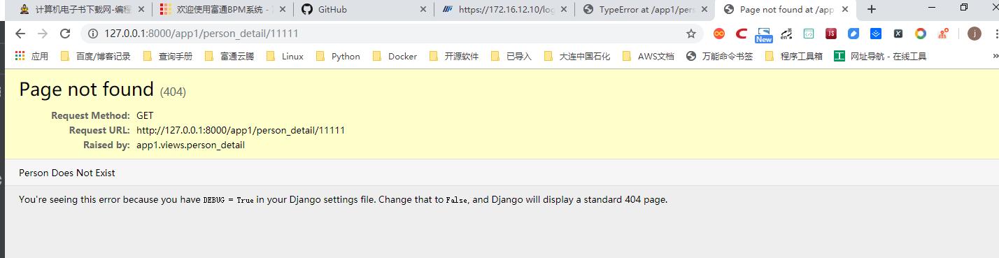
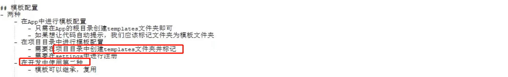
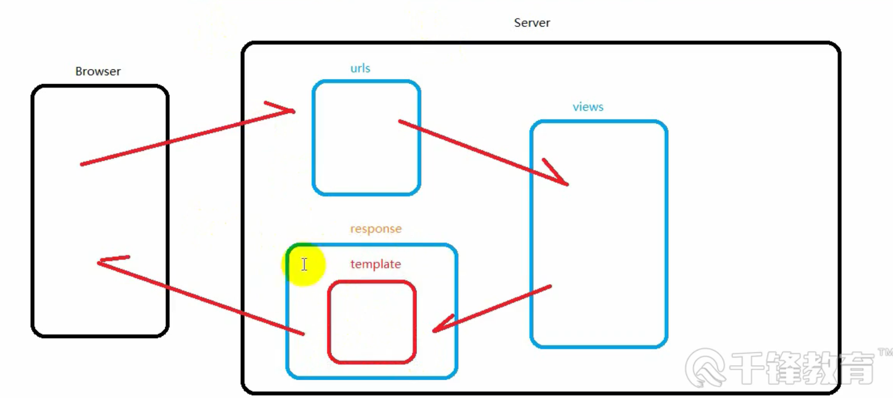

.. contents::
   :depth: 3
..

Django流程跑通
==============

app1下的admin.py中配置

::

   from django.contrib import admin # 引入admin模块
   from app1.models import Person, Order # 引入数据模型类

   class PersonAdmin(admin.ModelAdmin):
       """
       创建PersonAdmin类，继承于admin.ModelAdmin
       """
       #  配置展示列表，在Person板块下的列表展示
       list_display = ('first_name', 'last_name')
       # 配置过滤查询字段，在Person板块下右侧过滤框
       list_filter = ('first_name', 'last_name')
       # 配置可以搜索的字段，在Person板块下右侧搜索框
       search_fields = ('first_name',)
       # 配置只读字段展示，设置后该字段不可编辑
       readonly_fields = ('created_at', 'updated_at')
   # 绑定Person模型到PersonAdmin管理后台
   admin.site.register(Person, PersonAdmin)

-  配置完成后，登录http://127.0.0.1:8000/admin/

|image0|

路由
----

|image1|

Django的URL路由流程： （1）Django查找全局urlpatterns变量（urls.py）
（2）按照先后顺序，对URL逐一匹配urlpatterns每个元素
（3）找到第一个匹配时停止查找，根据匹配结果执行对应的处理函数
（4）如果没有找到或出现异常，Django进行错误处理

Django支持三种表达格式：

（1） 精确字符串格式

（2）Django的转换格式

（3）正则表达式格式

demo下的urls.py

::

   from django.contrib import admin
   from django.urls import path,include

   urlpatterns = [
       path('admin/', admin.site.urls),
       path('app1/',include('app1.urls'))
   ]

找到项目根目录的配置文件夹demo下面的urls.py文件，打开文件，添加如下代码：

::

   from app1 import views as app1_views
   from django.urls import path
   urlpatterns = [
       # 精确匹配视图
       path('articles/2003/', app1_views.special_case_2003),
       # 匹配一个整数
       path('articles/<int:year>/', app1_views.year_archive),
       # 匹配两个位置的整数
       path('articles/<int:year>/<int:month>/', app1_views.month_archive),
       # 匹配两个位置的整数和一个slug类型的字符串
       path('articles/<int:year>/<int:month>/<slug:slug>/', app1_views.article_detail),
   ]

如果想使用正则表达式，则使用如下代码:

::

   from django.urls import re_path
   from app1 import views as views
   from django.urls import path
   urlpatterns = [
       # 精确匹配
       path('articles/2003/', views.special_case_2003),
       # 按照正则表达式匹配4位数字年份
       re_path(r'^articles/(?P<year>[0-9]{4})/$', views.year_archive),
       # 按照正则表达式匹配4位数字年份和2位数字月份
       re_path(r'^articles/(?P<year>[0-9]{4})/(?P<month>[0-9]{2})/$', views.month_archive),
       # 按照正则表达式匹配4位数字年份和2位数字月份和一个至少1位的slug类型的字符串
       re_path(r'^articles/(?P<year>[0-9]{4})/(?P<month>[0-9]{2})/(?P<slug>[\w-]+)/$', views.article_detail),
   ]

表单
----

在app1文件夹下创建一个forms.py文件，添加如下类代码：

::

   from django import forms
   class PersonForm(forms.Form):
       first_name = forms.CharField(label='你的名字', max_length=20)
       last_name = forms.CharField(label='你的姓氏', max_length=20)

表单类forms.Form有一个is_valid()方法，可以在views.py中验证提交的表单是否符合规则。
对于提交的内容，在views.py编写如下：

::

   from django.shortcuts import render
   from django.http import HttpResponse, HttpResponseRedirect
   from app1.forms import PersonForm

   def get_name(request):
       # 判断请求方法是否为POST
       if request.method == 'POST':
           # 将请求数据填充到PersonForm实例中
           form = PersonForm(request.POST)
           # 判断form是否为有效表单
           if form.is_valid():
               # 使用form.cleaned_data获取请求的数据
               first_name = form.cleaned_data['first_name']
               last_name = form.cleaned_data['last_name']
               # 响应拼接后的字符串
               return HttpResponse(first_name + '' + last_name)
           else:
               return HttpResponseRedirect('/error/')
       # 请求为GET方法
       else:
           return render(request, 'name.html', {'form': PersonForm()})

在app1下创建一个templates目录，编写name.html文件

::

   <!DOCTYPE html>
   <html lang="en">
   <head>
       <meta charset="UTF-8">
       <title>Title</title>
   </head>
   <body>
   <form action="/app1/get_name" method="post">
       
       {{ form }}
       <button type="submit">提交</button>
   </form>

   </body>
   </html>

添加URL到创建的app1/urls.py文件中。

::

   from django.urls import re_path
   from app1 import views as views
   from django.urls import path

   urlpatterns = [
       path('get_name', views.get_name),
       ## 精确匹配
       # path('articles/2003/', views.special_case_2003),
       # # 按照正则表达式匹配4位数字年份
       # re_path(r'^articles/(?P<year>[0-9]{4})/$', views.year_archive),
       # # 按照正则表达式匹配4位数字年份和2位数字月份
       # re_path(r'^articles/(?P<year>[0-9]{4})/(?P<month>[0-9]{2})/$', views.month_archive),
       # # 按照正则表达式匹配4位数字年份和2位数字月份和一个至少1位的slug类型的字符串
       # re_path(r'^articles/(?P<year>[0-9]{4})/(?P<month>[0-9]{2})/(?P<slug>[\w-]+)/$', views.article_detail),
   ]

此时访问访问 http://127.0.0.1:8000/app1/get_name

|image2|

视图
----

在django项目中定义新的视图，app1/views.py

::

   from django.http import HttpResponse  # 导入响应对象
   import datetime  # 导入时间模块

   def current_datetime(request):  # 定义一个视图方法，必须带有请求对象作为参数
       now = datetime.datetime.now()  # 请求的时间
       html = "<html><body>It is now %s.</body></html>" % now  # 生成html代码
       return HttpResponse(html)  # 将响应对象返回，数据为生成的html代码

添加URL到创建的app1/urls.py文件中。

::

       path('current_datetime', views.current_datetime),

|image3|

定义一个404错误页面
~~~~~~~~~~~~~~~~~~~

app1/views.py

::

   from django.shortcuts import render
   from django.http import HttpResponse, HttpResponseRedirect, Http404
   from app1.forms import PersonForm
   from app1.models import Person

   def person_detail(request, pk):  # url参数pk
       try:
           p = Person.objects.get(pk=pk)  # 获取Person数据
       except Person.DoesNotExist:
           raise Http404('Person Does Not Exist')  # 获取不到抛出Http404错误页面
       return render(request, 'person_detail.html', {'person': p})  # 返回详细信息视图

app1/urls.py

::

       path('person_detail/<int:pk>', views.person_detail),

|image4|

基于类的视图(CBV)
-----------------

app1/views.py

::

   from django.shortcuts import render
   from django.http import HttpResponse, HttpResponseRedirect
   from app1.forms import PersonForm

   def get_name(request):
       # 判断请求方法是否为POST
       if request.method == 'POST':
           # 将请求数据填充到PersonForm实例中
           form = PersonForm(request.POST)
           # 判断form是否为有效表单
           if form.is_valid():
               # 使用form.cleaned_data获取请求的数据
               first_name = form.cleaned_data['first_name']
               last_name = form.cleaned_data['last_name']
               # 响应拼接后的字符串
               return HttpResponse(first_name + '' + last_name)
           else:
               return HttpResponseRedirect('/error/')
       # 请求为GET方法
       else:
           return render(request, 'name.html', {'form': PersonForm()})

   from django.http import HttpResponse  # 导入响应对象
   import datetime  # 导入时间模块

   def current_datetime(request):  # 定义一个视图方法，必须带有请求对象作为参数
       now = datetime.datetime.now()  # 请求的时间
       html = "<html><body>It is now %s.</body></html>" % now  # 生成html代码
       return HttpResponse(html)  # 将响应对象返回，数据为生成的html代码

   from django.shortcuts import render
   from django.http import HttpResponse, HttpResponseRedirect, Http404
   from app1.forms import PersonForm
   from app1.models import Person

   def person_detail(request, pk):  # url参数pk
       try:
           p = Person.objects.get(pk=pk)  # 获取Person数据
       except Person.DoesNotExist:
           raise Http404('Person Does Not Exist')  # 获取不到抛出Http404错误页面
       return render(request, 'person_detail.html', {'person': p})  # 返回详细信息视图

   from django.shortcuts import render
   from django.http import HttpResponse, HttpResponseRedirect, Http404
   from django.views import View
   from app1.forms import PersonForm
   from app1.models import Person

   class PersonFormView(View):
       form_class = PersonForm  # 定义表单类
       initial = {'key': 'value'}  # 定义表单初始化展示参数
       template_name = 'name.html'  # 定义渲染的模板

       def get(self, request, *args, **kwargs):  # 定义GET请求的方法
           # 渲染表单
           return render(request, self.template_name,
                             {'form': self.form_class(initial=self.initial)})

       def post(self, request, *args, **kwargs):  # 定义POST请求的方法
           form = self.form_class(request.POST)  # 填充表单实例
           if form.is_valid():  # 判断请求是否有效
               # 使用form.cleaned_data获取请求的数据
               first_name = form.cleaned_data['first_name']
               last_name = form.cleaned_data['last_name']
               # 响应拼接后的字符串
               return HttpResponse(first_name + '' + last_name)  # 返回拼接的字符串
           return render(request, self.template_name, {'form': form})  # 如果表单无效，返回表单

app1/urls.py

::

   from django.urls import re_path
   from app1 import views as views
   from django.urls import path

   urlpatterns = [
       path('get_name', views.get_name),
       path('get_name1', views.PersonFormView.as_view()),        # 看这里，就是类视图的url路由
       path('current_datetime', views.current_datetime),
       path('person_detail/<int:pk>', views.person_detail),
       ## 精确匹配
       # path('articles/2003/', views.special_case_2003),
       # # 按照正则表达式匹配4位数字年份
       # re_path(r'^articles/(?P<year>[0-9]{4})/$', views.year_archive),
       # # 按照正则表达式匹配4位数字年份和2位数字月份
       # re_path(r'^articles/(?P<year>[0-9]{4})/(?P<month>[0-9]{2})/$', views.month_archive),
       # # 按照正则表达式匹配4位数字年份和2位数字月份和一个至少1位的slug类型的字符串
       # re_path(r'^articles/(?P<year>[0-9]{4})/(?P<month>[0-9]{2})/(?P<slug>[\w-]+)/$', views.article_detail),
   ]

在浏览器中访问 http://127.0.0.1:8000/app1/get_name1

|image5|

Django模板
----------

Django指定的模板引擎在settings.py文件中定义，代码如下：

|image6|

::

   TEMPLATES = [{
           # 模板引擎，默认为Django模板
           'BACKEND': 'django.template.backends.django.DjangoTemplates',
           'DIRS': [],  # 模板所在的目录
           'APP_DIRS': True,  # 是否启用APP目录
           'OPTIONS': {
           },
       },
   ]

app1/templates目录下的html文件都为模板文件。

Django简单分发流程
~~~~~~~~~~~~~~~~~~

|image7|

.. |image0| image:: ../../../_static/admin_django.PNG
.. |image1| image:: ../../../_static/Django_urls0001.png

.. |image3| image:: ../../../_static/django002.png

