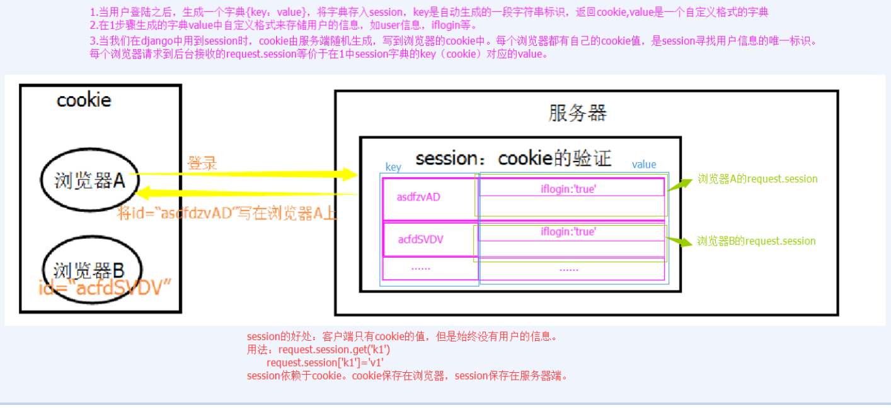

# 玩转Django2.0-视图

一、视图说明

　　视图(View)是Django的MTV架构模式的V部分，主要负责处理用户请求和生成相应的相应部分，然后在页面或其它类型文档中显示。也可以理解为视图是MVC架构里面的C部分（控制器）,主要处理功能和业务上的逻辑。

前期准备

## Django配置信息


```
# 创建项目
django-admin startproject mydajngo

# 创建app
(mydjango) D:\mydjango>python manage.py startapp web
(mydjango) D:\mydjango>python manage.py startapp user
```


### 1.基本配置

`mydajngo/settings.py`

```
INSTALLED_APPS = [
    'django.contrib.admin',
    'django.contrib.auth',
    'django.contrib.contenttypes',
    'django.contrib.sessions',
    'django.contrib.messages',
    'django.contrib.staticfiles',
    'index',
    'user',
]
```


### 2.静态资源

APP下的静态资源

创建`index/static`文件夹

```
STATIC_URL = '/static/'
```

设置根目录下的静态资源

创建`mydjango/public_static`文件夹

```
STATICFILES_DIRS = [os.path.join(BASE_DIR, 'public_static'),
                    os.path.join(BASE_DIR, 'index/index_static'), ]
```

在public_static下和index/index_static放置2张jpg图片，进行访问：

```
http://127.0.0.1:8000/static/index_pic.jpg
http://127.0.0.1:8000/static/linmc.jpg
```

 还可以设置服务器和项目之间的映射，STATIC_ROOT,该文件与服务器之间构建映射关系

```
STATIC_ROOT = os.path.join(BASE_DIR, 'all_static')
```

STATIC_ROOT用于项目生产部署，在项目开发过程中作用不大。

### 3.模板路径

```
TEMPLATES = [
    {
        'BACKEND': 'django.template.backends.django.DjangoTemplates',
        'DIRS': [os.path.join(BASE_DIR, 'templates'),
                 os.path.join(BASE_DIR, 'index/templates')],

        'APP_DIRS': True,
        'OPTIONS': {
            'context_processors': [
                'django.template.context_processors.debug',
                'django.template.context_processors.request',
                'django.contrib.auth.context_processors.auth',
                'django.contrib.messages.context_processors.messages',
            ],
        },
    },
]
```

### 4.数据库配置

```
DATABASES = {
    'default': {
        'ENGINE': 'django.db.backends.mysql',
        'NAME': 'myproject',
        'HOST': '127.0.0.1',
        'USER': 'root',
        'PASSWORD': 'admin#123',
        'PORT': '3306',
    }
}

```

值得注意的是，MySQL5.7在连接数据库时，会提示django.db.utils OperationalError的错误信息，因为mysql8.0在加密方式上发生了改变，mysql8.0版本的用户密码采用的是cha2加密方式。

为了解决这个问题。将8.0加密方式改为原来的加密方式。可以解决Django连接Mysql数据库的错误问题，在Mysql的可视化工具中运行以下SQL语句。

```
ALTER USER 'root'@'localhost' IDENTIFIED WITH mysql_native_password BY 'admin#123';
FLUSH PRIVILEGES;
```

### 5.中间件

在项目的MIDDLEWARE中添加LocaleMideeleware中间件，使得Django内置的功能支持中文显示。代码如下：

```
MIDDLEWARE = [
    'django.middleware.security.SecurityMiddleware',
    'django.contrib.sessions.middleware.SessionMiddleware',
    # 使用中文
    'django.middleware.locale.LocaleMiddleware',
    'django.middleware.common.CommonMiddleware',
    'django.middleware.csrf.CsrfViewMiddleware',
    'django.contrib.auth.middleware.AuthenticationMiddleware',
    'django.contrib.messages.middleware.MessageMiddleware',
    'django.middleware.clickjacking.XFrameOptionsMiddleware',
]
```

### 6. 编写URL规则

在App里添加urls.py是将属于App的URL都写入该文件。

在从App的urls.py找到具体的URL信息，在根

```
urlpatterns = [
    path('admin/', admin.site.urls),
    path('', include('index.urls')),
]
```

由于首页的地址分发给index的urls.py处理，因此下一步需要对index的urls.py编写URL信息，代码信息如下：

```
#!/usr/bin/env python
# -*- coding: utf-8 -*-

from django.urls import path
from . import views

urlpatterns = [
    path('', views.index)
]
```

在views.py中编写index函数的处理，代码如下：

```
from django.shortcuts import render
from django.http import HttpResponse


# Create your views here.

def index(request):
    return HttpResponse('Hello world')
```


### 7.获取请求信息

`urls.py`

```
    path('login.html', views.login)
```

`views.py`

```
def login(request):
    if request.method == "POST":
        name = request.POST.get('name')
        #相对地址，代表首页地址
        return redirect('/')
    else:
        if request.GET.get('name'):
            name = request.GET.get('name')
        else:
            name = 'Everyone'
        return HttpResponse('username is: ' + name)
```

在浏览器上分别输入以下URL地址：

```
http://127.0.0.1:8000/index/login.html
http://127.0.0.1:8000/index/login.html?name=Tom
```


### 8. 通用视图

　通用视图是通过定义和声明类的形式实现的，根据用途划分为三大类：TemplateView、ListView和DetailView。三者说明如下：

　　　　　　1、TemplateView直接返回HTML模板，但无法将数据库的数据展示出来。

　　　　　　2、ListView能将数据库的数据传递给HTML模板，通常获取某个表的所有数据。

　　　　　　3、DetailView能将数据库的数据传递给HTML模板，通常获取数据表的单条数据。

`urls.py`

```
    # 通用视图ListView
    # path('index/', views.ProductList.as_view()),

    path('index/<id>.html', views.ProductList.as_view(), {'name': 'phone'}),

    path('index01.html', views.index01, name='index01'),
```

`views.py`

```
class ProductList(ListView):
    # context_object_name设置Html模版的变量名称
    context_object_name = 'type_list'
    # 设定HTML模版
    template_name = 'index.html'
    # 查询数据
    queryset = Product.objects.values('type').distinct()

    # # # 重写 get_queryset 方法，对模型product进行数据筛选。
    # def get_queryset(self):
    #     type_list = Product.objects.values('type').distinct()
    #     return type_list

    # 添加其他变量
    def get_context_data(self, **kwargs):
        context = super().get_context_data(**kwargs)
        context['name_list'] = Product.objects.values('name', 'type')
        # print(context)
        return context

    def get_queryset(self):
        # 获取URL的变量id
        print(self.kwargs['id'])

        if self.request.GET.get('name'):
            self.kwargs['name'] = self.request.GET.get('name')
        # 获取URL的参数name
        print(self.kwargs['name'])

        # 获取请求方式
        print(self.request.method)
        type_list = Product.objects.values('type').distinct()
        return type_list
```


### 9.Django cookie and session

**cookie和session**

```

1、cookie不属于http协议范围，由于http协议无法保持状态，但实际情况，我们却又需要“保持状态”，因此cookie就是在这样一个场景下诞生。

cookie的工作原理是：由服务器产生内容，浏览器收到请求后保存在本地；当浏览器再次访问时，浏览器会自动带上cookie，这样服务器就能通过cookie的内容来判断这个是“谁”了。

2、cookie虽然在一定程度上解决了“保持状态”的需求，但是由于cookie本身最大支持4096字节，以及cookie本身保存在客户端，可能被拦截或窃取，因此就需要有一种新的东西，它能支持更多的字节，并且他保存在服务器，有较高的安全性。这就是session。

问题来了，基于http协议的无状态特征，服务器根本就不知道访问者是“谁”。那么上述的cookie就起到桥接的作用。

我们可以给每个客户端的cookie分配一个唯一的id，这样用户在访问时，通过cookie，服务器就知道来的人是“谁”。然后我们再根据不同的cookie的id，在服务器上保存一段时间的私密资料，如“账号密码”等等。

3、总结而言：cookie弥补了http无状态的不足，让服务器知道来的人是“谁”；但是cookie以文本的形式保存在本地，自身安全性较差；所以我们就通过cookie识别不同的用户，对应的在session里保存私密的信息以及超过4096字节的文本。

4、另外，上述所说的cookie和session其实是共通性的东西，不限于语言和框架
```



下面我们再来最后的总结一下cookie和session的[知识](http://www.wredian.com/zhishi/)点

一、操作Cookie

　　获取cookie：request.COOKIES[key]

　　设置cookie：response.set_cookie(key,value)

由于cookie保存在客户端的电脑上，所以，jquery也可以操作cookie。

```
<script src='http://830909.blog.51cto.com/static/js/jquery.cookie.js'></script>
$.cookie("list_pager_num", 30,{ path: '/' });
```

二、操作Session(session默认在服务器端保存15天)

　　获取session：request.session[key]

　　设置session：reqeust.session[key] = value

　　删除session：del request.session[key]   

（这个删除其实就是把数据库的session_data更新为一个其他的值了，并没有立即删除）

```
request.session.set_expiry(value)
* 如果value是个整数，session会在些秒数后失效。
* 如果value是个datatime或timedelta，session就会在这个时间后失效。
* 如果value是0,用户关闭浏览器session就会失效。
* 如果value是None,session会依赖全局session失效策略。
```

**代码示例**

参考：

https://www.cnblogs.com/nulige/p/6497311.html

